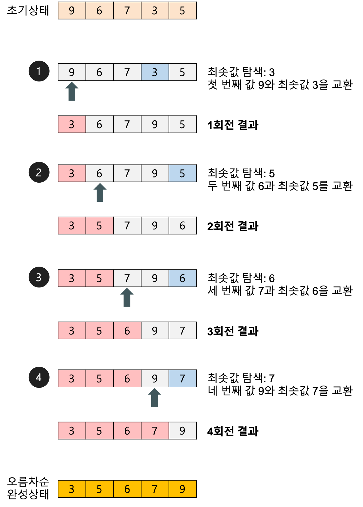

# 선택 정렬 - Selection Sort
: 해당 순서의 원소를 넣는 위치는 이미 정해져 있고, 어떤 원소를 넣을지 선택하는 알고리즘이다.
- `제자리 정렬 - in-place sorting` 알고리즘
- 비교 정렬
- 불안정 정렬
- 시간 복잡도: O(N^2)

### 정렬 방법
1. 주어진 리스트에서 최솟값을 찾는다.
2. 최솟값을 맨 앞 자리의 값과 교환한다.
3. 맨 앞 자리를 제외한 나머지 값들 중 최솟값을 찾아 위와 같은 방법으로 반복한다. 

#### 예제


## 소스코드
```java

/**
 * @param arrLen 배열의 크기
 * @param arr 정렬 할 배열
*/
private static int[] solution(final int arrLen, final int[] arr) {
    for (int i = 0; i < arrLen; i++) {
        int swapIdx = i;
        for (int j = i + 1; j < arrLen; j++) {
            if (arr[swapIdx] > arr[j]) swapIdx = j;
        }
        int temp = arr[i];
        arr[i] = arr[swapIdx];
        arr[swapIdx] = temp;
    }
    return arr;
}

public static void main(String[] args) {
    Scanner sc = new Scanner(System.in);
    final int arrLen = sc.nextInt();
    final int[] arr = new int[arrLen];
    for (int i = 0; i < arrLen; i++) 
        arr[i] = sc.nextInt();
    
    for(int i : solution(arrLen, arr))
        System.out.print(i + " ");
    
}
```