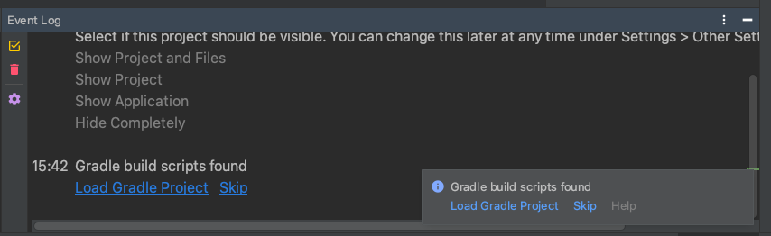

# SpringBoot Maven에서 Gradle로 migration!
- [SpringBoot Maven에서 Gradle로 migration!](#springboot-maven에서-gradle로-migration)
  - [Intro](#intro)
      - [프로젝트 환경](#프로젝트-환경)
    - [Migration 동기](#migration-동기)
      - [TheMoment Project](#themoment-project)
      - [1. 일단 Build속도가 느리다.](#1-일단-build속도가-느리다)
      - [2. 가장 큰 이유는 지속적 통합(CI)의 자료가 Gradle이 더 많다.](#2-가장-큰-이유는-지속적-통합ci의-자료가-gradle이-더-많다)
  - [본론](#본론)
    - [Maven Project에 Gradle Project 적용하기](#maven-project에-gradle-project-적용하기)
    - [의존성 migration](#의존성-migration)
      - [저장소 선언](#저장소-선언)
    - [Intellij에서 Gradle Project를 불러오자](#intellij에서-gradle-project를-불러오자)
      - [만약 Intellij가 Gradle을 불러오지 못한다면](#만약-intellij가-gradle을-불러오지-못한다면)
    - [하지만 왜인지 에러가 떠요...](#하지만-왜인지-에러가-떠요)
      - [문제해결](#문제해결)

## Intro
> SpringBoot 개발초기에는 Gradle이 무서운줄 알았다. 하지만 배포를 하다 보니까 Maven이 더 무섭더라..;;;;;;

이글은 Gradle 공식문서를 아주많이 참고했습니다! 
- [Gradle 공식문서](https://docs.gradle.org/current/userguide/migrating_from_maven.html#migmvn:multimodule_builds) - Apache Maven에서 빌드 마이그레이션

#### 프로젝트 환경
- MacOS
- Intellij Ultimate
- Java11/SpringBoot 
- Maven, Gradle

>**주의 이글은 야메입니다. 그냥 약간 규모가 작은 프로젝트를 migration했을뿐입니다.**  
>**자신의 프로젝트의 규모와 상황에따라 상황이 달라질 수 있습니다.**

### Migration 동기
#### TheMoment Project
학교에 불편한순간 이라는 프로젝트가 있다. [참고](https://github.com/theMomentTeam/the_moment-Server)  
1. 프로젝트를 하기전에 build tool 은 익숙한 maven을 선택했었다.  
2. 하지만 개발할때 익숙하고 편했지만 배포할때가 문제였다.  

#### 1. 일단 Build속도가 느리다.
> Gradle은 Maven보다 최대 100배 빠르다.

현제 Gradle은 Maven을 능가할정도로 Project Build 속도가 올라갔다. Gradle을 사용하지 않을 이유가 없다.  
Build 시간을 줄여 Test에 투자를하면 프로젝트의 질이 올라갈것이다.

#### 2. 가장 큰 이유는 지속적 통합(CI)의 자료가 Gradle이 더 많다.
> 저희 프로젝트는 CI툴을 Jenkins를 사용하려고 합니다.

우리 Project는 v1에서는 CI없이 배포할 예정이지만 너무 비효율적이다. ~~버전이 upgrade 할때마다 쉘을 쳐줘야하는게 귀차나...~~  
그리고 나중에는 무중단 배포를 목표로 운영해 나아갈예정이여서 CI는 거쳐가야할 필수 과제이다.  

하지만 이게 Maven을 통한 CI가 자료가 안나온다.

~~아니 근데 왜 jenkins 배포 자료 다 Gradle 위주로 많이 나오는거야...~~


## 본론
> 덕분에 Gradle로 이전을 하게되는 여정을 떠났다.
### Maven Project에 Gradle Project 적용하기
기존 Maven 프로젝트에서 Gradle Project를 시작하는것은 어렵지 않았다.  
> 하지만 그 뒤에 처리해야할 문제들이 어려운거지...

다음과같이 입력하면 Gradle Project를 시작할 수 있다.
```bash
gradle init
```
Maven프로젝트 디렉토리에서 위와같이 입력했으면  
`Found a Maven build. Generate a Gradle build from this? (default: yes) [yes, no]`   
와 같은 메세지가 나온다 Enter혹은 yes입력하다.

그후 
```sh
Select build script DSL:
  1: Groovy
  2: Kotlin
Enter selection (default: Groovy) [1..2]
```
이런식으로 build script를 선택하는것이 나올껀데 Groovy를 선택하자. (Enter or 1 입력)
> 참고 : Groovy는 JVM기반에서 실행되는 스크립트 언어이다. Gralde에서 Build Script로 많이 쓰인다.

그러면 Gradle이 알아서 pom.xml에 있는 depedency및 플러그인을 가져온다.

### 의존성 migration
> Gradle의 의존성 관리 시스템은 Maven보다 유연하지만   
> repository, 선언된 의존성, scope(Gradle의 의존성 구성) 및 의존성 전이의 동일한 개념을 계속 지원한다.  

#### 저장소 선언
Maven과 달리 Gradle은 기본 저장소가 없으므로 최소한 하나를 선언 해야한다.  
> Maven Central: 자바진영에서 개발의 필요한 의존성이 저장되어있는 저장소이다.  
> 들어가봤자 라이브러리을 나열해놔서 별 도움이 안된다. 굳이 라이브러리를 찾고싶으면 https://search.maven.org/ 여기에서 찾자

`Before`
```gradle
repositories {
    mavenLocal()
    maven {
        url = uri('https://repo.maven.apache.org/maven2/')
    }
}
```
`After`
```gradle
repositories {
    mavenCentral()
    maven {
        url = uri('https://repo.maven.apache.org/maven2/')
    }
}
```

### Intellij에서 Gradle Project를 불러오자
> 먼저 Gradle plugin이 설치가 되어있어야한다.

`gradle init`을 한후 gradle 프로젝트에 필요한 파일들이 프로젝트 폴더에 추가 되었으면,   
`Gradle build scripts found` 이 하단에 나타날것이다. 

그후 `gradle build` 혹은 `./gradlew build` 를 입력해서 gradle project로 현제 프로젝트가 build되는지 확인하자.  
Build가 되면 그대로 Gradle로 migration해서 사용하면 된다.



그러면 Intellij에서 intellij 하게 gradle의 depedency를 불러올것이다.

#### 만약 Intellij가 Gradle을 불러오지 못한다면
자신의 프로젝트에 최상단에서 `.idea`를 제거하고 Intellij를 제실행하면 해결될것이다.

### 하지만 왜인지 에러가 떠요...
> 항상느끼는거지만 에러코드를 보자 대부분 해결할 수 있다.

나의 경우에는 compileJava FAILED가 떴다.
에러코드를 올려보니 
```sh
                                            etc...

  symbol: method getAdminPwd()
/{PROJECT_ROOT}/src/main/java/com/moment/the/dto/AdminDto.java:33: error: cannot find symbol
                .adminName(this.getAdminName())
                               ^
  symbol:   method setCode(int)
  location: variable result of type CommonResult
/{PROJECT_ROOT}/src/main/java/com/moment/the/domain/response/ResponseService.java:62: error: cannot find symbol
        result.setMsg(CommonResponse.FAIL.getMsg());
              ^
51 errors

FAILURE: Build failed with an exception.

* What went wrong:
Execution failed for task ':compileJava'.
> Compilation failed; see the compiler error output for details.

* Try:
Run with --stacktrace option to get the stack trace. Run with --info or --debug option to get more log output. Run with --scan to get full insights.

* Get more help at https://help.gradle.org

BUILD FAILED in 1s
1 actionable task: 1 executed

```
`getter`, `setter` 매서드를 찾을 수 없다는 에러가 51개나 떳다.  
`getter`, `setter` 가 없다는건 lombok에서 문제가 있다는건데..!

그후 바로 Gradle에 lombok을 적용하는것을 구글링했다. ~~사랑해요 Stack Overflow~~   
참고 링크 : https://stackoverflow.com/questions/35236104/gradle-build-fails-on-lombok-annotated-classes

#### 문제해결
build.gradle 에 dependencies에 다음과같이 추가해주면 해결이된다.

```gradle
dependencies{
compileOnly 'org.projectlombok:lombok:1.18.16'
annotationProcessor 'org.projectlombok:lombok:1.18.16'
}
```
버전명시는 자신의 프로젝트에 추가되어있는 lombok 버전과 똑같이 맞추자

그후 Build를 하여 성공했다!
```sh
> gradle build

BUILD SUCCESSFUL in 668ms
5 actionable tasks: 5 up-to-date
```

그리고 Maven 관련된 파일을 모두 삭제후 프로젝트를 실행했다 역시 성공했다.

아마 migration 이 완벽히 됐는지 확인하려면 테스트가 많이 필요하겠지만 아무튼 성공했다.