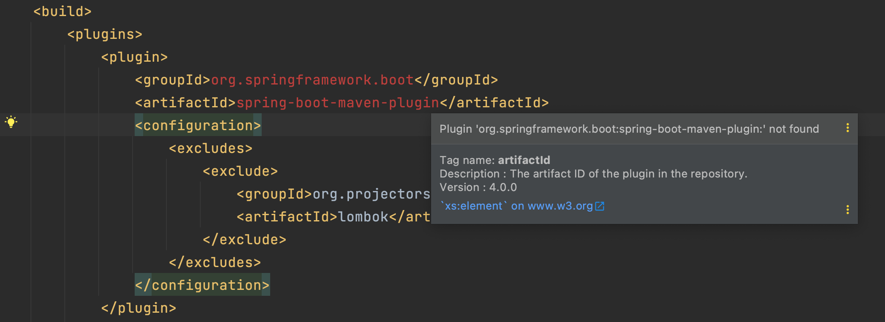

# Plugin-not-found 해결방법
어느날 intellij에서 maven 기반 SpringBoot 프로젝트를 하고있었는데 다음과 같은 에러가 났다.



### 원인 및 해결
위에 이미지 처럼 오류가나면 Maven plugin의 버전이 명시가 되지 않아서 나는 에러이다.
```xml
    <build>
        <plugins>
			<plugin>
				<groupId>org.springframework.boot</groupId>
				<artifactId>spring-boot-maven-plugin</artifactId>
				<version>2.4.2</version> //여기!!!!
				<configuration>
					<excludes>
						<exclude>
							<groupId>org.projectors</groupId>
							<artifactId>lombok</artifactId>
						</exclude>
					</excludes>
				</configuration>
			</plugin>
        </plugins>
    </build>
```
다음과같이 version을 명시해 주면 해결된다.