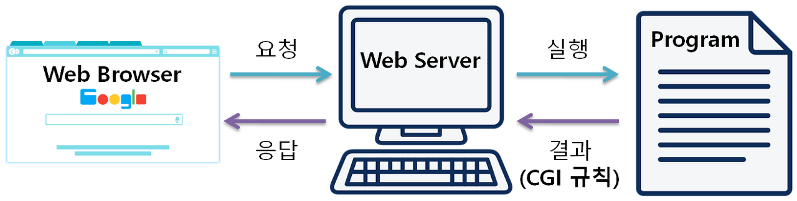
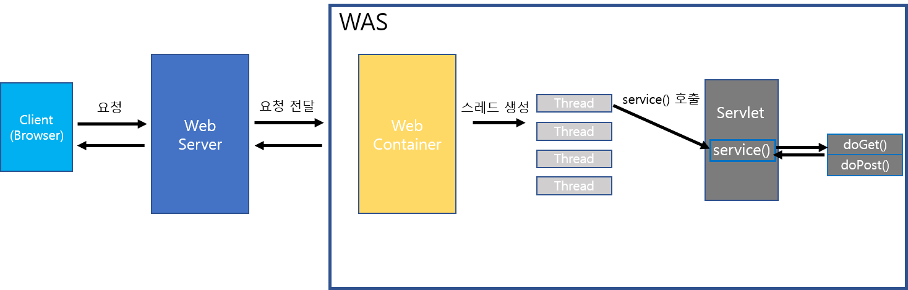
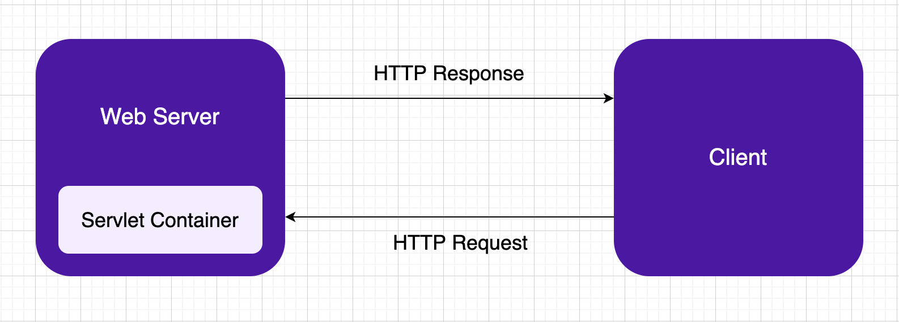
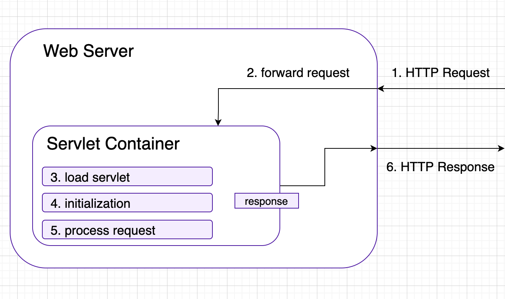

# Servlet
: Java를 이용하여 웹페이지를 동적으로 생성하는 server side 프로그램이다.
> 웹 프로그래밍에서 클라이언트의 요청을 처리하고 그 결과를 다시 클라이언트에게 전송하는 Servlet 클래스의 규현 규칙을 지킨 자바 프로그래밍 기술
- 서블릿은 자바 기반의 CGI 프로그램이며 CGI 규칙에 따라 웹 서버와 데이터를 주고받는다.
- 자바를 사용하여 웹을 만들기 위해 필요한 기술이다.
- `javax.Servlet.http.HttpServlet` 클래스를 상속받아 사용한다.

Servlet을 알기전에 먼제 웹 어플리케이션의 실행 과정에 대해 알아야 한다.

### 웹 어플리케이션의 실행 과정

1. 웹 브라우저가 웹 서버에게 요청을 전송한다.
2. 웹 서버는 클라이언트가 요청한 프로그램을 찾아서 실행한다.
3. 해당 프로그램은 작업을 수행한 후 그 결과를 웹 서버에게 돌려준다.
4. 웹 서버는 그 결과를 HTTP 형식에 맞춰 웹 브라우저에게 보낸다.

이때 **웹 서버와 프로그램 사이의 데이터를 주고받는 규칙을 CGI(Common Gateway Interface)라고 한다.**

웹 서버에 의해 실행되며 CGI 규칙에 따라 웹 서버와 데이터를 주고받도록 작성된 프로그램을 CGI 프로그램이라 한다.  

### Servlet의 특징
- 클라이언트의 요청에 대해 동적으로 작동하는 웹 어플리케이션 컴포넌트
- html을 사용하여 요청에 응답한다.
- Java Threed를 이용하여 동작한다.
- MVC 패턴에서 controller로 이용한다.
- HTTP 프로토콜 서비스를 지원하는 `javax.Servlet.http.HttpServlet` 클래스를 상속받는다.
- UDP보다 처리 속도가 느리다.
- HTML 변경 시 Servlet을 재컴파일해야한다.

### Servlet의 장점
- threed를 이용하여 요청을 처리하므로 빠르다.
- 플랫폼에 독립적이다. (JAVA의 JVM)
- 보안(Servlet Container)

### Servlet동작 과정

#### 1. 사용자의 요청
: 사용자가 웹서버에 요청을 전달한다.  
   &rarr; 만약 Servlet에 대한 요청인 경우 WAS에 요청을 전달한다.

#### 2. Web Container에서 request, response객체 생성
: Web Container는 사용자의 요청에 대한 `HttpServletRequest` 객체와, `HttpServletResponse` 객체를 생성한다.

#### 3. 사용자 요청처리
1. Web Container에서 배포서술자(web.xml)를 참조하여 사용자가 요청한 URL이 어떤 Servlet에 mapping되는지 찾는다.

2. 사용자가 요청한 Servlet이 이전에 요청된적 없다면 객체를 생성한후 `init()` 호출후 메모리에 로드한다.  
   **if** 이전에 객체를 생성한 적이 있으면 다시 생성하지 않는다.
3. Web Container에서 사용자의 요청을 처리할 Threed를 처리한다.
4. Threed가 생성된 후 해당 Threed를 통해 Servlet의 `service()`를 실행한다.
5. `service()` 에서 사용자의 요청 HTTP method에 따라 `doGet()`, `doPost()`, `doPut()`, `doDelete()`가 호출된다.  
   &rarr; 앞에서 생성한 `HttpServletRequest`, `HttpServletResponse` 객체를 Tomcat에 의해 인수로 전달받는다.

#### 4. 응답
: `doGet()` 또는 `doPost()` 등. 을 호출되어 사용자 요청에 따른 페이지를 생성한 뒤  
그것이 담긴 `HttpServletResponse`객체를 Web Container에서 HTTP Response로 바꾸어 Web Server에 전송한다.

#### 5. 소멸
1. `HttpServletRequest`, `HttpServletResponse` 객체를 소멸시킨다.
2. Threed를 종료시킨다.

### HttpServletRequest
> 사용자가 요청시 HttpServletResponse와 함께 웹컨테이너에서 자동으로 생성해준다
- 사용자의 요청과 관련된 정보(파라미터)와 동작을 가지고 있는 객체
- Servlet의 `service()` 인자로 넘겨준다.

#### 주요 기능
- 요청 파라미터 조회
- 사용자가 전달한 session 정보가 담겨있는 session 객체 조회
- Request scope(범위) 안에 존제하는 component간 공유 데이터 조회

### HttpServletResponse
> 사용자가 요청시 HttpServletRequest와 함께 웹컨테이너에서 자동으로 생성해준다
- 동일 정보와 동작을 가지고있는 객체
- Servlet의 `service()` 인자로 넘겨준다.

#### 주요 기능
- 다른 페이지로 Redircet
- Response Header정보 설정
- 쿠키저장

### Life cycle
1. Servlet 객체 생성은 최초 1회 이루어진다.
2. `init()` (Servlet 초기화) 또한 최초 1회만 이루어진다.
3. `service()` 는 특정 HTTP 요청(GET, POST 등)을 처리하는 메서드 (`doGet()`, `doPost()` 등)를 호출한다.
4. 서버는 `destroy()`를 호출하여 Servlet을 제거한다.  
   &rarr; 자원을 해제할때, Servlet이 수정되어 대시 메모리에 로딩해야 하는 경우, 서버가 종료될때

## Servlet Container
: 구현되어 있는 Servlet클레스를 규약에 맞게 **Servlet을 관리**해주는것

서버에 만들어진 Servlet이 스스로 작동하는 것이 아니라, Servlet을 관리 해주는 것이 필요한데, 이러한 역할을 하는 것이 바로 Servlet Container 이다.

즉 Servlet을 '요구사항 명세서'라고 표현하면, Servlet container는 그 명세서를 보고 개발하는 '개발자' 이다.  

클라이언트의 요청(Request)을 받아주고 응답(Response)할 수 있게, 웹서버와 소켓으로 통신한다.  

대표적으로 tomcat이 있다.  

1. 일반적으로 사용자는 서버에서 오직 정적인 웹페이지만을 요청할 수 있다.
2. 만약 사용자가 본인의 입력을 기초로한 웹페이지를 자유롭게 얻고 싶다면 이 방법은 제한적이다.
3. Servlet Container는 server side에서 동적으로 웹페이지를 생성하기 위해 Java를 사용한다.
4. 때문에 웹서버와 서블릿들이 상호작용할 때 서블릿 컨테이너는 필수적이다.

### Servlet Container의 역활
#### 1. 웹서버와의 통신 지원
Servlet과 Web서버가 쉽게 통신할 수 있게 한다.
- 일반적으로 소켓을 만들고 listen, accept 등을 해야하지만 Servlet Container는 이러한 기능을 API로 제공한다.
- 개발자가 Servlet에 구현해야할 비즈니스 로직에 대해 집중할 수 있도록 도와준다.

#### 2. 서블릿 생명주기(Life Cycle) 관리 
서블릿의 생명주기를 관리한다.
1. Servlet 클래스를 로딩하여 인스턴스화
2. 초기화 메소드를 호출 
3. 요청이 들어오면 적절한 서블릿 메소드를 호출
4. Servlet 소멸 시 Garbage Collection 진행

#### 3. 멀티쓰레드 지원 및 관리 
다중 쓰레드를 생성 및 운영을 관리한다.
1. Servlet Container는 요청이 올 때 마다 새로운 Java threed 하나 생성
2. HTTP 서비스 메소드를 실행하고 나면, threed는 자동으로 소멸
3. 원래는 threed를 관리해야 하지만 서버가 multi threed를 생성 및 운영해준다  
   &rarr; 안정성에 대해 걱정하지 않아도 된다.

#### 4. 선언적인 보안 관리
- 개발자는 보안에 관련된 내용을 Servlet 또는 Java 클래스에 구현해 놓지 않아도된다.
- 보안관리는 XML 배포 서술자에 기록하므로 자바 소스코드를 수정하여 다시 컴파일 하지 않아도 보안관리가 가능하다.

### 웹 서버와 Servlet Container의 요청을 처리

1. 웹서버가 HTTP 요청을 받는다
2. 웹서버는 요청을 Servlet Container로 전달한다.
3. Servlet이 Container에 없다면, Servlet을 동적으로 검색하여 컨테이너의 주소 공간에 로드한다.
4. 컨테이너가 서블릿의 `init()` 메소드를 호출하면, 서블릿이 초기화된다.  
   (서블릿이 처음 로드됬을 때 한번만 호출)
5. 컨테이너가 서블릿의 `service()` 메소드를 호출하여 HTTP 요청을 처리한다.  
   (요청의 데이터를 읽고, 응답을 만들어낸다)
6. 웹서버는 동적으로 생성된 결과를 올바른 위치에 반환한다.

### 이 과정에서 JVM의 역활
- 각 요청들을 "분리된 threed" 내부에서 처리한다.  
 Servlet을 사용하는것은 JVM이 각 요청을 분리된 자바 threed 내부에서 처리하도록 하는것이다.  
- 각 서블릿은 HTTP 요청에 응답하는 특정한 요소들이 있는 자바 클래스이다.
- 대부분의 사례에 서블릿 컨테이너는 하나의 JVM에서 동작하지만 컨테이너가 여러개의 JVM들을 필요로하는 문제들이 존재하기도 한다.
