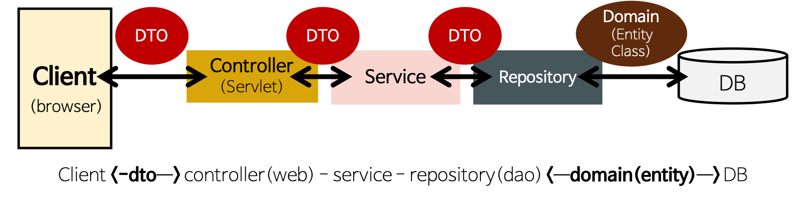

# Spring 구조(DAO, DTO, Entity, Controller, Service)
### 전체구조 


## DAO(Data Access Object)
**repository package**  
: DB를 사용해 데이터를 조회하거나 조작하는 기능을 전담하도록 만든 객체  
- 실제로 DB에 접근하는 객체 &rarr; Data Access
- SQL를 사용(개발자가 직접 코딩)하여 DB에 접근한 후 적절한 CRUD API를 제공
    - JAP 대부분의 기본적인 CRUD method를 제공하고 있다.
- ex) `Spring Data JPA` 예시
    ```java
    public interface BoardRepository extends CrudRepository<Board, Long>{}
    ```
    >Board테이블에 기본키의 자료형은 Long
## DTO(Data Transfer Object)
**DTO package**  
: **계층간 데이터 교환을 위한 객체**를 말한다 여기서 계층이란  
컨트롤러, 뷰, 비지니스 계층, 퍼시스턴스 계층을 말한다.

- **계층간 데이터 교환을 위한 객체** 이다
- DB에서 데이터를 얻어 `Service`나 `Controller` 등으로 보내는 객체
- 로직을 갖고 있지 않은 순수한 Object이다 `getter`/`setter`메서드만 가지고있다.
- `Request`와 `Response`용 DTO는 View를 위한 클래스
    - 자주 변경이 필요한 클래스
    - Persentaion Model
    - `toEntity()` 메서드를 통해서 DTO에서 필요한 부분을 이용하여 Entity로 만든다.
    - `Controller Layer`에서 `Response DTO`형태로 Client에 전달

## Entity
**Domain Package**
- 실제 DB 테이블과 매칭될 클래스
    - `@Entity`, `@Column`, `@Id` 등 사용
- 최대한 외부에서 Entity 클래스의 `getter`를 사용하지 않도록 해당 클래스 안에서 필요한 로직(method)을 구현
#### JPA entity 예시
```java
import lombok.*;
import org.hibernate.annotations.CreationTimestamp;
import org.hibernate.annotations.UpdateTimestamp;

import javax.persistence.*;
import java.time.LocalDateTime;

@Entity // Entity라고 명시
@NoArgsConstructor(access= AccessLevel.PROTECTED) // 기본생성자 protected로 생성
@Getter // getter 생성
public class Board {
    @Id @GeneratedValue(strategy= GenerationType.SEQUENCE)
    private Long id;

    @Column(nullable=false)
    private String title;

    @Column
    private String content;

    @Column(updatable=false)
    @CreationTimestamp
    private LocalDateTime regDatetime;

    @Column(nullable=false)
    private String regUserId;

    @UpdateTimestamp
    private LocalDateTime editDatetime;

    @Column
    private String editUserId;

    @Builder
    private Board(Long id, String title, String content, String regUserId, String editUserId) {
        this.id = id;
        this.title = title;
        this.content = content;
        this.regUserId = regUserId;
        this.editUserId = editUserId;
    }

}
```
### Entity class 와 DTO class 를 분리하는 이유
- `View Layer` 와 DB Layer의 역활을 철저히 하기위해
- 테이블과 매핑되는 Entity클래스가 변경되면 여러 클래스에 영향을 끼치게 되는 반면 View와 통신하는 DTO 클래스(Request / Response 클래스)는 자주 변경되므로 분리
## controller(web)
- 해당 요청 url에 따라 적절한 view 와 mapping처리
- `@Autowired Service`를 통해 service 의 method 를 이용
- 적절한 ResponseEntity(DTO)를 body에 담아 Client에 반환

## service
- `@Autowried Repository` 를 통해 repository의 method를 이용
- 적절한 business Logic 처리 
- DAO로 DB에 접근하고 DTO로 데이터를 전달받은 다음, 비지니스 로직을 처리해 적절한 데이터를 반환