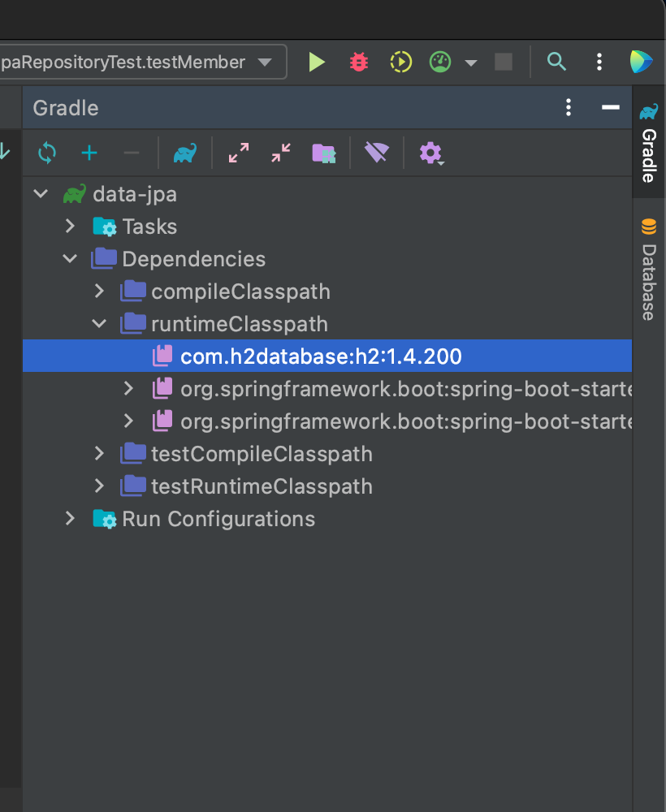

# Spring Data JPA
> 이 md는 [김영한씨의 실전! 스프링 데이터 JPA](https://www.inflearn.com/course/%EC%8A%A4%ED%94%84%EB%A7%81-%EB%8D%B0%EC%9D%B4%ED%84%B0-JPA-%EC%8B%A4%EC%A0%84/) 라는 강의를 보고 정리합니다.

### 이것은 마법같은 기술이다
>기존 Spring + JPA 만으로 생산능력이 높아졌지만 이 기술을 사용함으로 써 더욱 생산성이 높아진다.
- 구현체 없이 Repository 만으로 구현이 가능하다.
- CRUD는 기본적으로 제공된다. &rarr; 개발자는 핵심 비즈니스 로직에만 집중하여 개발하자!
- 선택이 아닌 필수다! 실무에 무조건 적용된다.

### 하지만
- JPA를 너무 추상화 해버린다.
- JPA를 몰라도 사용할 수 있다.
- 문제는 문제가 생겨 해결할때 JPA의 기본 원리를 모르면 해결할 수가 없다.
- 결론은 JPA부터 공부하자.

## 실습환경
Spring initializer를 통해 실습 환경을 생성한다.  
[실습 환경 공유](https://start.spring.io/#!type=maven-project&language=java&platformVersion=2.4.5.RELEASE&packaging=jar&jvmVersion=11&groupId=com.study&artifactId=data-jpa&name=data-jpa&description=Demo%20project%20for%20Spring%20Boot&packageName=com.study.data-jpa&dependencies=web,data-jpa,h2,lombok)

#### Java11

#### Build Tool
- Gradle

#### Dependencies
- Spring Web 
- **Spring Data JPA**
- H2 Database - 2mb의 메모리를 사용하는 가장 좋은 실습용 DB
- Lombok - Getter, Setter와 같은것을 어노테이션으로 생성을 해주는 의존성

`./gradlew dependencies --configuration compileClasspath`  
프로젝트폴더에서 다음과같은 명령어를 사용하면 자신이 사용한 dependencies를 확인할 수 있다.

### H2DB 설치 및 실행
1. 현재 추가된 Dependency 버전에 맞는 [H2DB]([html](https://www.h2database.com/html/main.html))를 설치한다.  

    window유저는 window를 사용하면 되고, mac이나 linux환경을 사용하면 All Platform 을 선택해서 다운로드한 후 압축을 풀면된다.   

    h2DB의 Dependency는 intellij ultimate 기준 오른쪽에 다음과 같이 확인할 수 있다.  

    > 

2. 압축 해제후 `/src/bin/` 경로로 이동후 `./h2.sh`를 실행한다.   
   만약 permission denied로 실행을 못하면 `chmod 755 ./h2.sh`를 쉘에 입력한다.

3. 실행후 H2 콘솔에 JDBC URL에 `jdbc:h2:~/DBname` 과 같이 입력한다.  
   이는 DB파일을 생성하기 위해 최초 1번만 실행한다.
   > DBname은 자신이 원하는 이름으로 입력해라 
4. 그후 접속은 `jdbc:h2:tcp://localhost/~/DBname`


### application 설정파일
`application.properties` 파일의 이름을 `application.yml` 이와같이 변경한다. 그후 다음과 같이 입력한다.  

설정파일은 프로젝트 상위 폴더기준 `/src/main/resources`에 있다.

```yml
spring:
  datasource:
    url: jdbc:h2:tcp://localhost/~/data-jpa
    username: sa
    password:
    driver-class-name: org.h2.Driver

  jpa:
    hibernate:
      ddl-auto: create
    properties:
      hibernate:
        #show_sql: true
        format_sql: true # 보여주는 쿼리를 예쁘게 포맷팅 해준다.

  logging.level:
    org.hibernate.SQL: debug
    #org.hibernate.type :trace  # 파라미터 바인딩된 부분까지 나온다.
```