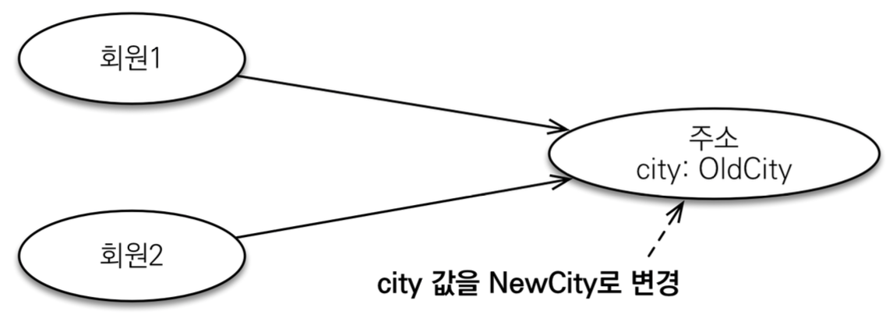
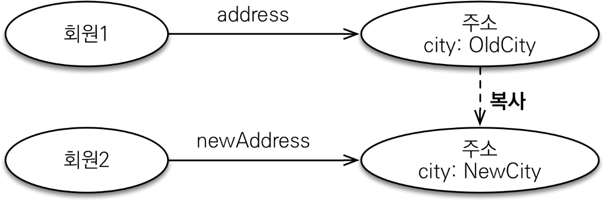

# 값 타입 과 불변 타입
## 값 타입
: 복잡한 객체 세상을 조금이나마 단순화 하려고 만든 개념이다. 따라서 값타입은 단순하고 안전하게 다룰수 있어야한다.

### 값 타입 공유 참조
- 임베디드 타입 같은 값 타입을을 여러 엔티티에서 공유하면 위험하다.
- 부작용(side effect)이 발생할 수 있다. &rarr; 이런거 찾기 엄청 어렵다.  


```java
Address address = new Address("city", "street", "10000");

Member member = new Member();
member.setUsername("member1");  
member.setHomeAddress(address);  
em.persist(member);

Member member2 = new Member();
member2.setUsername("member2");
member2.setHomeAddress(address); //  member의 homeAddress와 member2 의 homeAddress는 서로 같다 
em.persist(member2);

member.getHomeAddress.setCity("newCity"); // update 쿼리가 두개나간다. (member1과, member2에 대한 update쿼라)

```

### 값타입 복사
- 값 타입을 실제 인스턴스인 값을 공유하는 것은 위험하다.
- 대신 값(인스턴스) 를 복사하여 사용한다.  
  

```java
Address address = new Address("city", "street", "10000");

Member member = new Member();
member.setUsername("member1");  
member.setHomeAddress(address);  
em.persist(member);

Address copyAddress = new Address(address.getCity(), address.getStreet, address.getZipcode());

Member member2 = new Member();
member2.setUsername("member2");
member2.setHomeAddress(copyAddress); 
em.persist(member2);

member.getHomeAddress.setCity("newCity"); 

```

### 객체 타입의 한계
- 항상 값을 복사하여 사용하면 공유 참조로 인해 발생하는 부작용을 피할 수 있다.  
  &rarr; 휴먼에러 발생
- 문제는 임베디드 타입처럼 **직접 정의한 값타입은 자바의 기본 타입이 아니라 객체 타입이다.**
- 자바 기본 타입에 값을 대입하면 값을 복사한다.
- **객체 타입은 참조값에 직접 대입하는것을 막을 수 없다. &rarr; 객체공유를 막을 수 없다.**

## 불변 타입
: 생성시점 이후 절대 값을 변경할 수 없는 객체
> 불변이라는 작은 제약으로 부작용이라는 큰 재앙을 막을 수 있다.

- 객체 타입을 수정할 수 없게 만들면 기본 타입의 부작용을 원천 차단한다.
- 생성자로만 값을 설정하고 수정자(Setter)를 만들지 않으면 된다.
- 참고. Integer 과 String은 자바가 제공하는 대표적인 불변 객체