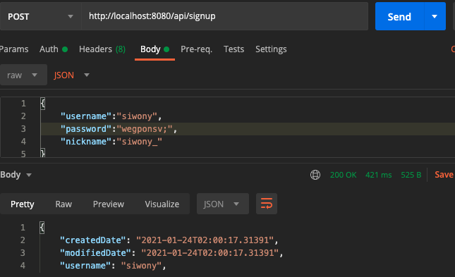

# JPA Auditing
### 사용동기
> MembershipApi를 만들면서 유저 가입일을 추가해보고싶었다.

### Auditing 활성화
자신의 SpringBoot Application class에 `@EnableJpaAuditing`를 추가한다.
```java
@EnableJpaAuditing //추가한것
@SpringBootApplication
public class Aouth2Application {

	public static void main(String[] args) {
		SpringApplication.run(Aouth2Application.class, args);
	}
}
```

### JPA Auditing으로 생성시간/수정시간 자동화
```java
@Getter
@MappedSuperclass
@EntityListeners(AuditingEntityListener.class)
public abstract class BaseTimeEntity {
    @CreatedDate
    private LocalDateTime createdDate;

    @LastModifiedDate
    private LocalDateTime modifiedDate;
}
```
`BaseTimeEntity` 클래스를 만들어 모든 Entity의 상위 클래스가 되어  
**Entity 들의 createDate, modifiedDate를 자동으로 관리하는 역활**
- ``@Getter`` : lombok이 해당 필드에 대한 기본 Getter를 생성해준다.
- ``@MappedSuperclass`` : JPA Entity 클래스들이 `BaseTimeEntity`를 상속할 경우  
필드들(createdDate, modifiedDate)도 칼럼으로 인식하도록 한다.
- ``@CreatedDate``: Entity가 생성되어 저장될 때 시간이 자동 저장된다.
- ``@LastModifiedDate`` : 조회한 Entity의 값이 변경할 때 시간이 자동저장된다

## 내 프로젝트에 적용
### UserEntity
```java
@Entity
@Table(name = "user")
@Getter
@Builder
@AllArgsConstructor
@NoArgsConstructor
public class User extends BaseTimeEntity{

    @JsonIgnore
    @Id
    @Column(name = "user_id")
    @GeneratedValue(strategy = GenerationType.IDENTITY)
    private Long userId;

    @Column(name = "username", length = 50, unique = true)
    private String username;

    @JsonIgnore
    @Column(name = "password", length = 100)
    private String password;

    @Column(name = "nickname", length = 50)
    private String nickname;

    @JsonIgnore
    @Column(name = "activated")
    private boolean activated;

    @ManyToMany
    @JoinTable(
            name = "user_authority",
            joinColumns = {@JoinColumn(name = "user_id", referencedColumnName = "user_id")},
            inverseJoinColumns = {@JoinColumn(name = "authority_name", referencedColumnName = "authority_name")})
    private Set<Authority> authorities;
}
```
유저의 기본적인 정보들이 담겨져 있는 User Entity 이다.  
미리 구현해놓은 singup API 를 사용하여 유저를 생성하면  
  
만들어진 시간과 수정시간이 정상적으로 데이터베이스에 입력이 되었다.  
(singup api는 DB에 저장된 값을 리턴해준다.)
