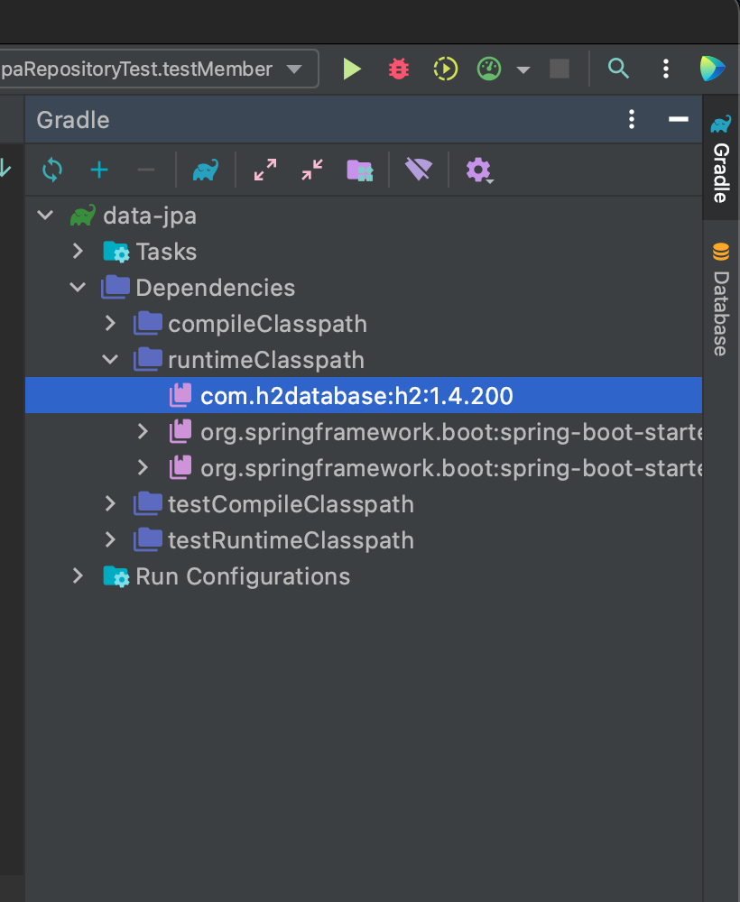
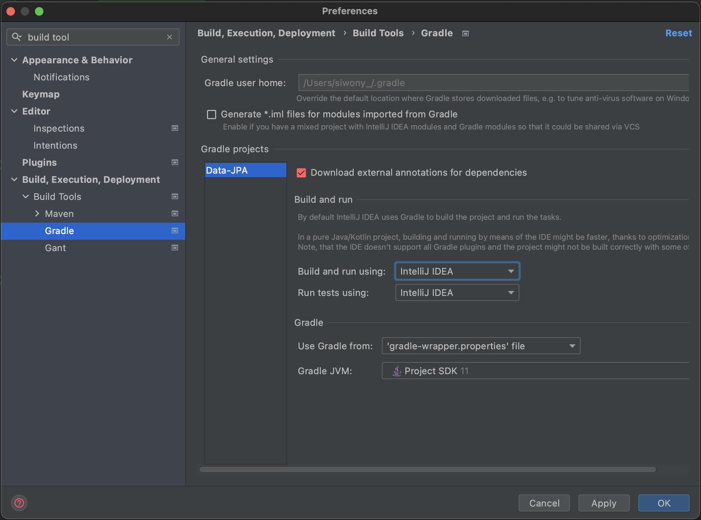

# Spring Data JPA
> 이 md는 [김영한씨의 실전! 스프링 데이터 JPA](https://www.inflearn.com/course/%EC%8A%A4%ED%94%84%EB%A7%81-%EB%8D%B0%EC%9D%B4%ED%84%B0-JPA-%EC%8B%A4%EC%A0%84/) 라는 강의를 보고 정리합니다.

### 이것은 마법같은 기술이다
>기존 Spring + JPA 만으로 생산능력이 높아졌지만 이 기술을 사용함으로써 더욱 생산성이 높아진다.
- 구현체 없이 Repository 만으로 구현이 가능하다.
- CRUD는 기본적으로 제공된다. &rarr; 개발자는 핵심 비즈니스 로직에만 집중하여 개발하자!
- 선택이 아닌 필수다! 실무에 무조건 적용된다.

### 하지만
- JPA를 너무 추상화 해버린다.
- JPA를 몰라도 사용할 수 있다.
- 문제는 문제가 생겨 해결할때 JPA의 기본 원리를 모르면 해결할 수가 없다.
- 결론은 JPA부터 공부하자.

## 실습환경
Spring initializer를 통해 실습 환경을 생성한다.  
[실습 환경 공유](https://start.spring.io/#!type=maven-project&language=java&platformVersion=2.4.5.RELEASE&packaging=jar&jvmVersion=11&groupId=com.study&artifactId=data-jpa&name=data-jpa&description=Demo%20project%20for%20Spring%20Boot&packageName=com.study.data-jpa&dependencies=web,data-jpa,h2,lombok) &larr; 링크를 타고들어가면 똑같은 필자와 똑같은 환경제공

#### Java11

#### Build Tool
- Gradle

#### Dependencies
- Spring Web 
- **Spring Data JPA**
- H2 Database - 2mb의 메모리를 사용하는 가장 좋은 실습용 DB
- Lombok - Getter, Setter와 같은것을 어노테이션으로 생성을 해주는 의존성

`./gradlew dependencies --configuration compileClasspath`  
프로젝트폴더에서 위와같은 명령어를 사용하면 자신이 사용한 dependencies를 확인할 수 있다.

### H2DB 설치 및 실행
1. 현재 추가된 Dependency 버전에 맞는 [H2DB](https://www.h2database.com/html/main.html)를 설치한다.  

    window유저는 window를 사용하면 되고, mac이나 linux환경을 사용하면 All Platform 을 선택해서 다운로드한 후 압축을 풀면된다.   

    h2DB의 Dependency는 intellij ultimate 기준 오른쪽에 다음과 같이 확인할 수 있다.  

    > 

2. 압축 해제후 `/src/bin/` 경로로 이동후 `./h2.sh`를 실행한다.   
   만약 permission denied로 실행을 못하면 `chmod 755 ./h2.sh`를 쉘에 입력한다.

3. 실행후 H2 콘솔에 JDBC URL에 `jdbc:h2:~/DBname` 과 같이 입력한다.  
   이는 DB파일을 생성하기 위해 최초 1번만 실행한다.
   > DBname은 자신이 원하는 이름으로 입력해라 
4. 그후 접속은 `jdbc:h2:tcp://localhost/~/DBname`

### application 설정파일
`application.properties` 파일의 이름을 `application.yml` 이와같이 변경한다. 그후 다음과 같이 입력한다.  

설정파일은 프로젝트 상위 폴더기준 `/src/main/resources`에 있다.

```yml
spring:
  datasource:
    url: jdbc:h2:tcp://localhost/~/DBname # 위에서 생성한 접속 URL
    username: sa
    password:
    driver-class-name: org.h2.Driver

  jpa:
    hibernate:
      ddl-auto: create # 애플리케이션 실행 시점에 테이블을 drop 하고, 다시 생성한다.
    properties:
      hibernate:
        #show_sql: true
        format_sql: true # 보여주는 쿼리를 예쁘게 포맷팅 해준다.

  logging.level:
    org.hibernate.SQL: debug
    #org.hibernate.type :trace  # 파라미터 바인딩된 부분까지 나온다.
```

### Spring Data JPA사용방법
#### 1. Entity 생성
`Member`
```java
@Entity @Getter
@NoArgsConstructor(access = AccessLevel.PROTECTED)
@ToString(of = {"id", "username", "age"})
public class Member {

    @Id @GeneratedValue
    @Column(name = "member_id")
    private Long id;
    private String username;

    public Member(String username){
        this.username = username;
    }
}
```

#### 2. Repository 생성
`MemberRepository`
- Repository는 interface로  `JpaRepository<Entity, EntityIdType>`를 상속 받는다.
```java
@Repository
public interface MemberRepository extends JpaRepository<Member, Long>
```

#### 3. Test 코드 작성
- Intellij에서는 테스트 코드를 작성할때 작성하고싶은 클레스에서 `cmd + n` 누르면 메뉴가 나타나는데 여기에서 test를 만들수 있다.
- 이렇게 만든 Test는 `/src/test` 에 있다.
```java
@SpringBootTest
@Transactional //JPA를 테스트하려면 트렌젝션 내에서 동작해야 된다. //import는 springframework trancational을 선택한다.
class MemberRepositoryTest {

    @Autowired MemberRepository memberRepo;

    @Test
    public void testMember(){
        Member member = new Member("memberA");
        Member savedMember = memberRepo.save(member);

        Member findMember = memberRepo.findById(savedMember.getId()).get();

        assertThat(findMember.getId()).isEqualTo(member.getId());
        assertThat(findMember.getUsername()).isEqualTo(member.getUsername());
        assertThat(findMember).isEqualTo(member);
    }

}
```

### 테스트가 느린이유
기본적으로 Intllij에서는 gradle를 거쳐 Test밑 빌드를 하기 떄문에 속도가 느리다.  

다음과 같이 설정한다
1. `Perference`에 들어가서 `build tool`를 검색한다.
2. 왼쪽 네비게이션 바에서 Build Tool 하위에 Gradle을 선택후
3. Build and run 에서 `Build and run using`과 `Run tests using` 를 Intllij IDEA로 선택한다.



### 쿼리를 더욱 이쁘게 날리자 - 이는 공부용으로 좋다.
dependency를 `build.gradle`에 `dependencies`안에 다음과 같이 추가한다.  

`build.gradle`
```gradle
dependencies {
 implementation 'com.github.gavlyukovskiy:p6spy-spring-boot-starter:1.5.7'
}
```