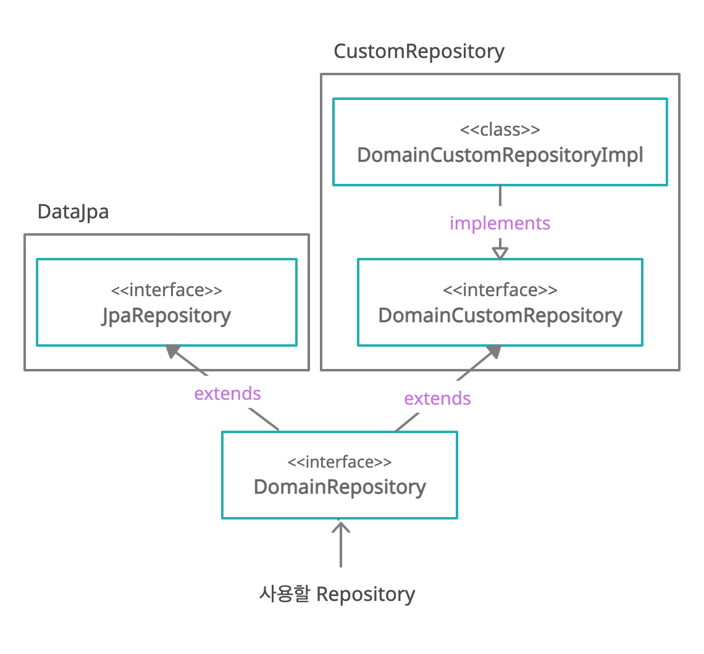

# Custom Repository
#### 왜 필요할까?  
개발을 하다 보면 Spring Data Jpa제공하는 Query Method만으로 부족한 경우가 있다.  
이를 위해 Custom한 Repository를 Data JPA와 함께 사용하고 싶을 경우 사용한다.  
> 대표적으로 Querydsl과 DataJpa와 같이 사용하는 경우가 있다.

#### 대략적인 워크플로우
보통 Spring Data Jpa를 사용할 경우 `JpaRepository`를 상속받아서 사용한다.  
CustomRepository를 생성하기 전에 `xxRepository`가 `JpaRepository`를 상속받는 구조이다

1. 사용할 `DomainRepository`에 `JpaRepository`와 `xxCustomRepository`를 extends받는다.
2. `xxCustomRepository`를 구현한다. (구현체 `xxCustomRepositoryImpl`)
3. **xxRepository** 에서 `DomainRepository`와 `xxCustomRepository`를 사용할 수 있다.

### CustomRepository의 규칙
- Custom Repository Interface 형식 : `**CustomRepository`
- Custom Repository Implements 형식 : `**CustomRepositoryImpl`