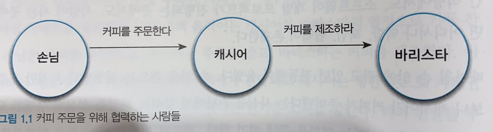
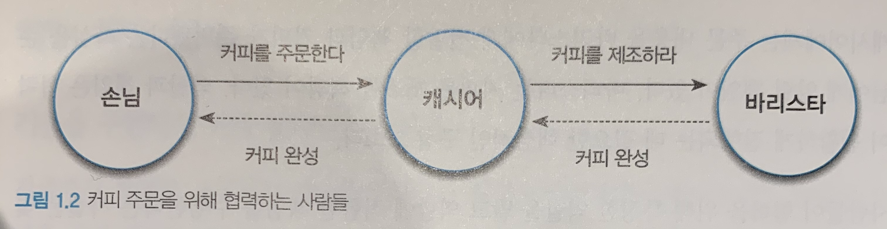

# 협력하는 객체들의 공동체
>시너지를 생각하라. 전체는 부분의 합보다 크다. - 스티븐 코비(Stephen R. Covey)

## Intro

### 객체지향 프로그래밍?
객체지향을 처음 접하면 다음과 같은 설명을 마주하게 된다.
> 객체지향이란 실세계를 직접적이고 직관적으로 모델링할 수 있는 패러다임

#### 객체지향 프로그래밍이란..
1. 현실속에 존재하는 사물을 최대한 유사하게 모방하여 소프트웨어 내부로 옮겨오는 작업이다.
2. 그 결과물인 객체지향 소프트웨어는 실세계의 투영이며,  
3. 객체란 현실 세계에 존재하는 사물에 대한 추상화 라는것이다.

이와같은 설명은 객체지향 프로그래밍의 **철학적인 개념**을 설명하는데 적합하다.

#### 하지만..
- 유연하고 실용적인 관점에서 객체지향 분석, 설계를 설명하는데 적합하지 않다.  
- 에초에 개발하면서 객체에 직접적으로 대응하는 현실의 객체를 발견확률이 낮다.
  >발견하더라도 일반적으로 객체와 사물 간의 개념적 거리는 유사성을 찾기 어렵다.  
  >심지어 소프트웨어가 반영해야 하는 객관적인 실세계가 존재한다는 아이디어 조차 논란의 여지가 있다.

#### 객체지향의 목표
: 실세계를 모방하는것이 아닌 새로운 세계를 창조하는것이다.
> 네트워크 방화벽이 건물과 연관될 필요가 있는가?

#### 소프트웨어 개발자의 역활
1. 단순히 실세계를 소프트웨어 안으로 옮겨담는것이 아니다.
2. **고객과 사용자를 만족시킬 수 있는 신세계를 창조하는것이다.**

#### 비현실적이라면서 왜 실세계에 대해 비유를 할까?
객체지향의 다양한 측면을 이해하고 학습하는데 매우 효과적이기 떄문이다.

**객체를 스스로 생각하고 스스로 결정하는 현실 세계의 생명체에 비유하는것**  
- 상태와 행위를 '캡슐화(encapsulation)'하는 소프트웨어 객체의 '자율성(autonomous)'을 설명하는데 효과적이다.

**사람들이 암묵적인 약속과 명시적인 계약을 기반으로 서로 협력하여 목표를 달성해 나아가는 과정은**
- '메시지(message)'를 주고받으며 공동의 목표를 달성하기 위해 '협력(collaboration)' 하는 객체들의 관계를 설명하는데 적합하다.

**실세계의 사물을 기반으로 소프트웨어 객체를 식별하고 구현까지 이어간다는 개념은**
- 객체지향 설계의 핵심 사상인 '연결완전성(seamlessness)'을 설명하는 데 적합한 틀을 제공한다.

### 앞으로 이책은 실세계 모방이라는 개념을 통해 객체지향의 다양한 개념을 설명할 것이다.

## 01. 협력하는 사람들
### 커피 공화국의 아침
1. 손님은 커피를 주문하고
2. 캐시어는 주문을 받고
3. 바리스타는 커피를 제조한다.
4. 바리스타의 제조가 끝난 커피는 다시 캐시어에 전달되고
5. 손님에게 커피가 준비됐다는 소식을 알린다.

이와같이 커피 한잔을 주문하는 이 작은 이벤트를 완성하려면 **여러 사람의 조율과 조화가 필요하다.**

모든 음료 주문은 
1. 손님이 커피를 주문하고
2. 캐시어가 주문을 받고
3. 바리스타가 커피를 제조하는 과정을 거친후 완료된다

결국 커피를 주문하고 제조하는 과정은 **역활, 책임, 협력**이라는 세 가지 개념이 조화를 이루며 만들어 낸것이다.  

#### 카페를 통한 역활, 책임, 협력
따뜻한 커피와 함께할 수 있는 소박한 아침 시간의 여유를 누릴 수 있는 이유는 
- 커피를 주문하는 손님
- 주문을 받는 캐시어
- 커피를 제조하는 바리스타

와 같은 역활이 존재하기 때문에 가능하다.

#### 손님, 캐시어, 바리스타는 주문한 커피를 손님에게 제공하기 위해 협력하는 과정에서 자신이 맡은 바 책임을 다한다.

1. 손님은 카페인을 채우기 위해 커피를 주문할 책임을 수행한다.
2. 캐시어는 손님의 주문을 받는 책임을 수행한다.
3. 바리스타는 주문된 커피를 제공하는 책임을 수행한다.
4. 마지막으로 손님은 커피를 캐시어로부터 받아 카페인을 체운다

이러한 과정으로 커피주문 이라는 협력관계는 끝이났다.

역활, 책임, 협력은 우리가 삶을 영위하기 위해 다른 사람과 접촉하는 모든곳에 존재 한다.

결국 객체지향에서 가장중한 것은 **역활, 책임, 협력이다.**

### 요청과 응답으로 구성된 협력
> 사람들은 스스로 해결하지 못하는 문제와 마주치면 문제 해결에 필요한 지식을 할고 있거나  
> 서비스를 제공해줄 수 있는 사람에게 도움을 **요청(request)** 한다.

- 일반적으로 하나의 문제를 해결하기 위해 다수의 사람 혹은 역활이 필요하다
- 한사람의 요청이 또 다른 사람에게 대한 요청을 유발하는 것이 일반적이다.  
- **즉 요청은 연쇄적으로 발생한다.**

#### 커피 주문을 위해 협력하는 사람들

- 커피 주문이라는 협력은 손님이 캐시어에게 원하는 커피를 주문하면서 시작된다.  
  &rarr; 손님이 캐시어에게 주문하는 것은 커피를 재공해 줄 것을 캐시어에게 요청하는 것이다.

- 주문을 받은 캐시어는 주문 내역이 기록된 컵을 전달함으로써 바리스타에게 주문된 커피를 제조해줄 것을 요청한다.

요청을 받은 사람은 주어진 책임을 다하면서 필요한 지식이나 서비스를 제공한다.  
&rarr; 다른 사람의 요청에 **응답(response)** 한다.  

응답 역시 요청의 방향과 반대 방향으로 연쇄적으로 전달된다.

- 바리스타는 커피를 제조한 후 제조가 완료됐음을 캐시어에게 알려 주는 것으로 캐시어의 요청에 응답한다.

- 캐시어는 진동벨을 울려 손님에게 주문된 커피가 준비됐음을 알림으로써 손님의 주문에 응답한다.

요청과 응답을 통해 다른 사람과 **협력(collaboration)** 할 수 있는능력은  
&rarr; 거대하고 복잡한 문제를 해결할 수 있는 공동체를 형성할 수 있게 만든다.

**협력의 성공은 특정한 역활을 맡은 각 개인이 얼마나 요청을 성실히 이행하는가에 달려있다.**

