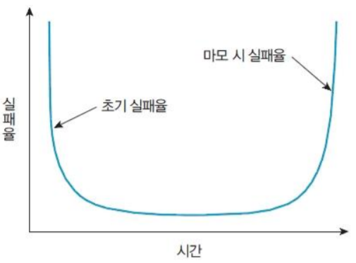
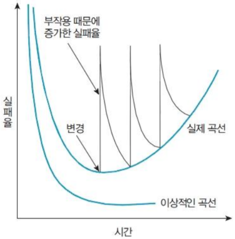

# 01. 소프트웨어 공학 소개
## 01 - 1 소프트웨어의 이해
### 1. 소프트웨어란?
: **프로그램 + 개발 과정에서 생성되는 모든 산출물(자료구조, DB구조, 테스트 결과등...)**
- 각 단계에서 만들어지는 문서와 사용자 메뉴얼 등도 포함이다.

> 프로그램: 프로그래밍한 `원시 코드 - source code`를 말한다.

### 2. 소프트웨어의 분류
#### 관리 소프트웨어
: 자료를 받아들여 가공 후 정보를 제공하는 소프트웨어이다.
- 주로 DB에 **자료를 저장**후 **검색**을 통해 사용자가 원하는 형태로 제공
- ex. 인터넷 뱅킹, 대학 종합정보시스템 등..

#### 제어 소프트웨어
: **센서**를 이용하거나 **기기들의 동작**을 **제어**하는 프로그램
- ex. 교통신호 제어, 의료기기 제어 등...
  
#### 임베디드 소프트웨어
: **장비나 기기에 내장된 형태**의 소프트웨어
- ex. 가전제품 등...

### 3. 소프트웨어 특징
#### 제조가 아닌 개발
- SW는 개발이 된다. 
  > 조립만 하면 끝나는 하드웨어와 다르다.
- SW는 개발경력에 따라 생성성이 다르다.

#### 소모가 아닌 품질 저하
하드웨어
- 하드웨어는 초기 실패율이 매우 높지만 오류 해결 후 큰 문제없이 오래 지속된다.
- 마모가 되면 실패율이 높아진다.

하드웨어의 실패 곡선(`욕조 곡선 - bathub curve`)  

소프트웨어
- 하드웨어와 다르게 닳지 않는다.
  > 오류를 해결한 후 사용기간 내 큰 문제없이 사용가능하다.
- 하지만 사용 시작 단계부터 사용자의 요구가 계속 발생한다.
  > 운영체제 등, 설치환경도 달라 질 수 있음
- 변경사항이 발생하면 이로 인한 `부작용 - side effect`으로 인해 오류와 실패률이 올라갈 수 있다.

소프트웨어의 이상적인/실제 실패 곡선

### 4. 소프트웨어의 당면 문제
#### 소프트웨어 개발의 느린 발전 속도
- HW에 비하면 개발속도가 상당히 느리다.
    > 개인용 PC성능과 SW발전 속도를 비교하면 차이가 난다.

#### 새로운 소프트웨어에 대한 사용자 요구의 증가 
- SW는 생산과 같이 공장에서 찍어내는게 아니라 A부터 Z까지 개발 해야 한다.
- 새로운 SW에 대한 사용자 요구가 날로 증가하지만 발전속도는 만족을 못시키고 있다.
- 하드웨어처럼 조립하는 방식으로 개발하기에는 표준화 등 해결해야 하는 문제가 많다.

 #### 관리 기술의 부분적 활용
- 관리가 효율적으로 이루어져야 좋은 품질의 SW를 적기에 맞추어 납품가능하다.
- SW를 개발할 때 주어진 예산내에서 수행할 수 있도록 비용을 관리하고,
- 정해진 기간 내에 마칠 수 있도록 스케줄을 관리해야 한다.

### 5. 소프트웨어 개발의 어려움
> 부제 - SW공학의 필요성
#### 개발 과정이 복잡하다.
- 무엇이든지 복잡하면 문제가 많이 발생한다.
- **SW공학은 개발의 복잡함을 줄이기 위한 방법과 기술을 제공한다.**

#### 참여 인력이 많다.
- 인력이 많으면 의사소통 경로가 많아져 의사 결정 과정이 복잡할 수 있다.
- 인력에 따른 변화가 많이 발생할 수 있다
- **SW공학은 개발에 참여하는 팀을 구성하고 관리하는 효율적인 방법을 제시한다.**

#### 개발 기간이 길다.
- 개발 기간이 길면 진행 상황을 파학하기 쉽지 않고 개발 비용 산정이 어렵다
- **SW공학에서는 프로젝트를 효율적으로 관리하기 위한 `프로젝트관리지식체계 - PMBOK`를 소개한다.**

 ## 01 - 2 공학과 소프트웨어 공학의 이해
 ### 공학
 - 정해진 **기간과 주어진 비용**이라는 제안이 생긴다.
 - 발전하면 **문제 해결을 위한 기술**이 축적된다.
 - 실무에 적용하여 **문제 해결의 절차를** 만든다
 - **절차의 개선으로 표준**을 만들어낸다.

### 소프트웨어 공학
: 품질 좋은 SW를 경제적으로 개발하기 위해 `계획을 세우고`, `개발하며`, `유지 및 관리` 하는 전 과정에서 `공학`, `과학 및 수학적 원리`와 `방법`을 적용하여 필요한 **이론과 기술 및 도구들에 관해 연구**하는 학문이다.
- SW개발의 어려움 해결한다.
- 효율적인 개발을 통해 생상성을 향상시킨다.
- 사용하자가 만족하는 고품질 SW제품을 만들기 위함이다.

#### 소프트웨어 개발 생명주기 - SDLC(Software Development Life Cycle)
**계획 &rarr; 분석 &rarr; 설계 &rarr; 구현 &rarr; 테스트 &rarr; 유지보수**