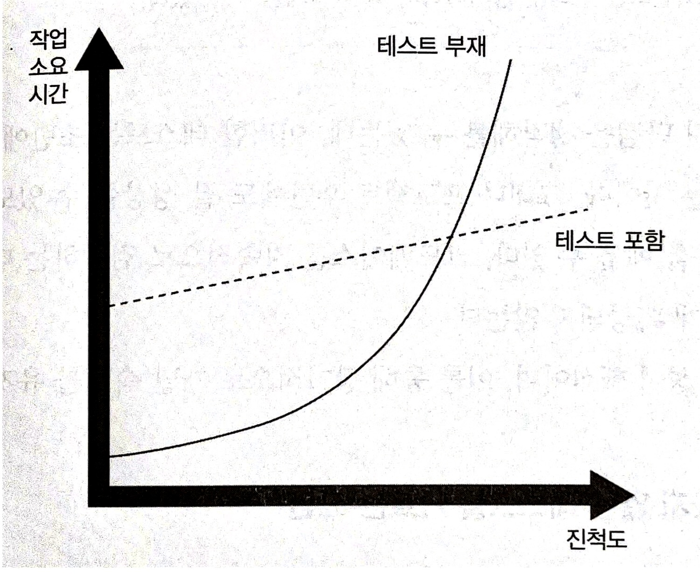
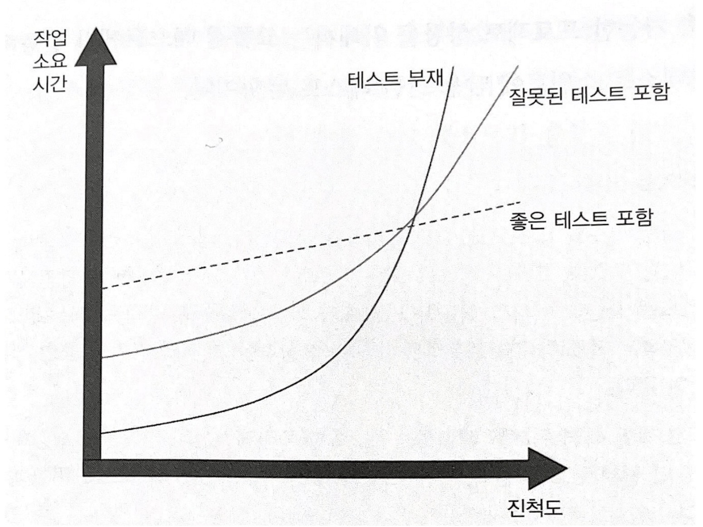

# 1장 단위테스트의 목표
## 요약
해당 장에서는 단위테스트의 목표와 현재 상황, 우리가 주로 사용하는 코드 커버리지 지표(코드 커버리지, 분기 커버리지)에 대해 알려주고 성공적인 테스트-스위트(test-suite)에 대한 특성을 알려준다.

> #### 테스트 스위트
> 테스트 실행 목적으로 그룹화된 테스트 케이스의 컬렉션이다.

이 책에서 가장 흥미롭다고 느낀 내용은 테스트 코드도 관리해야 할 소프트웨이고, 주기적으로 관리(리펙토링 등...)를 해야 한다는 점이였다.

## 1. 단위테스트의 목표
단위테스트의 소프트웨어 프로젝트의 **지속 가능**한 성장을 가능하게 하는 것 이다.

> 소프트웨어가 더 나은 설계로 이어지는 것은 단위테스트의 부수효과 중 하나에 불과하다.



테스트가 없는 테스트는 빨리 시작할 수 있지만 시간이 지나면서 점점 더 많은 시간을 들여야 처음에 보여준 것 과 같은 정도의 진척을 낼 수 있다.

개발 속도가 빠르게 감소하는 현상을 `소프트웨어 엔트로피(software entropy)`라고 한다.
- 코드베이스에서 무언가를 변경할 때마다 무질서도(엔트로피)는 증가한다.
- 지속적인 정리와 리팩터링 과 같은 적절한 관리를 하지 않으면 시스템은 점점 더 복잡해지고 무질서한다.

테스트는
- 안정망 혁할
- 회귀에 대한 보험을 제공하는 도구
- 하지만, 초반에 노력이 필요하다.

### 좋지 않는 테스트
좋지 않는 테스트도 초반에는 코드가 나빠지는 것을 늦출 수 있지만, 거시적인 관점에서는 테스트를 작성하지 않았을 때와 같다.



단위 테스트 목표를 달성하려면 테스트의 가치와 유지 비용을모두 고려해야 한다. 비용요소는 다음과 같은 다양한 활동에 필요한 시간에 따라 결정된다.
- 기반 코드를 리팩터링 할 때 테스트도 리팩터링하라.
- 각 코드 변경 시 테스트를 실행해라
- 테스트가 잘못된 경고를 발생시킬 경우 처리하라.
- 기반 코드가 어떻게 동작하는지 이해하려고 할 떄는 테스트를 읽는 데 시간을 투자하라.

지속 가능한 프로젝트 성장을 위해 **고품질 테스트에만** 집중해야 한다.

> 테스트 코드는 자산이 아니라 책임이다. 코드가 많아질수록 소프트웨어 내 잠재적인 버그에 노출되는 표면적이 더 넓어지고 프로젝트 유지비가 증가한다.  
> 테스트 코드도 결국 코드이다.  
> 제품코드 뿐만 아니라 테스트 코드도 유지보수가 필요하다.

## 3. 테스트 스위트 품질 츨정을 위한 커버리지 지표
단순 커버리지 지표만으로 테스트 스위트 품질을 효과적으로 측정하는데 사용될 수 없다.


### 코드 커버리지
$$코드 커버리지(테스트 커버리지) = \frac{실행 코드 라인 수}{전체 라인 수}$$

코드 커버리지가 낮으면 테스트가 충분치 않다는 증거이나, 100%라고 해도 반드시 양질의 테스트 스위트임을 보장하지 않는다.

```kotlin
fun isStringLong(input: String): Boolean{
    if(input.length > 5)
        return true
    return false
}

fun test(){
    val result = isStringLong("abc")
    isEqual(false, result)
}
```
여기서 중괄호를 포함한 메서드 전체 라인 수는 5이고 true를 반환하는 구문을 제외하면 4줄이 실행된다.
$4/5 = 0.8$ 이다.

이를 다음과 같이 리팩토링하면 어떻게 될까?
```kotlin
fun isStringLong(input: String): Boolean{
    return input.length > 5
}
```
코드 커버리지가 100%로 증가했다.

단지 메서드 내 코드를 바꿨을 뿐인데 해당 테스트가 검증하는 결과 개수는 여전히 같다.

단지 테스트 코드에서 테스트 할 코드를 실행하고 검증을 아예 하지 않을 수 있다.

### 분기 커버리지
분기 커버리지는 제어 구조에 중점을 둔다.
$$분기 커버리지 = \frac{통과 분기}{전체 분기 수}$$

위에 작성했던 테스트 코드를 분기 커버리지를 적용하면 50%이다.

분기 커버리지는 분기 개수만 다루지만, 해당 분기를 구현하는 데 얼마나 코드가 필요한지 고려하지 않는다.

### 커버리지 지표의 문제점
- 테스트 대상 시스템의 모든 가능한 결과를 검증한다고 보장할 수 없다.
- 외무 라이브러리의 코드 경로를 고려할 수 있는 커버리지 지표는 없다.

> 병원에 있는 환자가 열이 높으면 열이 난다는 것을 의미할 수 있다.
> 하지만 병원은 환자의 적절한 체온을 목표로 해서는 안된다.
> 단순히 목표가 되면 환자 옆에 에어컨을 설치해서 '효율적으로' 빨리 끝낼 수 있다.

시스템의 핵심 부분은 커버리지를 높게 두는 것이 좋지만 이 높은 수준을 요구사항으로 삼는 것은 좋지 않다.

## 4. 무엇이 성공적인 테스트 스위트를 만드는가?
### 1. 개발 주기에 통합돼 있음
모든 테스트는 개발 주기에 통합돼야 한다. 
이상적으로는 코드가 변경될 때마다 아무리 작은 것이라도 실행해야 한다.

### 2. '코드베이스'에서 가장 중요한 부분만을 대상으로 함
대부분의 애플리케이션에서 가장 중요한 부분은 비즈니스 로직(도메인 모델)이 있는 부분이다.
비즈니스 로직 테스트가 시간 투자 대비 최고의 수익을 낼 수 있다.
> 레버리지가 높다.

인프라 코드에 복잡하고 중요한 알고리즘이 있을 수 있으므로 많이 테스트하는게 좋지만, 초첨은 도메인 모델에 머물러야 한다.

이게 가능하려면 도메인 모델을 코드베이스 중 중요하지 않은 부분과 분리해야 한다.

### 3. 최소 유지비로 최대 가치를 끌어냄
이게 핵심이다.

테스트를 빌드 시스템에 통합하는 것만으로 충분하지 않으며, 도메인 모델에 높은 테스트 커버리지를 유지하는 것도 충분하지 않다. 또한 가치가 유지비를 상회하는 테스트 스위트에 유지하는 것이 중요하다.

이 마지막 속성은 두 가지로 나눌 수 있다.
- 가치 있는 테스트 식별하기
  - 더 나아가 가치가 낮은 테스트 식별하기
- 가치 있는 테스트 작성하기

#### 가치 있는 테스트 식별하기
가치가 높은 테스트를 식별하려면 `기준틀(frame of reference)`이 필요하다.

#### 가치 있는 테스트 작성하기
가치 있는 테스트를 작성하려면 코드 설계 기술도 알아야 한다.

단위 테스트와 기반 코드는 서로 얽혀 있으므로 코드베이스에 노력이 많이 기울이지 않으면 가치 있는 테스트를 만들 수 없다.

> 좋은 곡을 식별하는 것과 작곡하는 것은 다르다.

# References
- 테스트 스위트
  - https://en.wikipedia.org/wiki/Test_suite
  - https://www.ibm.com/docs/ko/elm/6.0.5?topic=testing-test-case-test-suite-overview
