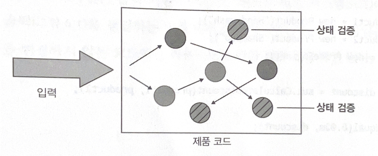

# 단위테스트 스타일
## 요약
단위테스트의 스타일은 3가지로 나뉜다.
1. 상태 기반
2. 출력 기반
3. 통신 기반

여기서 출력 기반 스타일의 테스트는 가장 품질이 좋지만 모든 코드에 적용할 수 없고 순수 함수 방식으로만 작성된 코드에 사용할 수 있다.

통신 기반 테스트는 간혈적으로 사용해야 한다.


## 단위 테스트의 세 가지 스타일
### 1. 출력 기반 테스트


SUT에 입력을 넣고 생성되는 출력을 검증하는 방식이다.
- 전역 상태나 내부 상태를 변경하지 않는 코드에만 적용된다.
- 함수형(functional)이라고 한다.
  - 함수형 프로그래밍 에 뿌리를 두고 있다.

### 2. 상태 기반 스타일 정의


작업이 완료된 후 시스템 상태를 확인하는 것이다.

상태 기반 스타일에서 상태란 SUT나 협력자 중 하나, 또는 DB나 파일시스템과 같은 프로세스 외부 의존성의 상태를 의미할 수 있다.

#### 예제
```kotlin
class Order{
    private val _products: MutableList<Product> = mutableListOf()
    private val products: List<Product>
        get() = _products

    fun addProduct(product: Product){
        _products.add(product)
    }
}
```