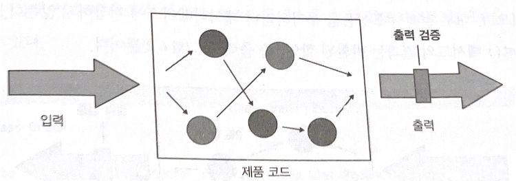

# 단위테스트 스타일
## 요약
단위테스트의 스타일은 3가지로 나뉜다.
1. 상태 기반
2. 출력 기반
3. 통신 기반

여기서 출력 기반 스타일의 테스트는 가장 품질이 좋지만 모든 코드에 적용할 수 없고 순수 함수 방식으로만 작성된 코드에 사용할 수 있다.

통신 기반 테스트는 간혈적으로 사용해야 한다.


## 단위 테스트의 세 가지 스타일
### 1. 출력 기반 테스트


SUT에 입력을 넣고 생성되는 출력을 검증하는 방식이다.
- 전역 상태나 내부 상태를 변경하지 않는 코드에만 적용된다.
- 함수형(functional)이라고 한다.
  - 함수형 프로그래밍 에 뿌리를 두고 있다.

### 2. 상태 기반 스타일 정의


작업이 완료된 후 시스템 상태를 확인하는 것이다.

상태 기반 스타일에서 상태란 SUT나 협력자 중 하나, 또는 DB나 파일시스템과 같은 프로세스 외부 의존성의 상태를 의미할 수 있다.

#### 예제
```kotlin
class Order{
    private val _products: MutableList<Product> = mutableListOf()
    private val products: List<Product>
        get() = _products

    fun addProduct(product: Product){
        _products.add(product)
    }
}

@Test
fun `Adding a product to an order`(){
    val product = Product("Hand wash")
    val sut = Order();

    sut.addProduct(product);

    Assertions.assertEquals(1, sut.products.count())
    Assertions.assertEquals(product, sut.products[0])
}
```
addProduct를 검증하는게 아닌 Order의 상태값인 products를 검증했다.

### 3. 통신 기반 스타일 정의
목을 사용해 테스트 대상 시스템과 협력자 간의 통신을 검증한다.

```kotlin
@Test
fun `Sending a greetings eamil`(){
    val emailGatewayMock: EmailGateWay = mockk()
    val sut = new Controller(emailGatewayMock)
    val email = "user@email.com"
    every{
        emailGatewayMock.sendGreetingsEmail(email)
    } just run

    sut.greetUser(email)

    verify(exactly = 1){
        emailGatewayMock.sendGreetingsEmail(email)
    }
}
```

## 단위테스트 스타일 비교
|                             | 출력 기반 | 상태 기반 |통신 기반|
|-----------------------------|---------|---------|------|
|리펙터링 내성을 지키기 위해 필요한 노력|   낮음   |   중간   |  중간 |
|유지비                         |   낮음   |   중간   |  높음 | 

### 결론
출력 기반 테스트를 선호하자. 
- 코드를 순수함수로 바꾸면 출력 기반 테스트로 변경할 수 있다.
  - 하지만 모든 코드를 순수 함수로 바꿀 수 없다.