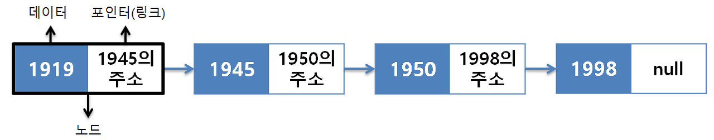
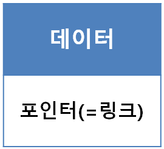
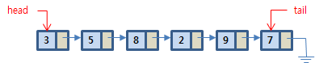
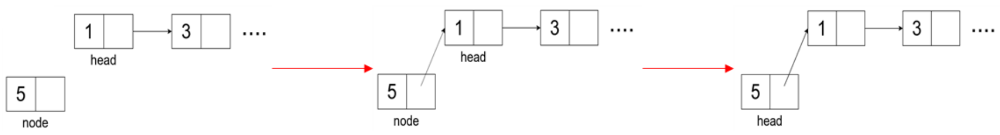
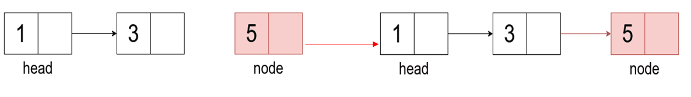
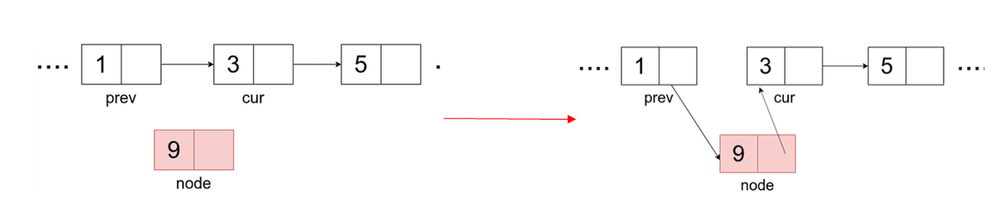
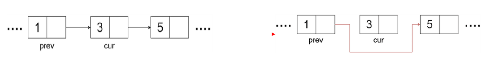

# 연결 리스트 - Linked List
: 연결 리스트는 노드들로 이어진 리스트를 말한다.  
#### 연결리스트의 예 - 단일 연결 리스트

- 고정 크기의 배열 등에 의해 구현된 선형 리스트의 단점을 보완한 자료구조이다.
  > 크기를 동적으로 변경할 수 있다.
- 노드는 보통 데이터를 저장하는 부분과, 다음 노드를 가르키는 부분으로 구성된다.
- `연결 리스트`는 처음과 끝을 가르키는 포인터들을 이용해 리스트를 관리한다.
- 삭제/삽입 에 데이터 이동의 필요가 없다.
- `단일 연결리스트`, `원형 연결 리스트`, `이중 연결 리스트` 가 있다.

#### 노드의 구조

- 노드는 데이터를 갖고있는 데이터 필드와 리스트의 다음 원소를 가리키는, 링크필드(포인터)로 구성된다.

### 연결 리스트 특징
- 포인터로 연결한다.
  > 원소들이 메모리 내 어느 위치에도 가능
- 크기가 가변적이다.
  > 메모리 허용하는 만큼 커질 수 있음
- 원소의 순서 유지되고, 순차 접근을 한다.
  > 원소의 순서는, 링크를 이용하여 유지시켜 준다.
- 선형 리스트에 비해 구현이 어렵다.
  > 포인터의 저장 필요에 저장공간이 조금더 많이 소요되나, 빈공간을 거의 없게 할 수 있다.
- 다른 자료구조(추상자료형, ADT)의 기반이 된다.
  > 큐, 스택, 해시 테이블 등

## 1. 단일 연결리스트 - Singly Linked List
: 포인터를 통해 단방향으로 다음 노드를 가르키는 자료구조이다.  

- 모든 원소가 데이터, 링크 쌍으로 이루어져 있다.
- 원소의 삽입과, 삭제가 용이하다.
- 탐색시 순차적으로 접근해야 하므로 비교적 느리다. 
  > 시간 복잡도: `O(N)`

### 삽입 / 삭제
> 일반적으로 삽입/삭제 연산은 상수, `O(1)` 시간복잡도를 갖는다.  
> 하지만 현실적인 삽입/삭제 연산은 탐색이 포함되므로 결국 O(1 + n)즉, O(n)의 시간복잡도를 가진다.

#### 1. 맨 앞에 노드 삽입
> Head만 있으면 되므로 `O(1)`의 시간복잡도를 갖는다.

1. `새로운 노드`를 생성한다.
2. `새로운 노드`의 `링크`를 `헤더` 다음으로 가리키도록 한다.
3. `헤더의 링크`는 `새로운 노드`를 가르키게 한다.  

#### 2. 맨 뒤에 노드 삽입
> Tail이 있으면 `O(1)`의 시간 복잡도, 없으면 O`(n)`의 시간복잡도를 가진다.

1. `새로운 노드`를 생성한다.
2. `마지막 노드`를 찾는다.
3. `마지막 노드`는 `새로운 노드`를 가르키게 한다

#### 3. 원하는 곳(index)에 노드 삽입
> 원하는 노드를 탐색 후 삽입하므로 시간복잡도 `O(n + 1)`즉, `O(n)`를 갖는다.

1. `새로운 노드`를 생성한다.
2. `특정 인덱스의 노드(cru)`와 그 `이전 노드(prev)`를 찾는다.
3. `prev`가 새로운 노드를 가르키고, `새로운 노드`가 `cur`를 가리키도록 한다.

#### 4. 특정 노드 삭제
> 원하는 노드를 탐색 후 삭제하므로 시간복잡도 `O(n + 1)`즉. `O(n)`를 갖는다.

1. `삭제할 노드`를 없앤다.
2. `삭제할 노드`의 `이전 노드의 포인터`를 `삭제할 노드`의 `다음 노드`로 지정해주면 된다.

## 2. 이중 연결 리스트 - Doubly Linked List
: 단일 연결 리스트에 앞 노드의 위치를 저장하는 포인터를 추가한 자료구조이다.

