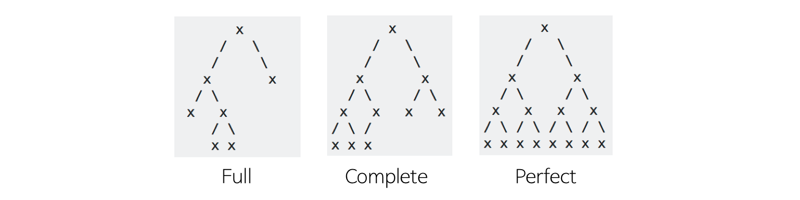
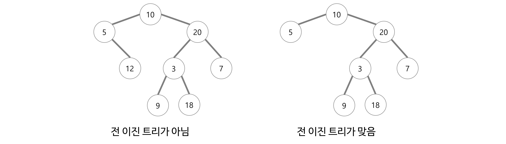

# 트리 - Tree
`노드 - node`로 이루어진 자료구조이다.
- `사이클 - cycle`이 없는 하나의 `연결 그래프 - Connected Graph`
- 혹은, `DAG - Directed Acyclic Graph, 방향성이 있는 비순환 그래프`의 한 종류이다.

만약 하나의 노드가 여러개의 자식노드를 가지는 불규칙한 트리의 경우 node를 구현하기가 상당히 복잡해진다.  
이러한 이유로 실제로는 하나의 노드가 2개의 자식노드만 가지는 **이진트리가 많이 사용된다.**

### 트리의 특징
- **계층 모델**이다.
  > 예시로 디렉토리가 있다.
- 노드가 N개인 트리는 항상 `N-1`개의 간선을 가진다.
- 루트에서 어떤 노드로 가는 경로는 유일하다.

### 트리의 구성요소
`노드 - node`와 그 노드들을 연결하는 `간선 - edge`들로 구성되어 있다,

### 트리의 조건
- 트리는 하나의 루트 노드를 갖는다
- 루트 노드는 0개 이상의 자식 노드를 갖고 있다.
- 그 자식 노드 또한 0개 이상의 자식 노드를 갖고있고, 이는 반복적으로 정의된다.
- 트리에는 `사이클 - cycle`이 존재할 수 없다.

## 트리와 관련된 용어

- `루트 노드 - root node` : 부모가 없는 노드
  > 트리는 하나의 루트 노드만을 가진다.
- `단말 노드 - leaf node` : 자식이 없는 노드
- `내부 노드 - internal node` : 자식이 있는 노드
  > 즉 단말 노드가 아닌 노드를 칭한다.
- `간선 - edge` : 노드를 연결하는 선
  > link, branch 라고도 부름
- `형제 - sibling` : 같은 부모를 가지는 노드
- `노드의 크기 - size` : 자신을 포함한 모든 자손 노드의 개수
- `노드의 깊이 - depth` : 루트에서 어떤 노드에 도달하기 위해 거쳐야 하는 간선의 수
- `노드의 레벨 - level` : 트리의 특정 깊이를 가지는 노드의 집합
- `노드의 차수 - degree` : `하위 트리 수 / 간선 수 = 각 노드가 지닌 가지의 수`
- `트리의 차수 - degree of tree` : 트리의 최대 차수
- `트리의 높이 - heigth` : 루트 노드에서 가장 깊숙히 있는 노드의 깊이

# 이진 트리 - Binary Tree
이진트리는 **트리를 구성하는 `노드들의 최대 차수 - degree`가 `2`인 노드들로 구성**되는 트리이다.
- 이진트리의 레벨 i에서 가질 수 있는 최대 노드의 수는 2i 이다. `i >= 0`
- 깊이가 k인 이진트리가 가질 수 있는 최대 노드의 수는 2k - 1 이다. `k >= 1`
- 이진 트리의 종류
  - `완전 이진 트리 - Completable Binary Tree`
  - `전 이진 트리 - Full Binary Tree`
  - `포화 이진 트리 - Perfact Binary Tree`

## 이진 트리의 종류

### 1. 완전 이진 트리 - Complate Binary Tree

1. 트리를 구성하고 있는 임의의 두 단말 노드의 레벨 차이가 1이하
2. 마지막 레벨을 제외한 모든 레벨에 존재할 수 있는 노드를 갖고 있다.
3. 왼쪽에서 오른쪽으로 채워진다.
- 배열을 사용해 효율적으로 표현할 수 있다.

### 2. 전 이진 트리 - Full Binary Tree

- 전 이진트리는 모든 노드가 0개 또는 2개의 자식 노드를 갖는 트리이다.

### 3. 포화 이진 트리 - Perfect Binary Tree
- 모든 레벨에 노드가 차있는 상태로 최대 노드 수인 `2^k-1`개로 채워져 있는 트리
- 전 이진 트리이면서 완전 이진 트리인 경우

## 2진 트리순회
트리는 선형 구조의 자료구조가 아니기 때문에 노드들을 방문할 규칙을 선택해야 한다.

- 표준적인 방법은 전위, 중위, 후위 순회 방법이 있다.
- 재귀호출을 통해 이를 구현한다.

### 전위 순회 - Pre order Traversal
> 루트 &rarr; 왼쪽 서브트리 &rarr; 오른쪽 서브 트리 

### 중위 순회 - In-order Traversal
> 왼쪽 서브트리 &rarr; 루트 &rarr; 오른쪽 서브트리

### 후위 순회 - Post-order Traversal
> 왼쪽 서브트리 &rarr; 오른쪽 서브트리 &rarr; 루트

### 레벨 순회 - Level-order Traversal
레벨 순서로 방문하는 순회 방법

## 2진 트리의 구현
2진 트리도 Graph의 일종이므로 `인접 행렬`, `인접 리스트`를 통해 구현할 수 있고, Link를 이용해 구현할 수 있다.

## Refrenece
- https://gmlwjd9405.github.io/2018/08/12/data-structure-tree.html
- https://velog.io/@adam2/TREE
- https://suyeon96.tistory.com/29?category=403287#---%--Link%EB%A-%BC%--%EC%-D%B-%EC%-A%A-%ED%--%-C%--%EC%-D%B-%EC%A-%--%ED%-A%B-%EB%A-%AC%--%EA%B-%AC%ED%--%--%---C%-B%-B-