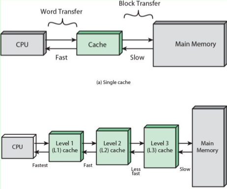
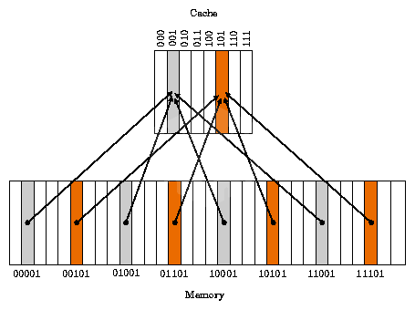

# 캐시 메모리 - Cache Memory
: 속도가 빠른 장치(CPU)와 느린 장치(메모리) 사이에서 병목현상을 줄이기 위한 고속 `Buffer Memory`이다.
> **병목현상**  
> : 어떤 시스템 내 데이터의 집중적인 사용으로 인해 전체 시스템에 절대적 영향을 미치는 부분에 사용빈도가 늘어나 그 부분의 성능이 저하되어 전체 시스템이 마비되는 현상을 의미한다.
- CPU가 주기억장치에서 저장된 데이터를 읽어올 때, 자주 사용하는 데이터를 캐시 메모리에 저장한 뒤,
- 다음에 이용할 때 주기억장치가 아닌 캐시 메모리에서 먼저 가져오면서 속도를 향상시킨다.
  > 즉, 캐시는 메모리 접근의 지역성을 이용하는 장치이다.
- 캐시 메모리는 비싸므로 용량이 적다
  > 보통 수십 KByte ~ 수백 KByte (나중에 변경 될 수 있음)



> 현재 우리가 사용하고 있는 컴퓨터들은 모두 캐시 메모리 2 ~ 3개(L1, L2, L3)를 사용한다.

#### 듀얼 코어 프로세서의 캐시 메모리
: 각 코어마다 독립된 `L1` 캐시 메모리를 가지고, 두 코어가 공유하는 `L2` 캐시 메모리가 내장된다.
- L1: CPU 내부에 존재
- L2: CPU와 RAM 사이에 존재
- L3: 보통 메인보드에 존재한다고 함

> 만약 L1 캐시가 128kb면, 64/64로 나누어 64kb에 명령어를 처리하기 직전의 명령어를 임시 저장하고,  
> 나머지 64kb에는 실행 후 명령어를 임시저장한다. (명령어 세트로 구성, I-Cache - D-Cache)

### 적중과 실패
캐시메모리가 있는 컴퓨터 시스템은 CPU가 메모리에 접근하기 전 먼저 캐시 메모리에서 원하는 데이터의 존재 여부를 확인한다.  
이때 **필요한 데이터가 있는 경우를 적중(hit), 없는 경우를 실패(miss)라고 한다.**

- 캐시 적중일 때
  > 캐시 메모리의 데이터를 CPU 레지스터에 복사한다.
- 캐시 실패/메모리 적중일 때
  > 메모리의 데이터를 캐시 메모리에 복사하고, 캐시 메모리의 복제된 내용을 CPU 레지스터에 복사한다.
- 캐시, 메모리 실패일 때
  > 보조 기억장치에서 필요한 데이터를 메모리에 복사한다.   
  > 메모리에 복제된 내용을 캐시 메모리에 복제한다. 캐시 메모리의 복제된 데이터를 CPU 레지스터에 복제한다.
#### 적중률
: 요청한 데이터를 캐시메모리에서 찾을 확률
```
         캐시 메모리의 적중 횟수
적중률 = -----------------------
         전체 메모리의 참조 횟수
```


## 캐시 메모리 동작원리 - 지역성
: 데이터 접근이 시간적, 공간적, 순차적으로 가깝게 일어나는 것이다.
- 캐시가 효율적으로 동작하려면, 캐시의 적중율(Hit-rate)를 극대화 시켜야 한다.
  > 즉 지역성을 가져야 한다.
- 기억장치 내의 정보를 균일하게 Access하는 것이 아닌 어느 한 순간에 특정 부분을 집중적으로 참조하는 특성이다.
- 시간 지역성, 공간 지역성이 있다.

### 시간 지역성
: 최근 사용되었던 기억 장소들이 집중적으로 액세스되는 경향
- for나 while 같은 반복문에 사용하는 조건 변수처럼 한번 참조된 데이터는 잠시후 또 참조될 가능성이 높다.
- 메모리 상의 같은 주소에 여러 차례 읽기 쓰기를 수행할 경우, 상대적으로 작은 크기의 캐시를 사용해도 효율성을 꾀할 수 있다.

### 공간 지역성
: 특성 클러스터의 기억 장소들에 대해 참조가 집중적으로 이루어지는 경향
- A[0], A[1]과 같은 연속 접근 시, 참조된 데이터 근처에 있는 데이터가 잠시후 또 사용될 가능성이 높음
  > ex. 배열

### 순차 지역성
: 데이터가 순차적으로 액세스되는 경향
> 데이터가 순차적으로 액세스되는 경향이 있다.
- 기억장치에 저장된 순서대로 이용될 가능성이 높다.
  > ex. 배열

## 캐시메모리의 구조 및 동작 방식
### Direct Mapped Cache
: DRAM의 여러 주소가 캐시 메모리의 한 주소에 대응되는 다대일 방식이다.  


> 현재 그림에서는 메모리 공간이 32개(00000~11111)이고, 캐시 메모리 공간은 8개(000~111)인 상황
- 인덱스 필드: 000를 가르킨다.
- 태그 필드: 인덱스 제외한 앞의 나머지(00, 01, 10, 11)를 가르킨다.
- 캐시메모리는 `인덱스 필드` + `태그 필드` + `데이터 필드`로 구성된다.

#### 특징
- 위 사진처럼 같은 색깔의 데이터를 동시에 사용해야 할 떄 사용한다.
- `Conflict Miss`가 발생한다.
- 간단하고 구현 비용이 낮다.
- 적중률이 낮아진다.

### Fully Associative Cache
: 비어있는 캐시 메모리가 있으면, 마음대로 주소를 저장하는 방식이다.
- 저장할 때는 매우 간단하지만, 모든 블럭을 순회해 데이터가 있는지 검사한다.
- CAM(content Addressable memory)라는 특수한 형태의 메모리 구조를 사용한다
  > 가격이 비싸다

### Set Associative Cache
: 특정 행을 지정하고, 그 행안의 어떤 열이든 비어있을 때 저장하는 방식이다.
> Direct + Fully 방식
- Direct에 비해 검색 속도는 느리지만, 저장이 빠르다. 
- Fully에 비해 저장이 느린 대신 검색이 빠르다.