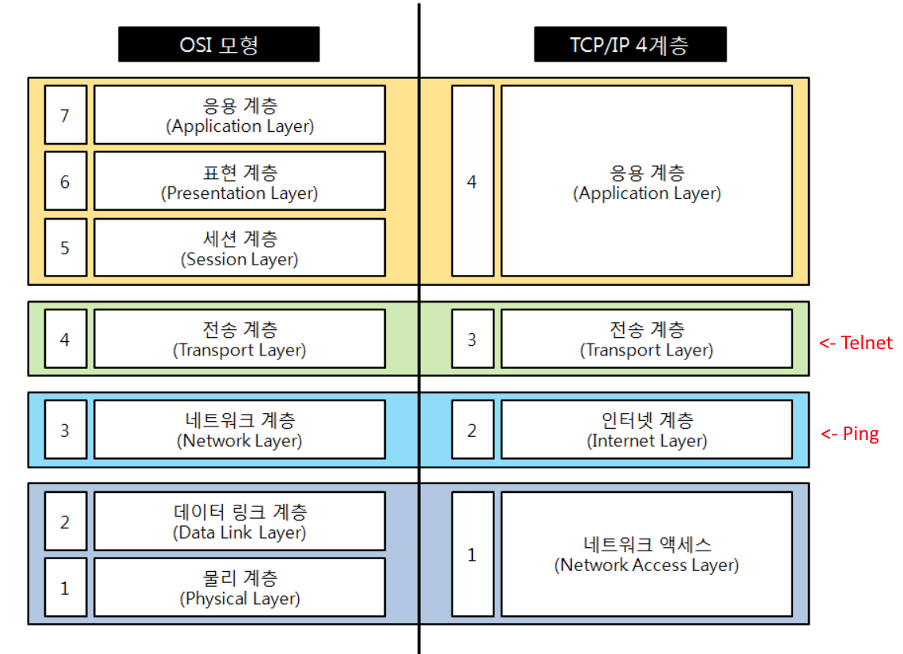

# TCP/IP 4계층
: DARPA에서  `TCP/IP` 프로토콜을 미 국방성의 통신 표준으로 채택하면서 해당 네트워크 통신 과정을 4개의 계층으로 나누어 설명한 것이다.
- 인터넷에 연결된 서로 다른 기종의 컴퓨터들이 데이터를 주고 받을 수 있도록 하는 인터넷 표준 프로토콜이다.
- 업계에서 실제적으로 사용되는 컴퓨터 통신 체계의 실질적인 표현 방법이다.

### 1. 네트워크 엑세스 계층 - Network Access Layer
: `물리적 연결`, `전기 신호의 변환/제어`, `네트워크 기기 간 데이터 전송` 및 `물리 주소`를 결정한다.
> MAC, LAN, 패킷망 등에 사용한다.
- 데이터 단위: **`프레임(Frame)`**
- 물리 주소(ex. MAC 주소)를 참조해 장비간 전송을 담당한다.
- 기본적으로 에러검출/패킷의 프레임화를 담당한다.
  > 최종적으로 데이터 전송을 하기 전 패킷헤더에 MAC주소와 오류 검출을 위한 부분을 첨부한다.
- OSI 7계층의 `물리 계층`, `데이터 링크 계층`에 해당된다.
- 보통 1계층을 `물리적 계층 - Physical Layer`과 `데이터 링크 계층 - Data Link Layer`로 나눠 TCP/IP 5계층으로 이야기하기도 한다. 

#### 프로토콜
- Ehternet, IEEE802, PPP, HDLC, X.25, RS-232C 등...

#### 장비
- 브리지, 스위치, 허브 등...

### 2. 인터넷(네트워크) 계층 - Internet Layer
: 다른 네트워크와의 통신을 위한 경로와 논리적 주소(IP주소) 결정한다.
- 데이터 단위: **`패킷(packet)`**
- 단말을 구분하기 위해 `논리적인 주소 - Logical Address`인 IP를 할당한다.
- 네트워크상 최종 목적지까지 정확하게 연결되도록 연결성을 제공한다.
- `라우팅 - Routing` 기능을 처리한다.
- 패킷단위의 데이터 구성
  > 데이터 + IP Header
- 요즈음 `클래스 리스` 방식을 사용한다.
    > 서브넷마스크로 네트워크와 호스트 주소를 구분한다.

#### 프로토콜
- IP, ARP, ICMP, RARP, OSPF 등...

#### 장비 
- 라우터 등...

### 3. 전송 계층 - Transport Layer
: 데이터 전송의 신뢰성 확보하고, 2계층에서 보내온 데이터의 정렬 및 오류 정정(ex. TCP/UDP)한다.
- 데이터 단위: **`세그먼트(Segmen)`**
  > 발신, 수신, 포트주소, 오류검출코드
- 통신 노드 간의 연결 제어 및 자료 송수신을 담당
- 애플리케이션 계층의 세션과 데이터그램 통신서비스를 제공한다.
- 포트 번호를 논리적 주소로 사용한다.
> - TCP는 패킷에 하나라도 오류가 있으면 재전송을 통해 에러를 복구하기 떄문에 TCP 헤더에 붇는 정보가 많다.
> - 하지만 UDP는 패킷을 중간에 잃거나 오류가 발생해도 대처하지 않기 때문에 간단한 구조를 가진다.

#### 프로토콜
- TCP, UDP, RTP, RTCP 등

#### 장비
- 게이트웨이

### 4. 응용 계층 - Application Layer
: 사용자에게 제공되는 어플리케이션에 사용하는 통신의 움직임을 결정한다.
- 데이터 단위: **`Data/Message`**
- 응용프로그램(application)들이 데이터를 교환하기 위해 사용되는 프로토콜이다.
- 사용자 응용프로그램 인터페이스를 담당한다.

#### 프로토콜
- FTP, SSH, DNS, TELNET, HTTP 등...