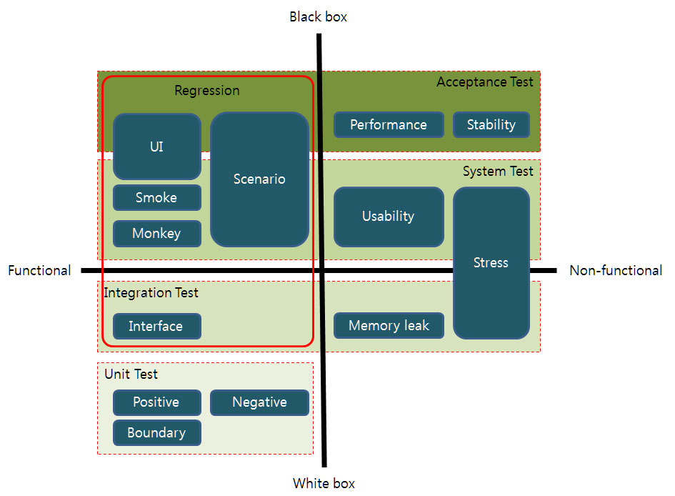

# 소프트웨어 테스트
-  소프트웨어 테스트는 소프트웨어가 문제가 없다를 보이는 것이 아니라 문제가 있다를 밝히는 과정이다.  
- 즉, 문제를 밝혀 그 문제를 해결하고 소프트웨어의 신뢰성을 높이는 일련의 과정이다.
- SWLC(소프트웨어 생명주기)의 프로세스중에 테스트에 해당된다.

> *SWLC(소프트웨어 생명주기) :  
> 요구사항 분석 &rarr; 설계 &rarr; 구현 &rarr; 테스트 &rarr; 유지보수

### 정의
- 노출되지 않은 숨어있는 결함(Fault)을 찾기 위해 소프트웨어를 작동시키는 일련의 행위와 절차
- 오류 발견을 목적으로 프로그램을 실행하여 품질을 평가하는 과정 
- 품질을 개선하기 위한 일련의 활동
- 일반적으로 테스트 케이스에 따라 SW를 동적으로 실행시켜 예상결과치와 비교 분석
- SW의 동작과 성능, 안정성이 요구되는 수준을 만족하는지 확인하기 위한 결함을 발견하는 메커니즘

### 목적
- 프로그램에 잠재된 오류의 발견
- 기술적인 기능 및 성능의 확인
- 사용자 만족도 향상
- 제품 신뢰도 향상

### 테스트의 일반적인 원리
|원리|내용|원인|
|--|--|--|
|**결함발견**|- 결함 제거가 아닌 결함의 발견을 목적 | 테스트 본연의 역활|
|**불완정성**|- 완전한 테스트는 불가능하다. - 무한경로, 무한 입력 값, 무한 타이핑 불가능| 자원의 한계|
|**초기 집중** (*요르돈 법칙)|- 개발 설계 시 부터 테스트 고려 - 결함의 조기 발견 및 재유입 방지|품질 비용 감소|
|**결함 집중**|- 결함의 80%는 20%의 특정 모듈에 집중된다.|파레토 법칙|
|**살충제 패러독스**|- 동일한 테스트 전략, 기법을 적용 할 시 내성이 생긴다. (더이상 새로운 결함을 찾아 내지 못한다.)|테스트에 특화된 코딩|
|**정황 의존적**|- 테스트는 주변 환경에 영향을 받음|외부요소, 심리 요소|
|**오류-부재의 궤변**|- 요구 사항을 충족시키지 못한다면, 결함을 발견하고 모두 제거하여도 좋은 테스트라 볼 수 없다.|테스터의 수동적 자세|

> *요르돈 법칙 :  
> Snowball Effect, 눈덩이 법칙, 결함 증폭 모델  
> 소프트웨어 개발 초기 체계적인 분석 및 설계가 수행되지 못하면 그 결과가 프로젝트 후반에 영향을 미치게되어 비용이 커진다는 법칙

## 소프트웨어 테스트의 종류

### Back Box Testing - 블렉 박스테스팅
: 소프트웨어의 내부 구조나 작동 원리를 모르는 상태에서 동작을 검사하는 방식이다.
- 올바른 입력과 올바르지 않은 입력을 입력하여 올바른 출력이 나오는지 테스트하는 기법이다.
- 사용자 관점의 테스트 방법이라 볼 수 있다.

### Whilte Box Testing - 화이트 박스 테스팅
: 시스템의 내부 설계를 고려한 테스팅으로서 시스템의 코드 내부의 로직에 대한 지식을 기반으로 수행된다.
- 응용 프로그램의 내부 구조, 동작, 내부 소스 코드 검사하는 테스트 방식이다.
- 커버리지(Coverage)를 통하여 테스팅된다.
- 개발자 관점의 테스트 방법이라 볼 수 있다.
