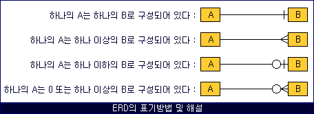
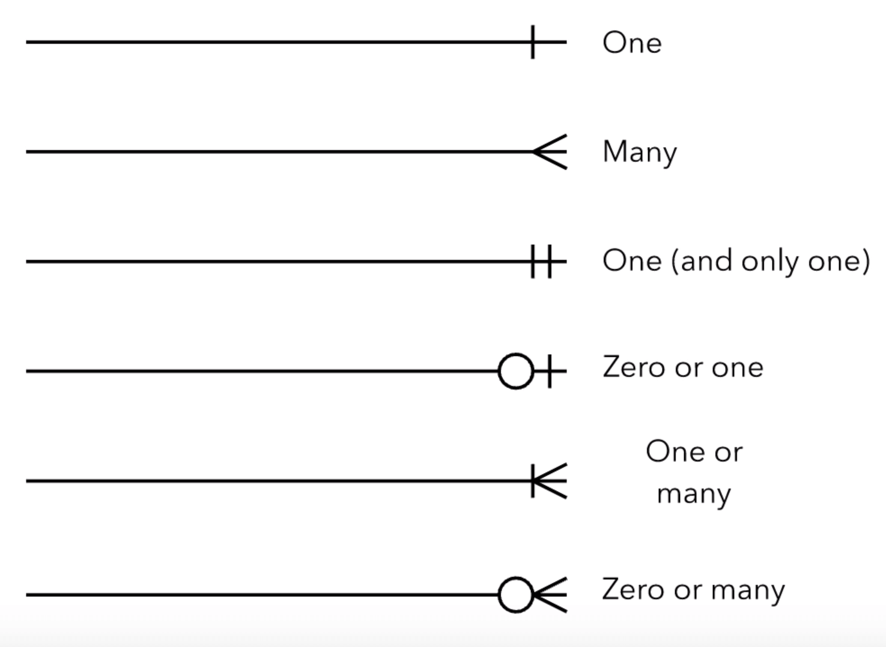
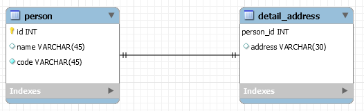
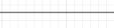
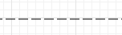

# Entity relationship Diagram
## ERD(Entity relationship Diagram)?
: 개체 속성과 개체 간 관계를 도표로 표현헌것.

## ERD 관계 표현법  

1. **1 : 1 (식별관계)**  
  
상세 주소 테이블은 person_id를 기본키로 사용하고 있고, person_id를 통해 person 테이블을 참조 하고 있다.  
>    >한명의 주민은 한개의 상세 주소를 가질 수 있다.  
      상세 주소는 주민 id가 없다면 존재 할 수 없다. (식별 관계)  
      주민 (주인 테이블) , 상세 주소 (자식 테이블) 
2. **1 : many (참조관계)**  
.png)  
부서와 회사원간의 관계를 표현한 ERD
>    >회사원은 한개의 부서에 반드시 소속되어야 한다.  
      한개의 부서에 여러 회사원이 소속될 수 있다.
      한개 부서에 회사원 한명도 없을 수 있다.
3. **1 : many (참조 Null 허용)**  
.png)  
**부서와 회사원간의 관계를 표현한 ERD**
>    >회사원이 부서에 꼭 소속할 필요가 없다.  
      한개의 부서에 여러 회사원이 소속될수 있다.
      한개의 부서에 소속된 회사원이 한명도 없을 수 있다.

## 비 식별관계와 식별관계
1. **식별관계(Identifying Relationship)**  
: **기본키에 외래키를 포함하고 있다.**  
실선으로 나타낸다.  
  
1. **비 식별관계(None Identifying Relationship)**  
: **기본키에 외래키를 미포함하고있다.**  
점선으로 나타넨다.  
