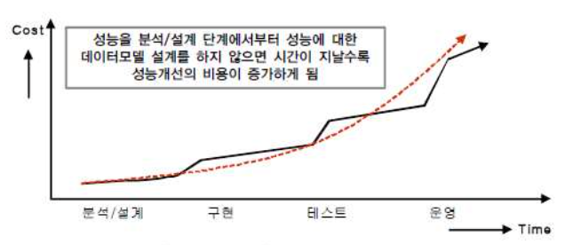

# 데이터 모델과 성능
## 1. 정의
: DB 성능을 고려하여 데이터 모델링을 수행하는 것
- 정규화, 반정규화, 테이블통합 및 분할, 조인 구조 PK/FK설정 등...

### 1-1. 수행 시점

- **빠를수록 좋다.**
  - 문석/설계 단계에서 성능 모델링 수행하면 재업무 비용이 최소화 한다.

분석/설계단계에서 데이터 모델은 대충하고, 성능이 저하되는 SQL을 튜닝하고, 부족한 하드웨어 용량을 증설하는 등의 작업은 추가적인 비용을 소진하게 하는 원인이 된다.

## 2. 성능 데이터 모델링 고려사항
### 2-1. 성능 데이터 모델링 진행 순서
1. 정규화를 정확하게 수행한다.
    > 주요 관심사별로 테이블을 분산한다.
2. 데이터베이스 용량산정 수행
    > 각 엔터티에 어느정도의 트랜잭션이 들어오는지 파악한다.
3. 데이터베이스에 발생되는 트랜잭션의 유형 파악
    > CRUD 매트릭스 활용
4. 용량과 트랜잭션의 유형에 따라 반정규화 수행
    > 테이블, 속성, 관계 변경
5. 이력모델의 조정, 인덱스를 고려한 PK/FK의 순서 조정, 슈퍼타입/서브타입 조정 등 수행
6. 성능관점에서 데이터 모델을 검증한다.

## Reference
- SQL 전문가 가이드
- [국민대학교 김남규 교수 - (DB실무) Part3-데이터 모델과 성능(1/6)](https://youtu.be/AAv0lT6KxyY)