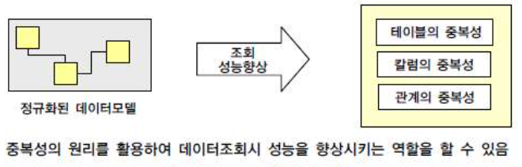
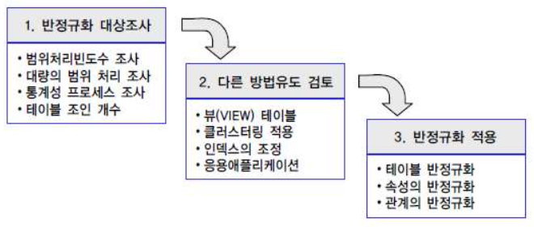
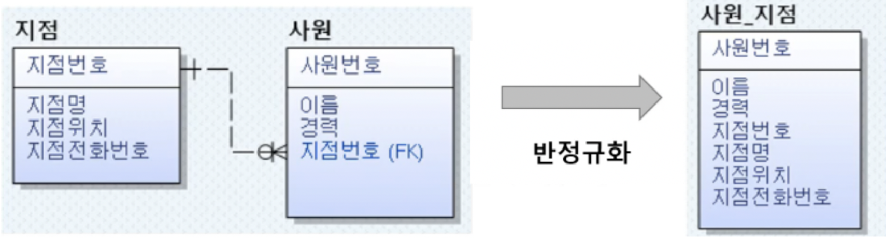
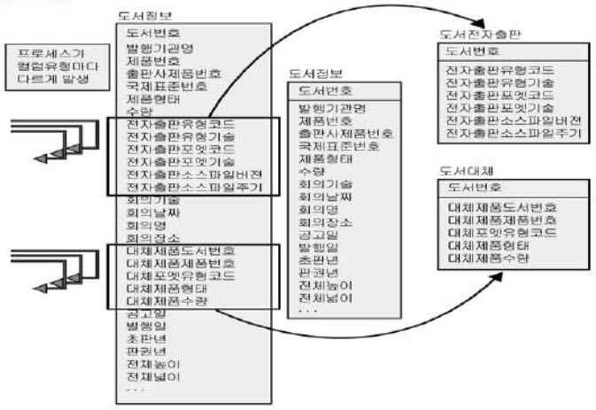
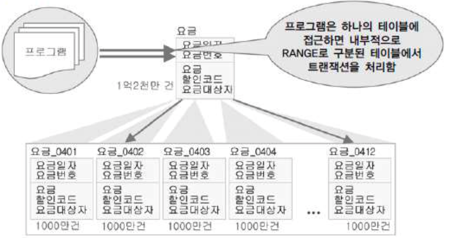
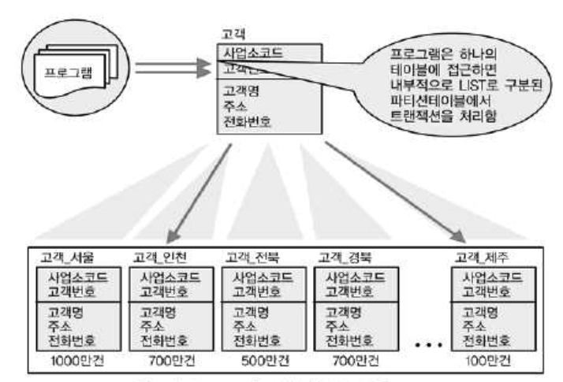
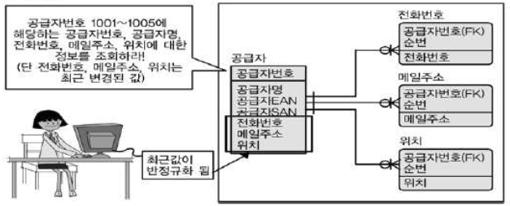
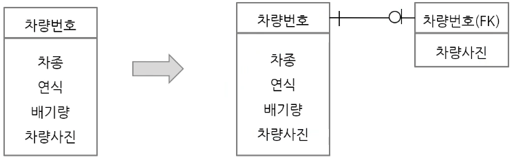
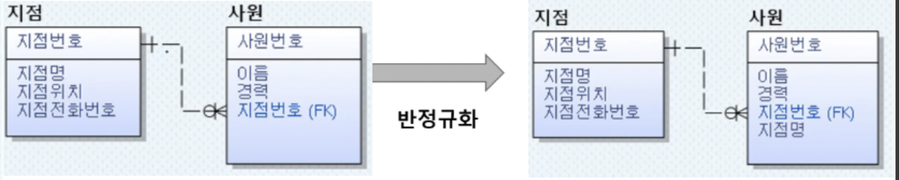

# 반정규화 - Denormalization
: 정규화된 엔터티, 속성, 관계에 대해 성능 향상을 목적으로 중복, 통합, 분리 등을 수행하는 데이터 모델링 기법이다.

디스크 I/O량이 많아서 성능이 저하되거나 JOIN으로 인한 성능저하가 예정되거나 칼럼을 계산하여 읽을 때 성능이 저하될 것이 예상되는 경우 반정규화를 수행하게 된다.

## 1. 특징
- 테이블, 칼럼, 관계의 반정규화를 종합적으로 교려해야 한다.
- 과도한 반정규화는 데이터 무결성을 침해하게 되어 좋지 않다.
  > 반 정규화를 진행하면 데이터 무결성을 침해할 수 밖에 없지만 이를 해결하는 장치를 마련해야 한다.

## 2. 반정규화의 적용방법 - 요약
반정규화에 대한 필요성이 결정이 되면 칼럼의 반정규화 뿐만 아니라 테이블의 반정규화와 관계의 반정규화를 종합적으로 고려하여 적용해야 한다.

### 2-1. 반정규화 대상조사
- **자주 사용되는 테이블에 접근하는 프로세서의 수가 많고 항상 일정한 범위만을 조회하는 경우** 검토한다.
- **테이블에 대량의 데이터 범위를 자주 처리하는 경우에 처리범위를 일정하게 줄이지 않으면 성능을 보장할 수 없는 경우 검토**한다.
- **통계성 프로세서에 의해 통계 정보를 필요할 때 별도의 통계 테이블을 생성**한다.
- 테이블에 **지나치게 많은 JOIN이 걸려 데이터를 조회하는 작업이 기술적으로 어려울 경우** 검토한다.

### 2-2. 다른 방법유도 검토
- **`뷰 - View` 생성** : 뷰 자체가 성능 향상을 가져오지 않는다. 신중하게 설계된 뷰를 재사용할 때 성능이 향상된다.
- **클러스터링**: 자주 사용되는 테이블의 데이터를 디스크의 같은 블록에 저장한다.
- **인덱스의 조정**: 인덱스 추가, 삭제 및 순서 조정
  > 조회중심의 테이블이 아니라면 인덱스를 추가하지 않는게 좋다.
- **응용 애플리케이션** : 데이터 처리를 위한 로직 변경 ex. 캐싱, 한방쿼리

### 2-3. 반정규화 적용
반정규화를 적용하기 전 사전에 충분히 성능에 대한 고려가 이루어졌다면 반정규화를 적용해야 한다.

- 테이블 반정규화
- 속성의 반정규화
- 관계의 반정규화

이 3가지의 방법이 있고 추가, 분할, 제거할 수 있다.

## 3. 반정규화 기법
### 3-1. 테이블 반정규화
<table>
    <thead>
        <tr>
            <th>기법분류</th>
            <th>기법</th>
            <th>내용</th>
        </tr>
    </thead>
    <tbody>
        <tr>
            <td rowspan=4>테이블병합</td>
            <tr>
                <td rowspan=1>1:1 관계 테이블병합</td>
                <td>1:1 관계를 통합하여 성능향상</td>
            </tr>
            <tr>
                <td rowspan=1>1:M 관계 테이블병합</td>
                <td>1:M 관계를 통합하여 성능향상</td>
            </tr>
            <tr>
                <td rowspan=1>슈퍼/서브타입 테이블병합</td>
                <td>슈퍼/서브 관계를 통합하여 성능향상</td>
            </tr>
        </tr>
        <tr>
            <td rowspan=3>테이블분할</td>
            <tr>
                <td rowspan=1>수직분할</td>
                <td>칼럼단위의 테이블을 디스크 I/O를 분산처리 하기 위해 테이블을 1:1로 분리하여 성능향상</td>
            </tr>
            <tr>
                <td rowspan=1>수평분할</td>
                <td>로우 단위로 집중 발생하는 트랜잭션을 분석하여 디스크 I/O및 데이터접근의 효율성을 높여 성능을 향상하기 위해 로우단위로 테이블을 쪼갠다.</td>
            </tr>
        </tr>
        <tr>
          <td rowspan=5>테이블 추가</td>
          <tr>
              <td>중복테이블 추가</td>
              <td>다른 업무이거나 서버가 다른 경우 동일한 테이블구조를 중복하여 원격조인을 제거하여 성능을 향상</td>
          </tr>
          <tr>
              <td>통계테이블 추가</td>
              <td>SUM, AVG등을 미리 수행하여 계선해 둠으로써 조회 시 성능을 향상한다.</td>
          </tr>
          <tr>
              <td>이력테이블 추가</td>
              <td>이력테이블중 마스터 테이블에 존재하는 레코드를 중복하여 이력테이블에 존재하는 방법은 반정규화의 유형</td>
          </tr>
          <tr>
              <td>부분테이블 추가</td>
              <td>하나의 테이블의 전체 컬럼 중 자주 이용하는 집중화된 컬럼들을 모아놓는 별도의 반정규화된 테이블 생성</td>
          </tr>
        </tr>
    </tbody>
</table>

#### 1. 테이블병합
- **1-1. 관계 테이블병합 (1:1 or 1:M )**
  - 두 테이블 동시 조회가 많은 경우  
    

    출처: https://youtu.be/pd0BzVro6zY?t=254

- **1-2. 슈퍼/서브타입 모델의 변환 - Super Type / Sub Type**
  1. 개별 트랜젝션이 많을 경우 &rarr; One To One
  2. 슈퍼타입 + 서브타입 접근 트랜잭션이 많은 경우 &rarr; Plus Type
  3. 여러 서브타입에 대한 동시 접근이 많을 때 &rarr; All in One Type
   

  **슈퍼/서브타입 모델 변환 타입의 비교**  
    |   구분   | One To One Type |    Plus Type   | Single Type |
    |:-------|:--------------:|:---------------:|:-----------:|
    | **특징** |  개별 테이블 유지  |슈퍼 + 서브타입 테이블|하나의 통합 테이블|
    | **확장성**|      우수함     |        보통      |     나쁨      |
    |**조인 필요 수**|     많음   |       보통       |     적음      |
    |**I/O 성능저하**|    양호   |        양호       |      좋음     |
    | **관리 용의성**|   나쁨     |       나쁨       |      좋음     | 
    |**적합  트랜잭션 유형**| 개별 테이블로 접근이 많은 경우| 슈퍼 + 서브 형식 데이터 처리가 많은 경우 | 전체에 대한 일괄 처리가 많은 경우

#### 2. 테이블분할
- **2-1. 테이블 수직 분할**
  - 많은 컬럼을 가진 테이블에서 프로세스가 컬럼 유형마다 다르게 발생하는 경우
  - ex. 전자출판 관련 조회, 대체제품 조회  
    

- **2-2. 테이블 수평 분할**
  - 테이블이 많은 양의 데이터를 가질 것으로 예상되는 경우 Partitioning을 진행한다.
  - **Range Partition: 범위로 분할**
    > 고객번호 1 ~ 1000, 1001~2001등...  
    

  - **List Partition: 값으로 분할**
    > 지역: 서울, 광주, 부산 등...   
    

  - **Hash Partition : 해쉬 함수로 분할**
    - 임이의 길이의 데이터를 짧은 길이의 데이터로 매핑하는 함수

#### 3. 테이블추가
- **3-1. 이력테이블 추가**
  - 가장 최근값을 중복으로 기록한 테이블을 생성한다.
    > 가장 최근값을 중복으로 기록한 테이블 생성  
    

  > `이력테이블 칼럼 추가`와 `이력테이블 추가`의 차이점  
  > **이력테이블을 값**을 추가하고, **이력테이블 컬럼 추가는 여부(true, false)** 를 추가한다.

- **3-2. 부분테이블 추가**
  - 집중적으로 자주 사용되는 특정 속성들을 추출하여 별도 테이블을 구성한다.
  - 테이블 수직 분할과 유사하지만 원본 테이블이 그대로 유지된다.
  > ex) 차량번호에 대한 차량사진 조회 질의가 많은 경우  
    
  출처: https://youtu.be/KN586GvpZW0?t=570

### 3-2. 칼럼 반정규화
|  반정규화 기법  |                               내용                       |
|:------------:|:--------------------------------------------------------|
|      중복컬럼 추가     |조인에 의해 처리할 떄 성능저하를 예방하기 위해 중복된 칼럼을 위치시킨다.   |
|      파생컬럼 추가     |트랜잭션이 처리되는 시점에 계산에 의해 발생되는 성능저하를 예방하기 위해 미리 값을 계산하여 컬럼에 보관한다.   > Derived Column이라고 한다.|
|    이력테이블 칼럼추가   |대량의 이력데이터를 처리(조회)할 떄 나타날 수 있는 성능저하를 예방하기 위해 이력테이블에 기능성 컬럼을 추가한다.   > 최근값 여부, 시작과 종료일자 등...|
|   PK에 의한 칼럼 추가   |PK가 복합 의미를 갖는 경우 구성 요소 값의 조회 성능 향상을 위해 일반 속성을 추가한다.|
|데이터 복구를 위한 칼럼 추가 |사용자의 실수, 응용프로그램 오류로 인해 데이터가 잘못 처리된 경우, 원래 값으로의 복구를 위해 이전 데이터를 임시적으로 보관하는 컬럼추가|
#### 1. 중복칼럼 추가
> 조인을 감소시킨다.
- 해당 테이블에서 자주 사용하는 칼럼을 중복시킨다.
- ex. 각 사원의 이름과 소속지점명을 조회하는 질의가 많은 경우
  

  출처: https://youtu.be/z1AcDayMXgY?t=1169
 
#### 2. 파생칼럼 추가
- 질의가 예상되는 값을 미리 계산하여 저장한다.

- 2-1. 컬럼에 의한 파생
  - `Derived Column`이라고 한다.
  - ex. 과목 점수 합계, 평균 등...

- 2-2. 로우에 의한 파생
  > 가급적 사용하지 않아야 한다.
  - 특정 로우가 변경되면 모든 로우 값을 다시 계산하게 된다.
  - 즉, 인스턴스의 순서에 의존성이 생기므로 사용하지 않아야 한다.
  - ex. 공사비 누적(엑셀을 생각하면 됨)

#### 3. 이력테이블 칼럼 추가
- ex. 최근값, 종료여부 등...

#### 4. PK의 의미적 분리를 위한 칼럼 추가
- 차량테이블의 PK가 차량번호(광주 뷁 1234)와 같이 '지역' + '일련번호'로 구성된 경우 지역을 이용한 조회가 빈번한경유
  - 지역이라는 컬럼을 생성한다.
  - https://youtu.be/z1AcDayMXgY?t=2580

#### 5. 데이터 복구를 위한 칼럼 추가
- 사용자의 실수, 응용프로그램의 오류로 인한 데이터 손실 대비를 위해 생성한다
- ex. 고객의 이전 주소, 고객의 이전 데이터 등...

### 3-3. 관계 반정규화
#### 1. 중복관계 추가
: 조인을 통해 정보 조회가 가능하지만, 조인 경로 단축을 위해 중복관계를 추가한다.

이전글: [3-1. 정규화](normalization-and-performance.md)
다음글: [3-3. Index](index.md)

## Reference
- SQL 전문가 가이드
- [국민대학교 김남규 교수 - (DB실무) Part3-데이터 모델과 성능(3/6)](https://youtu.be/z1AcDayMXgY)
- [국민대학교 김남규 교수 - (DB실무) Part3-데이터 모델과 성능(4/6)](https://youtu.be/pd0BzVro6zY)