# 엔터티 - Entity
## 1. 엔터티의 정의
데이터 모델과 데이터 베이스에 관위자가 정의한 사항은 다음과 같다.
- 변별할 수 있는 사물 - Peter Chen (1976)
- DB 내에서 변별 가능한 객체 - C.J Date (1986)
- 정보를 저장할 수 있는 어떤 것 - James Martin (1989)
- 정보가 저장될 수 있는 사람, 장소 물건, 사건 그리고 개념 등 - Thomas Bruce (1992)

위 정의들의 공통점은...
- **명사**에 해당된다.
  > 사람, 장소, 물건, 사건, 개념 등...
- 업무상 관리가 필요한 **관심사**에 해당한다.
- 저장이 되기 위한 **어떤 것** 이다.

즉 엔터티란 **"업무에 필요하고 유용한 정보를 저장하고 관리하기 위한 집합적인 것(Thing)"** 으로 설명할 수 있다.

## 2. 엔터티의 분류

### 2-1. 유/무형에 따른 분류

#### 1. `유형 - Tangible` 엔터티
- 물리적인 형태가 있고 안정적이며 지속적으로 활용된다.
- ex. 교수, 강의실, 학생 등...

#### 2. 무형 엔터티
  1. **`개념 - Conceptual` 엔터티**
     - 물리적인 형태는 존재하지 않으나 관리해야 할 개념적 정보
     - ex. 수업, 보험상품 등...

  2. **`사건 - Event` 엔터티**
     - 업무 수행 과정에서 발생하며 비교적 발생량이 많다.
     - ex. 수강신청, 주문, 입금 등...

### 2-2. 발생시점에 따른 분류
#### 1. 기본/키 엔터티 - Fundamental Entity, Key Entity
: 업무에 원래 존재하는 정보로써 다른 엔터티와 관계에 의해 생성되지 않고 독립적으로 생성되는 엔터티
- 타 엔터티의 부모의 역할을 하게된다.
- 자신의 고유 식별자를 가지게 된다.
- 사원, 부서, 고객, 상품 자재 등...

#### 2. 중심엔터티 - Main Entity
: 그 업무에 있어서 중심적인 역할을 하는 엔터티
- 기본 엔터티로부터 발생된다.
- 계약, 사고, 예금원장, 청구, 주문, 매출 등...

#### 3. 행위엔터티 - Active Entity
- 두 개 이상의 부모엔터티로부터 발생된다.
- 자주 내용이 바뀌거나 데이터양이 증가된다.
- 주문목록, 사원변경이력 등...

### 2-3. 기타
- 스스로 생성될 수 있는지에 따라서 독립엔터티, 의존엔터티로 나뉜다.

## 3. 엔터티의 특징
### 3-1. 업무에서 필요하고 관리하고자 하는 정보
- `관심 영역 - Business Boundary`에 따라 달라진다.
- ex. 도서관리 시스템에 환자라는 엔터티가 존재할 일이 없다.

### 3-2. 식별가능
- `식별자 - Unique Identifier`에 의해 식별 가능해야 한다.
- 유일 식별자 : 해당 엔터티 인스턴스만의 고유한 이름

식별자가 두 개 이상의 엔터티를 대변하면 잘못된 설계이다.

만약 회원 엔터티에서 이름을 식별자로 만들어버리면 세상에는 중복되는 이름이 있으므로 이는 잘못된 식별자라고 할 수 있다.

### 3-3. 둘 이상의 인스턴스 집합
하나의 엔터티는 **두 개 이상의 인스턴스**를 포함한다.

### 3-4. 업무 프로세스에 의해 이용된다.
- 업무 프로세서에 의해 CRUD가 발생해야 한다.
- CRUD가 발생하지 않음 &rarr; **부적절한 엔터티 도출**, 또는 **업무 누락**

### 3-5. 반드시 속성을 가져야 한다.
- 주식별자만 존재하고 일반 속성은 없는 경우도 바람직하지 않다.

    - 단 `연관 엔터티 - Associative Entity`는 주 식별자 속성만 갖고 있어도 된다. 
        > 다음과 같은 관계에서 수강 Entity를 의미한다.
        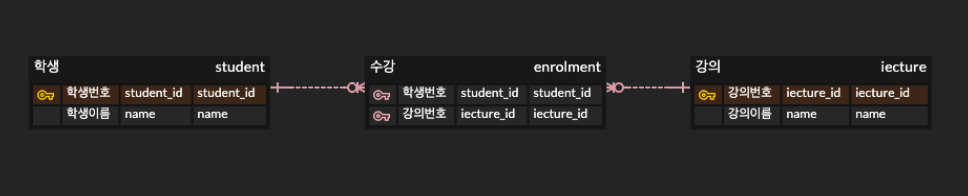

### 3-6. 엔터티는 최소 한 개 이상의 관계를 가져야 한다.
관계가 없는 엔터티를 `고립 엔터티 - Isolated Entity`라고 하는데 `고립 엔터티`가 있을 경우 부적절한 엔터티 도출 및 관계 누락이 있는지 확인한다.

#### 고립 엔터티를 인정하는 경우
- 통계성 엔터티
  > 읽기 효율성 또는 집계처리를 위한 엔터티
- 코드성 엔터티
  > ex. 에러 코드 관련 테이블(단순 참조만 할 때)
- 시스템 처리용 내부 엔터티
  > ex. 트랜잭션 로그 테이블 등...

## 4. 엔터티의 명명
- 엔터티 생성 의미대로, 실제 업무에서 사용하는 용어를 사용한다.
- 약어를 사용하지 않는다.
- 단수 명사를 사용한다.
- 이름이 동일한 엔터티가 중복으로 존재할 수 없다.

## 5. 관계 - Relationship
### 5-1. 관계
- 엔터티간 논리적 연관성

### 5-2. 페어링 - Pairing
- 엔터티 내 인스턴스 간의 개별적 연관성

### 5-3. 페어링의 집합 == 관계

### 5-4. 관계의 분류
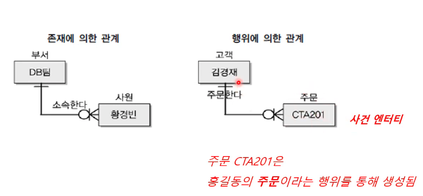

출처: https://youtu.be/RIe2LRc3oio?t=439

관계는 사건 엔터티의 유무로 판단하면 된다.

### 5-5. 관계의 표기법
#### 1. 관계명
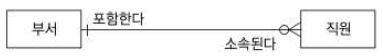

- 각 관계는 두 방향의 관계명을 가진다.
- 애매한 동사를 피한다.
- 현재형으로 표현한다.  

#### 2. 관계 차수 - Degree
- 각 관계에 참여할 수 있는 인스턴스의 수 

#### 3. 선택성
- 필수 참여 - Mandatory Membership
  
- 선택 참여 - Optional Membership
  
관계의 양쪽이 Optional인 경우, 해당 관계는 잘못 설정되었을 가능성이 크다.

#### 4. 관계 읽기
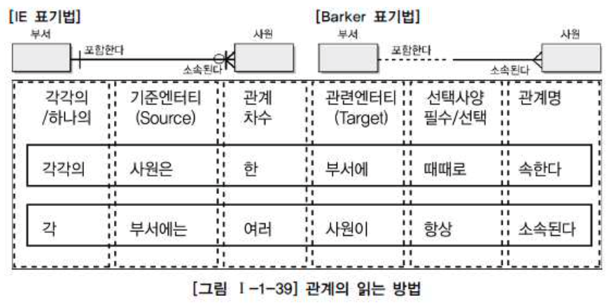

## 6. 속성 - Attribute
- 사물의 특징 또는 본질적인 성질
- 인스턴스에 대해 의미상 더 이상 분리되지 않는 최소의 데이터 단위
- 엔터티에 속한 인스턴스들의 성격을 구체적으로 나타낸다.
  > 인스턴스 각각을 구분할 수 있는 기준 파악 &rarr; 이름 부여 &rarr; 속성화

#### 엔터티 인스턴스 속성 속성값의 대응
- 각 엔터티는 둘 이상의 인스턴스를 가진다.
- 각 엔터티는 둘 이상의 속성을 가진다.
- 각 속성은 하나의 속성값을 가진다.

### 6-1. 특징
- 해당 업무에서 필요하고 관리해야 하는 정보
- 모든 속성은 주식별자에 함수적으로 종속되어야 한다.
- 하나의 속성은 한개의 값만 가져야 한다.
  - 속성이 다중값을 가질경우 해당 속성을 별도의 엔터티로 분리한다.

### 6-2. 속성의 명명 (권장)
- 협업에서 사용하는 이름을 부여
- 약어 사용은 가급적 금지
- 서술식 속성명을 피하고 명사적 속성명을 사용한다.
- 수식어와 소유격을 피한다.
- **속성의 이름은 가급적 전체 모델에서 유일하게 정의** (권장)

### 6-3. 속성의 표기
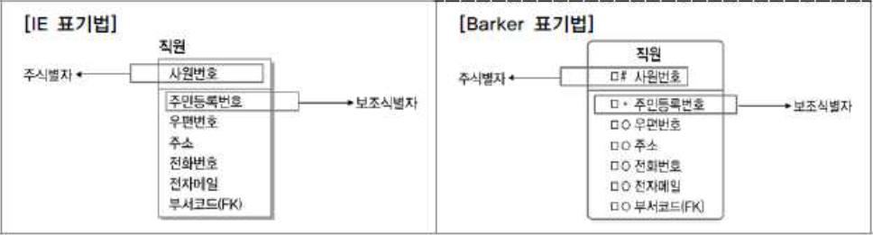

- 엔터티 내에 이름을 기재

### 6-4. 도메인 - Domain
- 각 속성의 가질 수 있는 값의 범위
  > ex. 학점: 0.0 ~ 4.5 사이의 실수  
  > ex. 주소: 길이가 20자리 이내인 문자열
- 속성에 대한 데이터 타입, 크기, 제약사항을 지정한다.

### 6-5 속성의 분류
#### 특성에 따른 분류
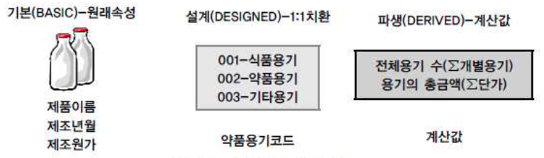

- **기본 속성 - Basic Attribute**
  - 가장 일반적인 속성, 원래의 업무로부터 유래
- **설계 속성 - Designed Attribute**
  - 데이터 모델링을 위해 새로 만든 속성 
  > ex. PK, Idx, 코드
- **파생 속성 - Derived Attribute**
  - 다른 속성들로 유도된 속성 (주로 통계 관련)
  - 가급적 적게 정의하는 것이 좋다.
    > 데이터의 중복과 성능에 영향을 미친다.
  - ex. 과목점수평균

#### 엔터티 구성 방식에 따른 분류
- Primary Key 속성 : 엔터티의 인스턴스를 구별할 수 있는 속성
- Foreign Key 속성 : 타 엔터티의 PK를 참조하는 속성
- 일반 속성

#### 분리 가능함에 따른 분류
- 복합 속성 - Composite Attribute
- 단순 속성 - Simple Attribute

#### 속성값의 수에 따른 분류
- 다중값 속성 - Multi-Valued Attribute
- 단일값 속성 - Single-Valued Attribute

## 7. 식별자
### 7-1. 식별자의 분류
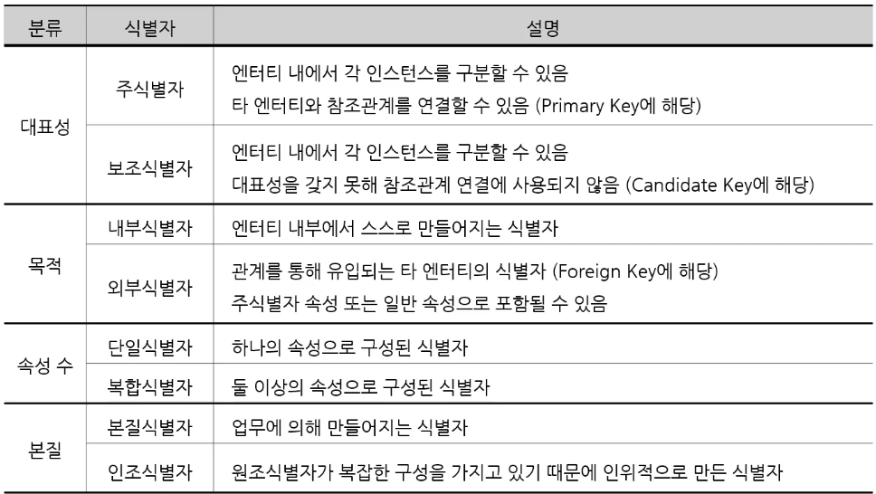

출처: https://youtu.be/GQpbyjjPkK8?t=39

주로 주식별자, 내부식별자, 단일식별자, 본질식별자를 한번에 가지는 경우가 일반적이다.

엔터티 내에서 각 인스던스를 구문할 수 있는 것 중에서 대표성 갖는 것을 주 식별자로 가지고 탈락한 것을 보조식별자로 갖는다.

### 7-2. 식별자의 특징
#### 1. 유일성
: 주식별자에 의해 엔터티 내의 각 인스턴스들을 모두 유일하게 구분할 수 있어야 한다.
> ex. 각 회원들에 대해 ID가 개인별로 구요하게 부여됨

#### 2. 최소성
: 주식별자를 구성하는 속성의 수는 유일성을 만족하는 최소의 수가 되어야 한다.
> ID만으로 유일성이 만족되면, (ID, 이름)은 주식별자가 아니다.

#### 3. 불변성
: 주식별자가 지정되면, 그 식별자의 값은 변하지 않아야 한다.
> 주식별자인 ID의 값이 변한다는 의미는 이전기록이 말소되고 새로운 기록이 발생했다는 의미다.

#### 4. 존재성
: 주식별자의 값은 null이 될 수 없다.
> 주식별자인 ID가 없는 회원은 있을 수 없다.

### 7-3. 주식별자 도출 기준
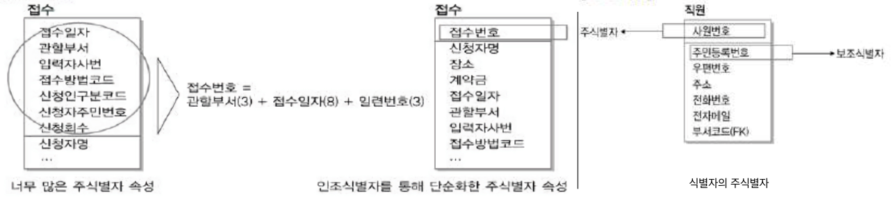

- 유일성을 갖는 속성 중 해당 업무에서 자주 이용되는 속성을 지정
- 이름으로 기술되는 것은 가능하면 주식별자로 지정하지 않는다
  > ex. 명칭, 내역과 같이 무조건 중복될 수 있으므로 code같은 것으로 주 식별자를 가진다.
- 복합식별자를 구성할 경우 너무 많은 속성이 포함되지 않아야 함
  > 주식별자가 너무 많이 포함되면, 인조식별자를 통해 단순화한 주식별자 속성을 만든다. ex. 회원번호, 접수번호 등...

### 7-4. 식별자 관계와 비식별자 관계
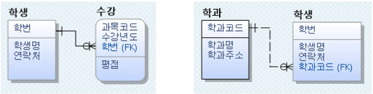

출처: https://youtu.be/GQpbyjjPkK8?t=1558

부모 엔터티의 식별자 A를 자식 엔터티의 외부식별자 A(FK)로 포함할 때
#### 1. 식별자 관계
위 사진에서 A(FK)가 주식별자에 포함된 경우를 식별자 관계라고 한다.
- 실선으로 나타낸다.
- 과목코드, 수강년도, 학번은 무조건 값을 가져야한다.
  > 식별자는 null을 가지면 안된다.

#### 2. 비식별자 관계
위 사진에서 A(FK)가 비 식별자 속성으로 포함된 경우를 비식별자 관계라고 한다.
- 부모 엔터티와 자식 엔터티의 관계가 약한경우
  > 부모 엔터티 없이 자식 엔터티가 생성 가능
- 점선으로 나타낸다.

### 7-5. 식별자 관계 - Identifier Relationship
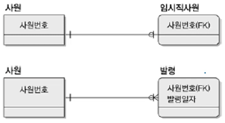

출처: https://youtu.be/GQpbyjjPkK8?t=1834

- 부모의 주식별자가 자식엔터티의 주식별자로 상속한다.
- 반드시 부모 엔터티가 생성되어야 자식 엔터티가 생성될 수 있다.
  - 해당 속성이 Not Null 이므로 &rarr; weak entity에 해당된다.
- 자식 엔터티의 주식별자가 해당 속성만으로 구성되는 경우 &rarr; 1 : 1 관계
  > 사번번호(FK)는 **주식별자**, **외부식별자**, **단일식별자** 에 해당된다.
- 자식 엔터티의 주식별자가 해당 속성 + a 로 구성되는 경우 &rarr; 1 : N 관계
  > 사원번호(FK)는 **주식별자**, **외부식별자**, **복합식별자** 에 해당된다.

> **weak entity란?**  
> 자신 혼자 식별자를 만들 수 없고 다른 엔터티의 도움을 받아 생성할 수 있는 엔터티를 의미한다.

#### 1. 식별자 관계 남용시 문제
- 주식별자 속성이 지속적으로 증가한다.

#### 2. 비식별자 관계 남용시 문제
- 조회시 JOIN횟수가 증가한다.

### 7-7 비식별자 관계를 고려해야 하는경우
- 부모 엔터티와 자식 엔터티의 관계의 강도가 약한 경우
- 자식 엔터티의 독립적인 주식별자 설정이 필요한 경우
- PK 속성의 단순화가 필요한 경우
  > SQL복잡도 증가로 인한 개발 생산성이 저하되는 현상을 방지한다.

#### 식별자/비식별자 관계의 비교

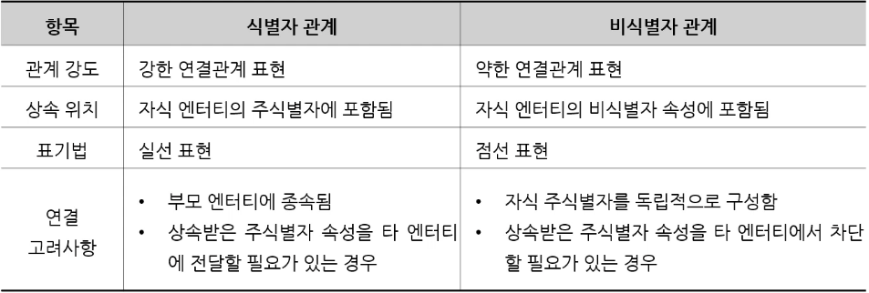

출처: https://youtu.be/GQpbyjjPkK8?t=3047

이전글: [1. 데이터 모델링의 이해](understanding-data-modeling.md)
다음글: [3. 데이터 모델과 성능](data-model-and-performance.md)

## Refrenece
- SQL 전문가 가이드
- [국민대학교 김남규 교수 - (DB실무) Part2-데이터 모델링의 이해(3/5)](https://youtu.be/RIe2LRc3oio)
- [국민대학교 김남규 교수 - (DB실무) Part2-데이터 모델링의 이해(4/5)](https://youtu.be/GQpbyjjPkK8)
- [국민대학교 김남규 교수 - (DB실무) Part2-데이터 모델링의 이해(5/5)](https://youtu.be/BEzctduY9Jk)
