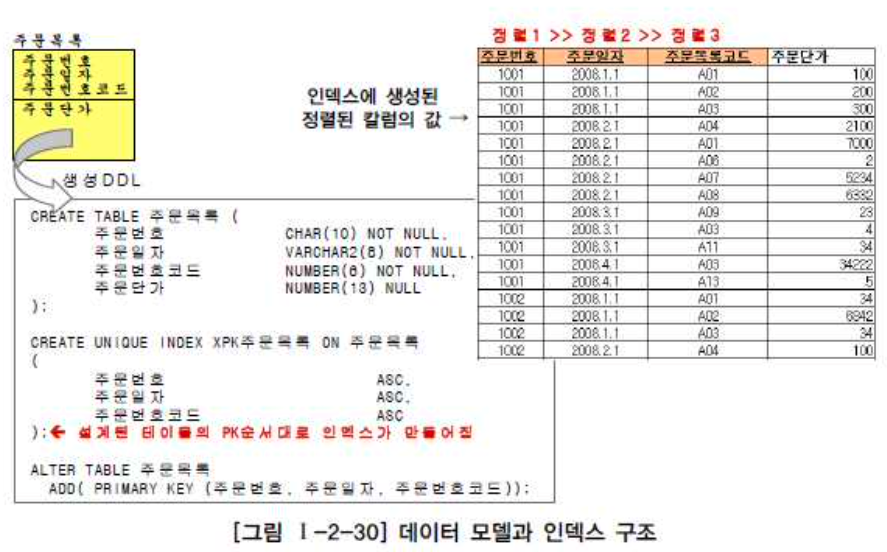
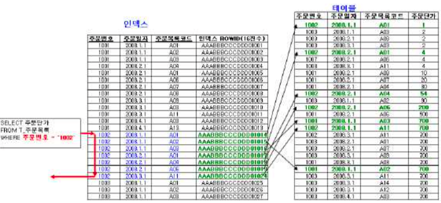
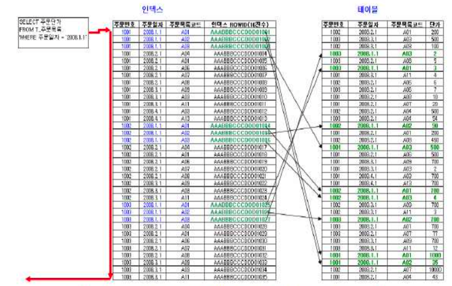
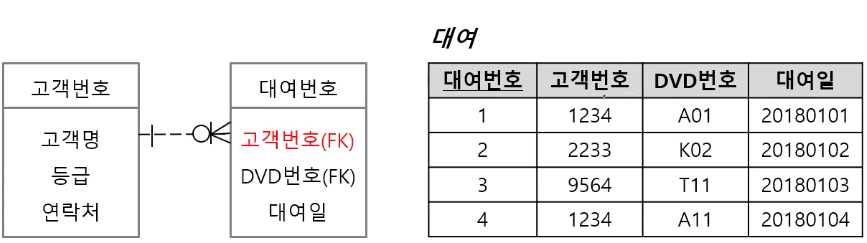

# 인덱스 - Index
> 핵심을 full scan을 하지 않고 인덱스 테이블을 통해 효율적으로 검색하는 것

## 2. 인덱스의 특징
- 실제 테이블을 Full Scan하지 않고 인덱스 테이블을 검색한다.
- 지나치게 많은 인덱스 생성시 시간 및 공간이 낭비된다.
- 인덱스된 필드의 업데이트시 시간이 증가한다.
- 자동 생성(PK or Unique) / 수동 생성(Create Index 구문)
- B-tree, B+tree와 같은 자료구조를 활용한다.

## 1. 인덱스의 스캔 구조 이해

### 1-1. 인덱스 스캔 방법
- SELECT 주문단가 FROM 주문목록 WHERE **주문번호 = '1002'**  
  

- Full Scan을 하지 않고 인덱스 테이블의 주문번호가 1002번인 결과값만 조회했다.

만약 최초의 정렬기준이 아닌 다른 정렬기준으로 조회를 하면 어떻게 될까?

- SELECT 주문단가 FROM 주문목록 WHERE **주문일자='2008.1.1'**  
  
  
맨 앞에 있는 칼럼이 제외된 상태에서는 데이터를 조회 할 경우 데이터를 비교하는 범위가 매우 넓어지게 되어 성능 저하를 유발하게 된다.

#### PK의 속성 순서대로 인덱스가 정렬된다.

#### FK 인덱스 설정을 통한 성능 향상

- ex) 고객번호가 `1234`인 고객의 대여기록 조회
    > 고객 테이블에 4천건, 대여 테이블에 1,000만건이 존재하는 경우

출처: https://youtu.be/mjanSuhnpNw?t=632

&rarr; 대여 테이블의 고객번호에 인텍스를 설정함으로 성능 향상이 가능하다.

이전글: [3-2. 반정규화](denormalization.md)
다음글: [3-4. 분산데이터베이스](distributed-database.md)