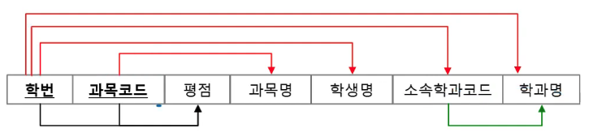
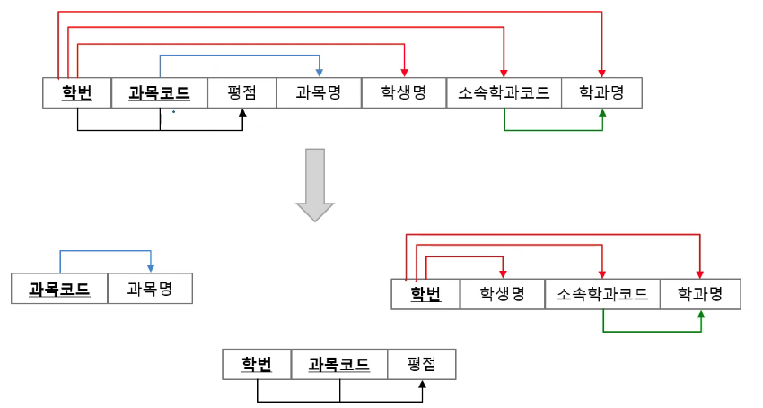
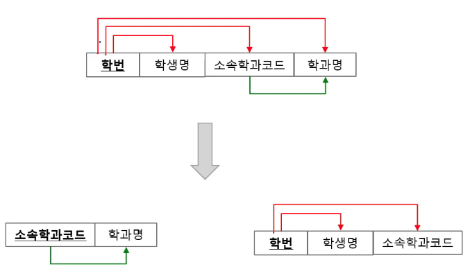
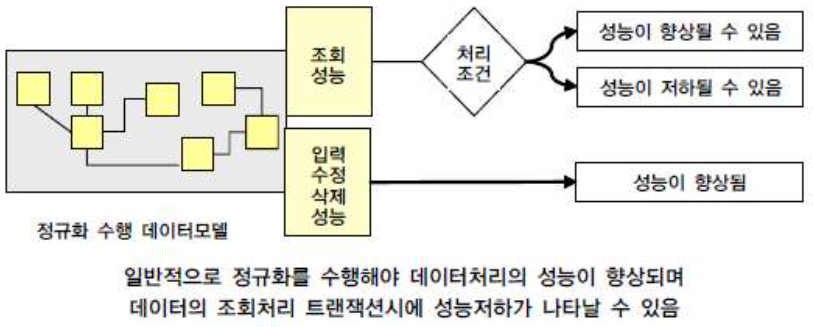

# 정규화와 성능
## 1. 정규화 - Normalization
- 목적: 삽입/삭제/갱신 이상현상 방지
- `함수적 종속성 - Functional Dependency`에 기반

### 1-1. 종류
> 실무에서 보통은 3차 정규형까지 한다.

출처: https://youtu.be/vnHTZT7L-KI?t=1086

#### 1. `1NF - 1 Normal Form`
: 모든 값이 원자값을 가짐
Composite 혹은 Multi-valued 애트리뷰트를 제거한다.
> 웬만하면 1정규형은 일부로 하지 않는 이상 만족한다.

#### 2. 2NF: 부분함수종속 제거

출처: https://youtu.be/vnHTZT7L-KI?t=1369

- 부분함수종속은 복합키 일 떄 발생할 확률이 크다.

위 그림으로 예시를 들면 *복합 식별자*인 두개의 속성(`학번, 과목코드`)에 종속적인 `평점`을 제외한 빨간색으로 가르키는 속성들을 제거한다.

하지만 2NF를 수행했지만 아직 `소속학과코드`는 식별자가 아니지만 `학과명`을 종속하고 있다 이를 3NF를 수행하여 만족시켜보자

#### 3. 3NF: 이행함수종속 제거

기본키가 아닌 종속성을 갖는 속성을 제거한다.

출처: https://youtu.be/vnHTZT7L-KI?t=1614

2정규형처럼 그냥 테이블을 나누면된다.

---

식별자가 아닌 속성(주식별자의 일부 또는 일반속성)이 결정자 역할을 하는 함수 종속 제거를 하면 3정규형까지 얻을 수 있다.

### 1-2. 정규화의 효과

출처: https://youtu.be/vnHTZT7L-KI?t=1368

- 데이터 중복 감소 &rarr; 성능 향상
- 데이터가 관심사별로 묶임 &rarr; 성능 향상
- 조회 질의에서 조인이 많이 발생할 시 &rarr; 성능 저하

정규화를 통해 일반적으로 성능이 향상되나, 조회의 경우 처리 조건에 따라 성능이 향상되거나 저하된다.

### 1-3. 정규화 예시
https://youtu.be/vnHTZT7L-KI?t=2286

이전글: [데이터 모델과 성능](data-model-and-performance.md)
다음글: [반정규화](denormalization.md)

## Reference
- SQL 전문가 가이드 - 2절 정규화와 성능
- [국민대학교 김남규 교수 - (DB실무) Part3-데이터 모델과 성능(2/6)](https://youtu.be/vnHTZT7L-KI)
