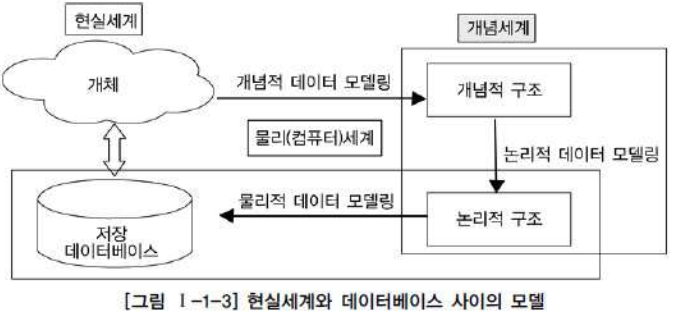
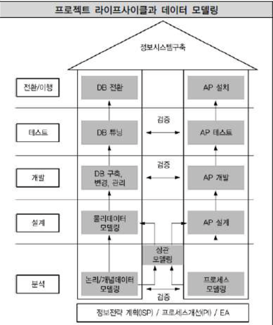
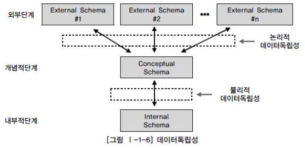
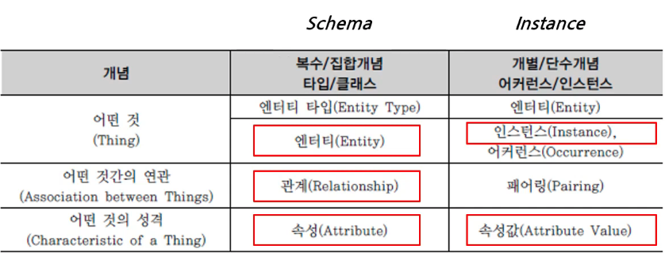
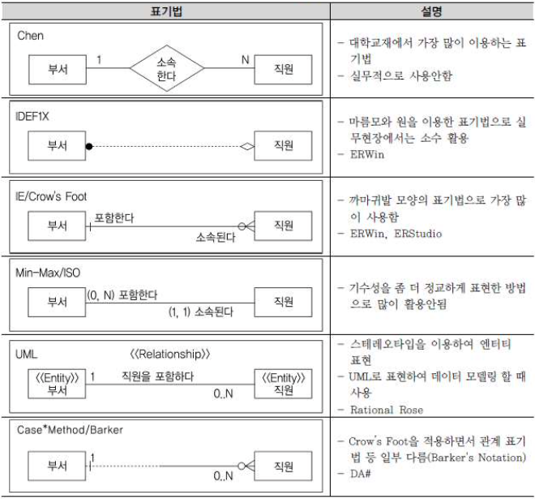

# 데이터 모델링의 이해
데이터 모델링은 **"복잡한 현실 세계를 *추상화*, *단순화*하여, 일정한 표기법에 의해 *명확하게* 표현하는 일"** 라고 할 수 있다.
- 정보시스템을 구축하기 위한 데이터 관점의 업무 분석 기법
- 현실 세계의 데이터(What)에 대해 약속된 표기법에 따라 표현하는 과정
- DB를 구축하기 위한 분석/설계의 과정

데이터 모델링은 그저 DB만을 구축하기 위한 용도가 아닌 **데이터 모델링 자체로서 업무를 설명하고 분석하는 부분에도 매우 중요한 의미**가 있다.

좀 더 실무적으로 해석하면 **업무에서 필요로 하는 데이터를 시스템 구축 방법론에 따라 분석하고 설계하여 정보시스템을 구축하는 과정**으로 정의할 수 있다.

그러므로 설계보다 **업무 내용을 정확하게 분석하는 것이 첫 번째 단계**다.

#### 데이터 모델이 제공하는 기능 
- 시스템을 현재 또는 원하는 모습으로 가시화하도록 도와준다.
- 시스템의 구조와 행동을 명세화할 수 있게 한다.
- 시스템을 구축하는 구조화된 틀을 제공한다.
- 시스템을 구축하는 과정에서 결정한 것을 문서화한다.
- 다양한 영역에 집중하기 위해 다른 영역의 세부 사항을 숨기는 다양한 관점을 제공한다.
- 특정 목표에 따라 구체화된 상세 수준의 표현 방법을 제공한다.

## 1. 특징
> 추상화, 단순화, 명확화

#### 1. 추상화
현실세계를 일정한 형식에 맞추어 표현한다.
- 다양한 현상을 일정한 양식인 **표기법**에 따라 표현한다.

#### 2. 단순화
복잡한 현실세계를 약속된 규약에 따라 제한된 표기법언어로 표현하여 쉽게 이해할 수 있도록 하는 개념을 의미한다.

#### 3. 명확화
누구나 이해하기 쉽게 **"대상에 대한 애매모호함을 제거하고 정확하게 현상을 기술하는 것"** 을 의미한다.

## 2. 모델링의 세 가지 관점
모델링은 크게 세 가지 관점으로 구분하여 설명할 수 있다.
> `데이터관점`, `프로세스관점`, `데이터와 프로세스의 상관관점`

#### 1. 데이터관점
> What, Data

업무가 어떤 데이터와 관련이 있는지 or 데이터간의 관계는 무엇인지 모델링하는 방법

#### 2. 프로세스관점
> How, Process

업무가 실제하고 있는 일은 무엇인지 또는 무엇을 해야 하는지 모델링하는 방법

#### 3. 데이터와 프로세서의 상관관점
업무가 처리하는 일의 방법에 따라 데이터는 어떻게 영향을 받고 있는지 모델링하는 방법

## 3. 데이터 모델링의 중요성 및 유의점
데이터 모델링이 중요한 이유는 `파급효과 - Leverage`, `복잡한 정보 요구사항의 간결한 표현 - Conciseness`, `데이터 품질 - Data Quality`로 정리할 수 있다.

### 1. "파급효과" - Leverage 
시스템 구축이 완성되어 가는 시점에 데이터 구조의 변경으로 인한 일련의 변경 작업은 위험요소이다.  
> 병행/통합 테스트 끝내고 에플리케이션이 완성되어가는 시점에 데이터 모델이 변경된다고 생각해보자 생각만 해도 끔찍하다.

이러한 이유로 인해 시스템 구축 작업 중 다른 설계 과정보다 **데이터 설계가 더 중요하다고 볼 수 있다.**

### 2. 복잡한 정보 요구사항의 "간결한 표현" - Conciseness
데이터 모델은 **구축할 시스템의 정보 요구사항과 한계를 가장 명확하고 간결하게 표현할 수 있는 도구**이다.

### 3. 데이터 품질 - Data Quality
DB에 담겨 있는 데이터는 기업의 중요한 자산이다.  
이 데이터는 기간이 오래될수록 활용가치가 높아지는데, 데이터 품질의 대한 문제는 초기에 데이터가 조금 쌓일 때는 모르지만 데이터가 쌓이고 쌓여서 추후 오랜시간이 지난 후 데이터를 전략적으로 활용하려고 할 때 문제가 대두된다.

데이터 품질의 문제는 데이터 구조의 문제로 직결된다.

### 3 - 1. 데이터 모델링의 유의점
#### 1) 중복 - Duplication
데이터 모델은 같은 데이터를 사용하는 사람, 시간, 장소를 파악하는 데 도움을 준다.  
이러한 지식 응용은 DB가 여러 장소에 같은 정보를 저장하는 잘못을 하지 않도록 한다.

#### 2) 비유연성 - Inflexibility
**데이터의 정의를 데이터의 사용 프로세스와 분리해야 한다.**

데이터 모델의 설계에 따라 사소한 업무변화에도 데이터 모델이 수시로 변경됨으로써 유지보수의 어려움을 가중할 수 있다.

**데이터의 정의를 데이터의 사용 프로세스와 분리**하여 데이터 혹은 프로세스의 작은 변화가 애플리케이션과 DB에 중대한 변화를 일으킬 가능성을 줄인다.

#### 3) 비일관성 - Inconsistency
: **데이터와 데이터 간 상호 연관 관계에 대해 명확하게 정의해야한다.**
> 데이터의 중복이 없더라도 비일관성은 발생한다.

사용자가 처리하는 프로세스 혹은 이와 관련된 프로그램과 테이블의 연계성을 높이는 것은 데이터 모델이 업무 변경에 취약하게 만드는 단점이 된다.

## 4. 데이터 모델링의 3단계 진행
> (추상적) 개념적 데이터 모델링 &rarr; 논리적 데이터 모델링 &rarr; 물리적 데이터 모델링 (구체적)

### 1. 개념적 데이터 모델링
추상화 수준이 높고 업무중심적이고 포괄적인 수준의 모델링을 진행한다.
- 전사적 데이터 모델링
- `EA - Enterprise Architecture`수립시 많이 이용한다.

### 2. 논리적 데이터 모델링
업무의 구체적인 모습과 흐름에 따른 구체화된 업무중심의 데이터 모델을 만들어 내는 것이다.
> 데이터 모델링이 최종적으로 완료된 상태
- 시스템으로 구축하고자 하는 업부에 대해 Key, 속성, 관계 등을 정확하게 표현한다.
- 재사용성이 높다.

이 단계에서 중요한 또 다른 활동은 **정규화**이다.  
정규화는 논리 데이터 모델의 일관성을 확보하고 중복을 제거하여 속성들의 가장 적절한 엔티티에 배치되도록 함으로 보다 신뢰성 있는 데이터구조를 얻는데 목적이 있다.

논리 데이터 모델의 상세화는 식별자 확정, 정규화, M:M 관계 해소, 참조 무결성 규칙 정의 등이 있다.

### 3. 물리적 데이터 모델링
DB의 저장구조에 따른 테이블스페이스 등을 고려한 방식이다.
- DB의 성능, 저장 등 물리적인 성격을 고려햐여 설계한다.

## 5. 프로젝트 `생명주기 - Life Cycle`에서 데이터 모델링

일반적으로 
- 계획 또는 분석단계에서 개념적 데이터 모델링이 일어난다.
- 분석단계에서는 논리적 데이터 모델링을 수행한다.
- 설계단계에서 물리적 데이터 모델링을 수행된다.

현실 프로젝트에서는 **개념적 데이터 모델이 생략된 개념/논리 데이터 모델링이 분석단계 때 대부분 수행한다.**

## 6. 데이터 모델링에서 데이터독립성의 이해
### 1. 데이터독립성의 필요성
> 데이터독립성 &lrarr; 데이터종속성
- 유지보수 비용증가
- 데이터의 복잡도 증가
- 데이터 중복성 증가
- 요구사항 대응 저하

#### 데이터 독립성의 이점
- **각 view의 독립성을 유지**하고 **계층별 View에 영향을 주지 않고 변경**이 가능하다.
  > 뭔가 객체지향의 loose coupling이랑 똑같은 거 같다.
- 단계별 Schema에 따라 `데이터 정의어 - DDL`, `데이터 조작어 - DML`가 다름을 제공한다.

데이터독립성을 이해하기 위해 3단계로 표현된 ANSI 표준 모델을 살펴봐야 한다.

특히 3단계인 구조, 독립성, 사상의 3가지를 이해하면 된다.

### 2. 데이터베이스 3단계 구조
> 외부 스키마 &rlarr; 개념 스키마 &rlarr; 내부 스키마

**외부단계**는 사용자와 가까운 단계로 사용자 개개인이 보는 자료에 대한 관점과 관련이 있는부분이다.
- 사용자가 처리하고자 하는 데이터 유형에 따라
- 관점에 따라
- 방법에 따라 

다른 스키마 구조를 가지고 있다.

**개념단계**는 사용자가 처리하는 데이터 유형의 공통적인 사항을 처리하는 통합된 뷰를 스키마 구조로 디자인한 형태이다.
- 사용자가 처리하는 통합된 뷰를 설계하는 도구

**내부적 단계**는 데이터가 물리적으로 저장된 방법에 대한 스키마 구조를 말한다.

### 3. 데이터독립성 요소
#### 외부 스키마 - External Schema
: 프로그래머나 사용자의 입장에서 데이터베이스의 모습으로 조직의 일부분을 정의한 것
- View 단계 여러 개의 사용자 관점으로 구성
  > 개인적 DB 스키마
- DB의 개개 사용자나 응용프로그래머가 접근하는 DB정의를 의미한다.
- 사용자관점, 접근하는 특성에 따른 스키마 구성

#### 개념 스키마 - Conceptual Schema
: 모든 응용 시스템과 사용자들이 필요로하는 데이터를 통합한 조직 전체의 데이터베이스 구조를 논리적으로 정의한 것.
- 통합관점

#### 내부 스키마 - Internal Schema
: 전체 데이터베이스의 물리적 저장 형태를 기술하는 것.
- 물리적 저장구조

### 4. 두 영역의 데이터독립성
3단계로 나눠진 각각의 영역에 대한 독립성을 지정하는 용어는 논리적인 독립성과, 물리적인 독립성 이다.

#### 1. 논리적 독립성
: 개념 스키마가 변경되어도 외부 스키마에는 영향을 미치지 않도록 지원하는 것  

**논리적 사상(외부적/개념적 사상)을 통해 논리적 독립성이 보장된다.**

- 논리적 구조가 변경되어도 응용 프로그램에 영향이 없다.
- 사용자 특성에 맞는 변경이 가능하다.
- 통합 구조 변경가능

#### 2. 물리적 독립성
: 내부 스키마가 변경되어도 외부/개념 스키마는 영향을 받지 않도록 지원하는 것  

**물리적 사상(개념적/내부적 사상)을 통해 물리적 독립성이 보장된다.**
- 저장장치의 구조변경은 응용프로그램과 개념스키마에 영향이 없다.
- 물리적 구조 영향 없이 개념구조 변경가능
- 개념구조 영향 없이 물리적인 구조 변경가능

## 6. 사상 - Mapping
: 상호 독립적인 개념을 연결시켜주는 다리

#### 외부적/개념적 사상 - 논리적 사상
: **외부 화면이나 사용자에게 인터페이스 하기 위한 스키마 구조는 전체가 통합된 개념적 스키마와 연결된다는 것**
- 외부적 뷰와 개념적 뷰의 상호 관련성을 정의함
- 사용자가 접근하는 형식에 따라 다른 타입의 필드를 가질 수 있음.
- 개념적 뷰의 필드 타입은 변화가 없음

#### 개념적/내부적 사상 - 물리적 사상
: **통합된 개념적 스키마 구조와 물리적으로 저장된 구조의 물리적인 테이블스페이스와 연결되는 구조**
- 개념적 뷰와 저장된 DB의 상호관련성을 정의함
- 만약 저장된 DB구조가 바뀐다면 개념적/내부적 사상이 바뀌어야함. 그래야 개념적 스키마가 그대로 남아있게 된다.

## 7. 데이터 모델링의 3가지 구성 요소
- Entity : 업무와 관련된 **어떤 것**
- Attribute : 어떤 것이 갖는 **성격**
- Relationship : 어떤 것 간의 **관계**

#### 단수/복수 용어 구분
   

출처: https://youtu.be/o4Z30OJQmZ8?t=530

## 8. ERD - Entity Relationship Diagram
주로 IE/Crow's Foot표기법을 사용한다.

### 7 - 1. ERD 작성 순서
#### 1. 엔터티를 그린 후 적절하게 배치한다.
- 가장 중요한 엔터티를 왼쪽 상단에 배치하고 이것을 중심으로 다른 엔티티를 나열한다.
  > 왼쪽 &rarr; 오른쪽, 위 &rarr; 아래 
- 가급적 선이 꼬이지 않게 배치한다.

#### 2. 엔터티간 관계 설정
- 식별자 관계를 우선 설정한다.
  > 식별자 관계: 부모로부터 상속받은 FK가 자식의 PK의 일부가 되는 관계
- 가급적 Cycle 관계도는 발생하지 않아야 한다.

#### 3. 관계형 기술 (양 방향)
- 현재형을 사용하고 지나치게 포괄적인 단어 지양

#### 4. 관계차수와 선택성을 표시한다.
> 1 : N, 1 : 1 ...

## 9. 좋은 데이터 모델의 요소
#### 1. 완정성 - Completencess
업무에서 필요로 하는 **모든 데이터가 데이터 모델에 정의**되어야 한다.

#### 2. 중복배체 - Non-Redundancy
**동일한 사실(=속성)은 반드시 한 번만 기록**하여야 한다.

#### 3. 업무규칙 - Business Rules
**업무규칙이 데이터 모델에 표현**되어아 한다.
> ex. 사원에는 정규직, 임시직이 있으며, 정규직만 호봉 정보를 가진다.

#### 4. 데이터 재사용 - Data Reusbility
회사 전체 관점에서 **공통 데이터를 도출**하고, 이를 **전 영역에서 사용**할 수 있도록 설계해야 한다.

#### 5. 의사소통 - Communication
데이터 분석과정에서 도출되는 많은 업무 규칙들은 데이터모델에 엔터티 서브타입, 속성, 관계 등의 형태로 최대한 자세하게 표현되어야 한다.
- 정보시스템 운용, 관리하는 관련자들이 설계자가 정의한 업무 규칙들을 동일한 의미로 받아드리는 역할과,
- 정보시스템을 활용할 수 있게 하는 역할을 하게 된다.

#### 6. 통합성 - Integration
동일한 **데이터는 조직의 전체에서 한 번만 정의**되고, 이를 여러 **다른 영역에서 참조, 활용**해야 한다.

## Reference
- SQL전문가 가이드
- 유튜브 국민대학교 김남규 교수채널 [(DB실무) Part2-데이터 모델링의 이해(2/5)](https://www.youtube.com/watch?v=o4Z30OJQmZ8) 동영상
