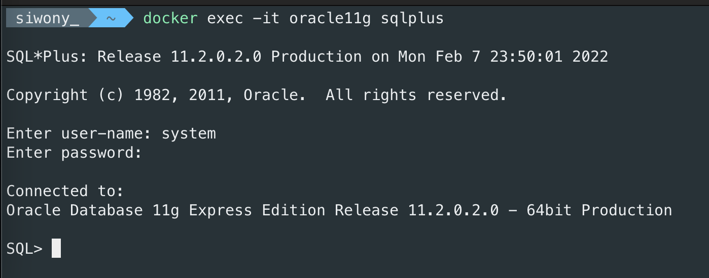

# Oracle 11g quick start with doker

### 1. oracle 11g 이미지 pull
```sh
docker pull jaspeen/oracle-xe-11g
```

### 2. 이미지 실행하기 
```sh
docker run --name oracle11g -d -p 1521:1521 jaspeen/oracle-xe-11g
```
1521은 오라클DB의 기본 포드이다.

### 3. oracle11g실행하기

#### 3-1. sqlplus 접속
```sh
docker exec -it oracle11g sqlplus
```

#### 3-2. 로그인 하기
아이디 패스워드를 입력하여 sqlplus로 로그인한다.
- **user-name: system**
- **password: oracle**

잘 입력했으면 아래 사진과 같이 나올 것이다.


