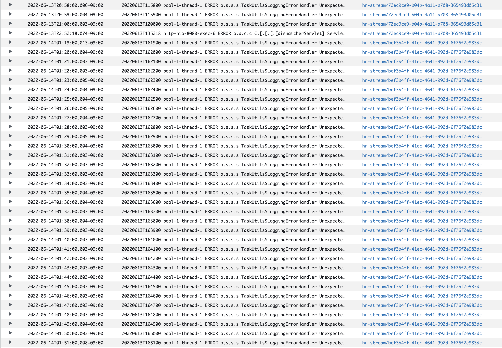

# ECS에 배포한 단일 노드 Redis의 Read only replica 에러 해결기
HiRecruit서비스에서는 Redis를 Session storage로 사용한다.  

### 왜 Hirecruit에서는 Amazon ElastiCache for Redis를 두고 ECS에 redis를 배포헀나요?
일단 Amazon ElastiCache 서비스의 비용은 학생들이 부담하기에는 돈이 너무 많이 든다. 그리고 Redis를 단일 노드로 사용할 것 이므로 Amazon ElasticCache는 오버스펙이라는 생각이 들어 Docker 컨테이너 형태로  쉽게 배포할 수 있는 ECS를 선택했다.

## 1. 배포방식
[redis 공식 docker image](https://hub.docker.com/_/redis)를 pull받아서 별도의 설정없이 그대로 배포했다.

이미 local환경에서 어느정도 테스트를 해봐서 상관 없겠지 하며 배포를 했지만... 어느순간 갑자기 Read only replica에러가 발생했다.

## 2. 수많은 에러의 향연
운영 환경에서 SpringBoot Application Server가 잘 동작하고 있었는데 어느순간 1분단위로 계속 에러가 발생하였다.



> Clould Watch logging...

로그를 살펴보면 RedisReadOnlyException이 발생하는 것을 확인할 수 있다.
```log
20220613T162700 pool-1-thread-1 ERROR o.s.s.s.TaskUtils$LoggingErrorHandler Unexpected error occurred in scheduled task
org.springframework.data.redis.RedisSystemException: Error in execution; nested exception is io.lettuce.core.RedisReadOnlyException: READONLY You can't write against a read only replica.
	at org.springframework.data.redis.connection.lettuce.LettuceExceptionConverter.convert(LettuceExceptionConverter.java:54) ~[spring-data-redis-2.6.4.jar!/:2.6.4]
	at org.springframework.data.redis.connection.lettuce.LettuceExceptionConverter.convert(LettuceExceptionConverter.java:52) ~[spring-data-redis-2.6.4.jar!/:2.6.4]
	at org.springframework.data.redis.connection.lettuce.LettuceExceptionConverter.convert(LettuceExceptionConverter.java:41) ~[spring-data-redis-2.6.4.jar!/:2.6.4]
	at org.springframework.data.redis.PassThroughExceptionTranslationStrategy.translate(PassThroughExceptionTranslationStrategy.java:44) ~[spring-data-redis-2.6.4.jar!/:2.6.4]
	at org.springframework.data.redis.FallbackExceptionTranslationStrategy.translate(FallbackExceptionTranslationStrategy.java:42) ~[spring-data-redis-2.6.4.jar!/:2.6.4]
	at org.springframework.data.redis.connection.lettuce.LettuceConnection.convertLettuceAccessException(LettuceConnection.java:272) ~[spring-data-redis-2.6.4.jar!/:2.6.4]
    이하 생략...
```
갑자기 잘 작동하던 Redis가 ReadOnly로 변했다는게 이상하여 원인을 찾기 위해 `redis-cli`를 통해 Redis에 접속한 후 레디스 서버 정보를 보여주는 `info` 명령어를 치고 로그를 확인하는 중 `Replication` 섹션에서 role이 slave로 변경된 것을 확인했다.
```conf
# Replication
role:slave
master_host:xxx.xxx.xxx.xxx
master_port:xxxx
master_link_status:down
master_last_io_seconds_ago:-1
master_sync_in_progress:0
master_link_down_since_seconds:1341313174
```

그 후 임시 방편으로 `redis-cli`에서 `SLAVEOF NO ONE`을 입력하여 redis node를 slave에서 master로 변경하고, application 에서는 더이상 `RedisReadOnlyException`이 발생하지 않은 것을 확인했다.

## 3. 해치웠나?
정상작동을 확인하고 하루가 지난 후 똑같은 에러가 발생하였다.

그래서 에러가 발생하지 않도록 Redis Replication에 대해 알고자 구글링을 하는 도중 redis.conf에 cluster-enabled 설정을 발견했다.

### 3-1. Redis Cluster?
Redis Cluster는 데이터를 자동으로 여러 개의 Redis 노드에 나누어 저장할 수 있는 방법을 제공한다. 또한 일부 노드가 죽거나 통신이 되지 않을 때에도 작업을 계속할 수 있는 가용성을 제공한다. 

하지만 cluster-enabled 속성의 기본값은 `no`다 즉, 원래 아무 설정도 하지 않으면 단일 노드로 동작해야 한다는 것 이다. 하지만 해당 이슈가 발생하였으므로 ECS환경에서는 다르게 작동한다고 생각이 들었다.

## 4. 해결
`redis.conf`에 `cluster-enabled`속성에 `no`를 설정한 후 image를 만들고 배포하였다. 6월 15일부터 지금까지 정상작동 하고 있다.

#### redis.conf
```conf
cluster-enabled no
```

## 5. 문제 원인이 뭐였을까?
아직 redis에 대한 depth가 낮아 원인을 정확하게 모르겠지만, 취업한 친구의 사수님 피셜로 같은 ECS서비스를 사용하면 Redis컨테이너끼리 묶이는 경향이 있다고 한다. 정확한건 나중에 깊게 공부하다 보면 알 수 있겠지...?