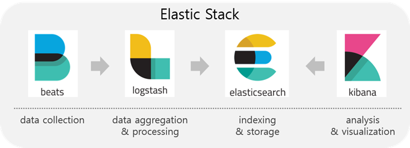
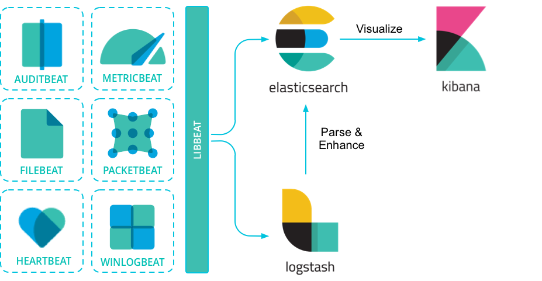

# Elastic Stack - Elasticsearch, Logstash, Kibana + Beats

> ELK &rarr; Elastic Stack(ELK Stack)

#### ELK Stack의 시작
1. `Elastic Stack(ELK Stack)`의 시작은 `ELK`로, `Elasticsearch`, `Logstash`, `Kibana`의 머리글자로 이루어진 프로젝트이다. 
2. 여기에 최근 경량의 **단일 목적 데이터 수집기인 `Beats`가 추가**되면서, **`Elastic Stack(ELK Stack)`** 으로 발전하게 되었다.

#### ELK Stack 구성요소 한눈에 보기

- `Elasticsearch`: `JSON` 기반의 분산형 검색 및 분석 엔진으로 대규모의 데이터를 손쉽게 저장, 검색, 분석할 수 있다.
- `Logstash`: 확장형 플러그인 에코시스템으로 구성된 동적 데이터 수집 파이프라인
  > 다양한 소스에서 동시에 데이터를 수집하고 변환(JSON 등...)하여 자주 사용하는 Stash 보관소로 보냅니다.
- `Kibana`: 확장형 사용자 인터페이스로 데이터를 구체적으로 시각화할 수 있다.
  > 데이터를 시각적으로 탐색하고 실시간으로 분석 할 수 있다.
- `Beats`: 단말 장치의 데이터를 전송하는 경량 데이터 수집기 플랫폼
  > 다소 부피가 큰 Logstash의 기능을 세분화하여, 데이터를 수집하는 원격 서버에 에이전트로 설치하는 경량화된 데이터 수집기

> 에이전트: 분산 환경에서 상호 협력을 통해 작업을 수행하는 컴퓨터 프로그램

## ELK Stack의 구성
### 1. Elastic search
: `JSON` 기반의 분산형 `RESTful` 검색 및 분석 엔진이다.
- `Apache Lucene`을 기반으로 한 분산형 오픈 소스 검색 및 분석 엔진이다
- 다양한 서비스에 이용가능하다.
  - 로깅과 로그, 보안, 비즈니스, 엔터프라이즈 분석
  - 인프라 메트릭과 컨테이너 모니터링
  - 웹, 앱 어플리케이션 검색
  - 애플리케이션 성능 모니터링
- 간단한 `RESTful API`, 분산형 특징, 빠른 속도, 높은 확장성
- `Elastic search`의 가장 큰 장점은 **실시간(Real-time) 분석 시스템**이다.
#### Elasticsearch의 데이터 분석 방법
1. 클러스터가 실행되고 있는 동안 계속해서 데이터가 입력(Indexing)되고,
2. 그와 동시에 실시간에 가까운 속도로 색인된 데이터의 검색과 집계가 가능하다.

**이게 가능한 이유는 다음과 같다**  
`역인덱스(Inverted file index)` 데이터 구조를 사용하여 `풀 텍스트(Full text)` 검색을 할 수 있도록 설계되었기 때문이다.

> 역 인덱스: 키워드를 통해 문서를 찾아내는 방식  
> 자료구조가 Key : Value인 Map의 예시로 들면 value를 통해 key를 찾는 것이라 할 수 있다.

#### Elasticsearch의 역할
- `Logstash`를 통해 수신된 데이터를 저장소에 저장하는 역할을 담당한다.
- 데이터를 중심부에 저장하여 예상되는 항목을 검색하고 예상치 못한 항목을 밝혀낼 수 있다.

#### 참고
- `Lucene`이 JAVA로 만들어졌기 때문에 `Elasticsearch` 또한 JAVA로 개발되어 있다.

### 2. Logstash
: 실시간 파이프라인 기능을 가진 오픈소스 데이터 수집 엔진이다.
- 서로 다른 소스의 데이터를 탄력적으로 통합하고, 사용자가 선택한 목적지로 데이터를 정규화할 수 있다.
- `JRuby`로 되어있으며, `Ruby`로 개발되어 `JVM`위에서 돌아간다.

#### Logstash의 역할
- `Server-side` 데이터 처리 파이프라인으로 다양한 소스에서 동시에 데이터를 수집하고 통합한다.
- 또한, 집된 데이터를 정규화하여 `Elasticsearch` 등의 목적지로 전송하는 역할을 한다.
- **`Elastic Stack`에서는 가공된 데이터를 `Elasticsearch`로 전달한다.**

#### 동작 원리
1. 다양한 유형의 데이터를 입력(INPUTS), 필터(FILTER), 출력(OUTPUTS) 파이프라인을 통해 원하는 형식으로 변환
    > "다양한 유형의 데이터"의 예시는 다음과 같다. &rarr; 웹 로그, 애플리케이션 로그, HTTP 요청, 센서 정보 등...  
     > "원하는 형식으로 변환하는 데이터"의 예시는 다음과 같다. &rarr; 확장, 변경, 필터링, 삭제 등의 처리를 통해 가공된 데이터
2. 원하는 데이터 저장소(Stash 보관소)로 전달할 수 있다.

### 3. Kibana
: `Elasticsearch`에 색인된 데이터를 검색하고 시각화하는 오픈소스 프론트엔드 서비스이다.
- 기본적으로 `Discover`, `Visualize`, `Dashboard` 메뉴와 다양한 App으로 구성되어 있으며, 플러그인을 통해 확장 가능하다.

> **Discover**: `Elasticsearch`에 색인된 소스 데이터들의 검색을 위한 메뉴이다.  
> **Dashboard**:  `Visualize`메뉴에서 만들어진 시각화 도구(수집된 차트, 그래프, 메트릭, 검색 및 지도 등)들을 조합하여 단일 페이지에 모아 놓고 다양한 관점에서 데이터에 요약된 인사이트를 제공한다.

#### Kibana의 역할 
1. `Elasticserach`에서 색인된 데이터를 검색하여 보고, 시각화하며 여러 차트를 생성하여 데이터를 분석한다. 
2. 브라우저를 통해 대규모 데이터에 대한 실시간 분석 보기를 제공한다.
3. 웹 인터페이스를 통해 `Elastic Stack` 인스턴스를 모니터링하고 관리하며 보호한다.
4. 통합 가시성, 보안 및 엔터프라이즈 검색 애플리케이션을 위해 `Elastic Stack`에서 개발된 기본 제공 솔루션에 대한 집중화된 중앙 접근 기능을 제공한다.

### 4. Beats
: `Beats`는 다소 부피가 큰 `Logstash`의 기능을 세분화하여,   
데이터를 수집하는 원격 서버에 에이전트로 설치하는 경량화된 오픈소스 데이터 수집기이다.  

- Beats를 통해 수집된 데이터는 `Logstash`를 통하거나, 또는 `Elastcisearch`로 직접 보낼 수도 있다. 
- 각 용도에 따라 다양한 `Bests`를 선택해 사용할 수 있다.

#### Beats의 제품군
- Filebeat - Real-time insight into log data
  > 로그와 파일을 경량화된 방식으로 전달하고 중앙 집중화하여 작업을 보다 간편하게 만들어 주는 역할을 한다.
  > - `Logstash`사용 이유:  
     로그 메시지를 별도의 필드로 구문 분석하고 원하지 않는 데이터 비트를 필터링하고 다른 데이터를 보강하여 로그 메시지에 컨텍스트를 추가하는 고급 로그 향상 기능은 `Logstash`없이는 처리할 수 없다.

- Packetbeat - Analyze network packet data
  > `Packetbeat`는 데이터에 실시간으로 접근하여 내용을 분석하면 네트워크 트래픽의 흐름이 어떤지 파악할 수 있다.
- Winlogbeat - Analyze Windows event logs.
  >  Winlogbeat를 이용해 Windows 이벤트 로그를 `Elasticsearch`와 `Logstash`로 스트리밍할 수 있다.
- Metricbeat - Ship and analyze metrics.
  > CPU부터 메모리, `Redis`, `NGINX`까지 `Metricbeat`를 통해 다양한 시스템 서비스 통계를 가볍게 전송할 수 있다.
- Heartbeat - Ping your Infrastructure.
  > `Heartbeat`를 통해 가동 시간과 반응 시간등 활성 상태를 탐지하고 서비스가 가능한지 모니터링한다.
- Auditbeat - Send audit data to Elasticsearch.
  > `Auditbeat`는 `Linux` 감사 프레임워크 데이터를 수집하고 수집한 데이터를 `Elastic Stack`에 실시간 전송한다.
- Functionbeat - Ship cloud data with serverless infrastructure.
  > 클라우드 서비스의 `Function-as-a-Service (FaaS)` 플랫폼에서 기능으로 배포하여 데이터를 수집, 전송, 모니터링한다.