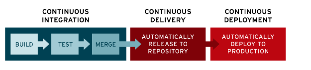

# CI/CD
### 배경
전통적인 배포 파이프라인 단계는 다음과 같다
1. **Version control** : 일반적으로 코드를 가지고 일을 하는 소프트웨어 개발자들은 코드 변경사항을 커밋한다.
2. **Acceptance tests** : 미리 컴파일/빌드된 코드에 대해 테스트 묶음을 실행한다.
3. **Independent Deployment** : 독립 배포는 컴파일되고 테스트된 artifact 개발환경에 배포한다. 개발환경은 이상적으로 프로덕트 환경과 아주 비슷해야 한다.
4. **Producton Deployment** : 일반적으로 운영팀(Operations)이나 DevOps팀에 의해서 다루어진다. 이것을 Independent Deployment 프로세스와 매우유사해야 하고, production 서버에 코드를 배포한다.
5. **이러한 기존 방식으로, 휴먼에러(Human error)가 발생할 수 있다.** 결국 잘못된 배포로 인해 영향을 미칠 수 있다.

- 소프트웨어가 거대 및 복잡해지고 분업과 협업의 과정에서 코드의 Merge 과정은 까다롭고, 테스트하는데 큰 자원을 소비하는 문제를 해결하기위해 도입하게되었다.
- 개발 브랜치가 일정 기간 이상 이용되면, 통합의 어려움은, 충돌 해결에 들어가는 시간, 오류 발생 위험이 커진다. 이러한 단점을 극복하고자 변동 내용의 반영 빈도를 늘리는 자동화가 등장
- 빌드와 기능성을 검증하는 새로운 방법을 확보하고 기능의 개발과 배치 속도를 큰 폭으로 개선하기 시작하였다.
- 
### CI/CD 정의
지속적 통합(Continuous Intergration)  
지속적 전달(Continuous Delivery), 지속적 배포(Continuous Deployment)

: **애플리케이션 개발 단계를 자동화 하여 보다 짧은 주기로 고객에게 제공하는 방법**
- 지속적인 통합(CI), 지속적인 서비스 제공(CD), 지속적인 배포(CD)를 가능하게 한다.
- 새로운 코드의 통합으로 인하여 개발 및 운영팀에 발생하는 문제를 해결하는 솔루션이다.

### CI 지속적 통합(Continuous Integration)
: **여러 개발자가 작성하거나 수정한 소스를 지속적으로 통합하고 테스트하는 것**
- Build & Packaging
- 새로운 코드 변경 사항이 정기적으로 빌드 및 테스트되어 공유 레포지토리에 병합되는것
- Build, Test를 실시하는 프로세스를 말하며 이러한 통합 프로세스를 상시로 실시하는것
- 다수의 개발자가 동시에 애플리케이션 개발과 관련된 코드 작업을 할경우, 서로 충돌할 수 있는 문제를 해결하기 위함
- 언제나 최신 Build를 고객에게 바로 제공 가능하게 한다.

### CI 적용 흐름(Jenkins)
1. 개발자는 자신이 개발한 소프트웨어의 소스코드를 공통된 버전 관리시스템(github 등)에 저장
2. 소스코드상에 변동이 생기면 버전 관리 시스템에서 CI툴(Jenkins)로 소스코드 변경을 알림
3. CI툴에서 변경된 소스코드를 대상으로 Build, Test, Merge를 진행  
    >이 과정들이 완료되면 슬랙, 카카오톡, 메일 등을 통해 통합 결과 알림

### CD(Continuous Delivery, Continuous Deployment)
: **개발, 통합, 배포, 릴리즈, 테스트를 자동화하여 지속적으로 배포하는 것**

**Continuous Delivery(지속적 전달)**  
> 프로덕션은 수동으로 배포한다.

**Continuous Deployment(지속적 배포)**
> 프로덕션까지 자동으로 배포한다.