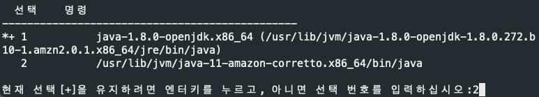

# 간단한 Spring Boot AWS Server 배포
> 이글은 EC2, AWS Linux, JAVA11, Maven, macOS 기준으로 설명할 글입니다.  
> 그리고 간단한 협업, Test 를 위한 배포입니다.

### 자신의 MAC 에서 AWS instance연결하기
1. 자신의 터미널에서 키페어가 있는 디렉토리로 이동 한다.
2. 터미널에서 pair key의 권한을 변경
    > key 이름은 ``~.pem`` 형식으로 되어있다
    ```sh
    chmod 400 키이름.pem
    ```
    > 유저가 읽기만가능하다는 권환으로 변경
3. 자신의 AWS instance 를 선택후 연결하기 를 누른다.
4. 그후 SSH 클라이언트 텝에 있는 ``예`` 에 적어져있는 명령어를 터미널에 입력한다.
    >필자의 key 이름은 ~~귀찮아서~~ `asdfasef` 로 했다.  
    

5. 다음과 같이 뜨면 성공이다.  
    

### AWS Linux 가상환경에서 배포 환경 구축하기
> 필자는 openJDK 11 버전을 사용할 것이다.
1. Git 설치
    ```bash
    sudo yum install git
    ```
2. JAVA8 설치 및 JAVA 11 버전 적용(open JDK)  
    > JAVA11을 적용시키기 위해 먼저 JAVA8을 설치한다.
    **JAVA8 install**
    ```bash
    sudo yum install -y java-1.8.0-openjdk-devel.x86_64
    sudo yum install java-11-amazon-corretto-headless
    ```
    **JAVA11 로 바꾸기**
    ```bash
    sudo alternatives --config java
    ```
    설치했던 java-11-amazon-corretto 버전을 선택한다.  
    

3. Apache Maven설치
    ```bash
    sudo wget http://repos.fedorapeople.org/repos/dchen/apache-maven/epel-apache-maven.repo -O /etc/yum.repos.d/epel-apache-maven.repo
    sudo sed -i s/\$releasever/6/g /etc/yum.repos.d/epel-apache-maven.repo
    sudo yum install -y apache-maven
    ```

### 배포
1. 자신의 SpringBoot project 받아오기  
    ex)
    ```bash
    mkdir app
    cd ./app
    git clone https://github.com/siwony/SpringBoot-MembershipAPI.git
    ```

2. 쉘스크립트를 이용해 배포  
    vim 에디터로 쉘스크립트 작성
    ```bash
    vim deploy.sh
    ```
    bash shell script
    ```bash
    #!/bin/bash
    # maven 프로젝트 폴더로 옮기기
    cd ./SpringBoot-MembershipAPI
    
    # 프로젝트의 변경사항이 없는지 확인
    echo "git pull"
    git pull
    
    # 프로젝트 컴파일
    echo "프로젝트 컴파일"
    mvn compile

    # 프로젝트 test
    echo "프로젝트 테스트"
    mvn test

    # jar 파일로 packaging
    echo "mvn package"
    mvn package
    ```

### 서버 시작
1. 서버 실행
    자신의 프로젝트 폴더의 target 으로 이동
    ```bash
    cd SpringBoot-MembershipAPI/target/
    ```
    `mvn packge` 명령어로 만든 jar 파일 실행
    ```bash
    java -jar 자신의jar파일
    #ex) java -jar membershipApi-0.0.1-SNAPSHOT.jar
    ```
    **If BackGround 에서 실행하고 싶다면 ``java -jar`` 앞에 ``nohub`` 을 붙이고 명령어 끝에 & 를 입력해야된다.**
    ```bash
    nohup java -jar 자신의jar파일
    #ex)nohub java -jar membershipApi-0.0.1-SNAPSHOT.jar &
    ```
    로그 확인하기
    ```bash
    cat nohub.out
    ```
    curl 를 이용한 서버 동작여부 test
    ```bash
    curl localhost:8080
    ```
    