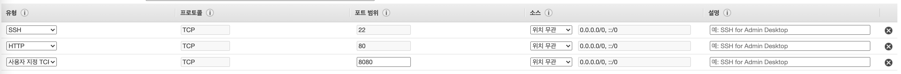

# AWS EC2
## Amazon EC2
: **Amazon Elastic Compute CLoud의 줄임말로써 AWS에서 제공하는 클라우드 컴퓨팅**
>Amazon EC2는 웹서비스 인터페이를 사용해 다양한 운영 체제로 인스턴스를 시작하고, 이를 사용자 정의 애플리케이션 환경으로 로드하며, 네트워크의 엑세스 권한을 관리하고, 원하는 수의 시스템을 사용해 이미지를 실행 할 수 있는 진정한 가상 컴퓨팅 환경을 제공한다.
### 장점
- **하드웨어 투자할 필요가 없어 빠르게 애플리케이션을 개발하고 배포 할 수 있다.**
- **원하는 만큼 가상 서버를 구축**
- **보안 및 네트워크 구성과 스토리지 관리가 가능**
- **서버 트래픽 예측 필요성 줄어든다**
    >요구 사항이나 갑작스러운 인기 증대 등 변동 사항에 따라 신속하게 규모를 확장하거나 축소할 수 있음
### 기능 
- **인스턴스(instance)**: 가상 컴퓨팅 환경
- **Amazon 머신 이미지(AMI)**: 서버에 필요한 운영체제와 여러 소프트웨어들이 적절히 구성된 상태로 제공되는 템플릿으로 인스턴스를 쉽게 만들 수 있다.
- **인스턴스 유형**: 인스턴스를 위한 CPU, 메모리, 스토리지, 네트워킹 용량의 여러 가지 구성 제공
- **키 페어를 사용하여 인스턴스 로그인 정보 보호**(AWS는 퍼블릭 키를 저장하고 사용자는 개인 키를 안전한 장소에 보관하는 방식)
- **인스턴스 스토어 볼륨**: 임시 데이터를 저장하는 스토리지 볼륨으로 인스턴스 중단, 최대 절전 모드로 전환 또는 종료 시 삭제됨
- **Amazon Elastic Block Store(Amazon EBS)**   
    : Amazon EBS 볼륨을 사용해 영구 스토리지 볼륨에 데이터 저장
- 인스턴스와 Amazon EBS 볼륨 등의 리소스를 다른 물리적 장소에서 액세스할 수 있는 리전 및 가용 영역
- 보안 그룹을 사용해 인스턴스에 연결할 수 있는 프로토콜, 포트, 소스 IP 범위를 지정하는 방화벽 기능
- **탄력적 IP 주소(EIP)**: 동적 클라우드 컴퓨팅을 위한 고정 IPv4 주소
- **태그**: 사용자가 생성하여 Amazon EC2 리소스에 할당할 수 있는 메타데이터
- **Virtual Private Clouds(VPC)** : AWS 클라우드에서는 논리적으로 격리되어 있지만 원할 때마다 고객의 네트워크와 간편히 연결할 수 있는 가상 네트워크

## 간단하게 Spring Boot 서버를 열기위한 Instance 생성하기
> 본인은 SpringBoot로 만든 서버를 이용하여 AWS EC2 에 돌릴 예정이기때문에 SpringBoot 배포환경 기반으로 글을 작성할 것이다.
### Instance 만들기
1. **AWS Management Console 에 들어가서 EC2 에 들어간다.**
2. **인스턴스 시작을 누른다.**

 
1. **Amazon Machine Image(AMI) 선택 에서**   
    ``Amazon Linux 2 AMI (HVM), SSD Volume Type - ami-047a51fa27710816e (64비트 x86) / ami-03c5cc3d1425c6d34 (64비트 Arm)`` 를 선택한다.
    > 본인이 원하는 것을 선택해도된다 필자는 이렇게 할것이다.

1. **인스턴스 유형 선택 에서 원하는 인스턴스를 선택하고 ``인스턴스 세부 정보구성`` 을누른다.**
    > 간단한 Back-end서버를 열것이기 때문에 프리티어가 적용되는 ``t2.micro`` 를 사용할것이다.
1. **3, 4, 5 단계에서 자신이 원하는 설정을 한다.**
    > 간단하게 열것이기 때문에 본인은 기본값으로 할것이다.
1.  다음으로 6단계 보안 그룹 구성 에서 유형을 다음과 같이 추가해준다
  

    - 소스를 위치 무관으로 해준다. 
        >어디서나 접속을 할 것이기 때문
    - 유형에서 HTTP를 추가해준다.
        >HTTP통신을 이용한 back-end 서버를 추가 할 것이기 떄문
    - 사용자 지정 TCP 를 추가한후 포트 범위를 8080으로 설정한다.
        >본인이 8080 포트에 서버를 열것이기 때문
7. 검토 및 시작을 누른후 확인 후 시작하기를 누른다.
8. 그후 키페어 선택창에서 키페어가 있으면 선택하고 없으면 만든다.  
8-1. 키페어가 없는 경우 만들어서 로컬에다가 저장한다
    >따로 폴더에 저장하는것을 권장한다. **이 키는 남에게 넘어가면 큰일난다.**
### [Maven 기반 Spring Boot 서버 간단하게 배포하기](./simple-spring-boot-aws.md)
> 요거는 CI/CD 요딴거 다 떄려치우고 간단하게 서버 올릴때 할꺼에여 주로 대회같은 간단한 서버 만들때