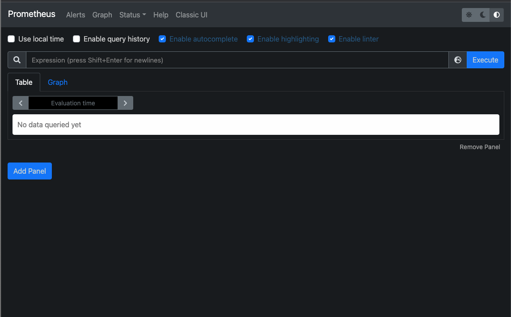
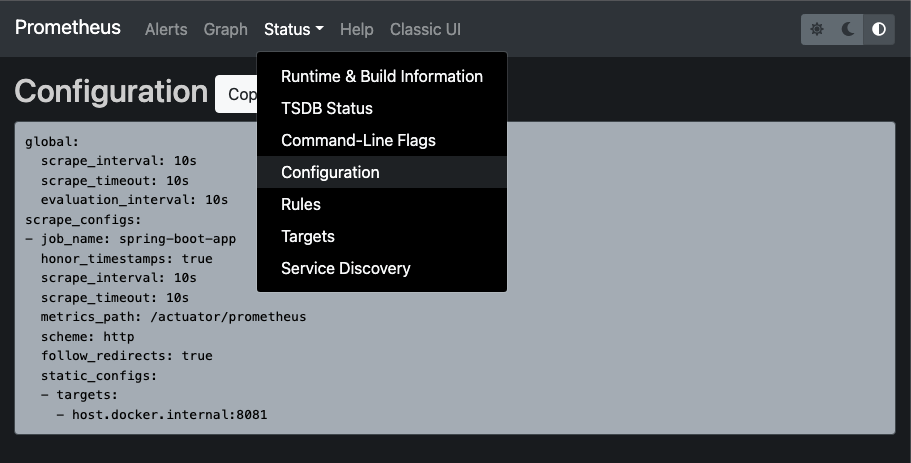
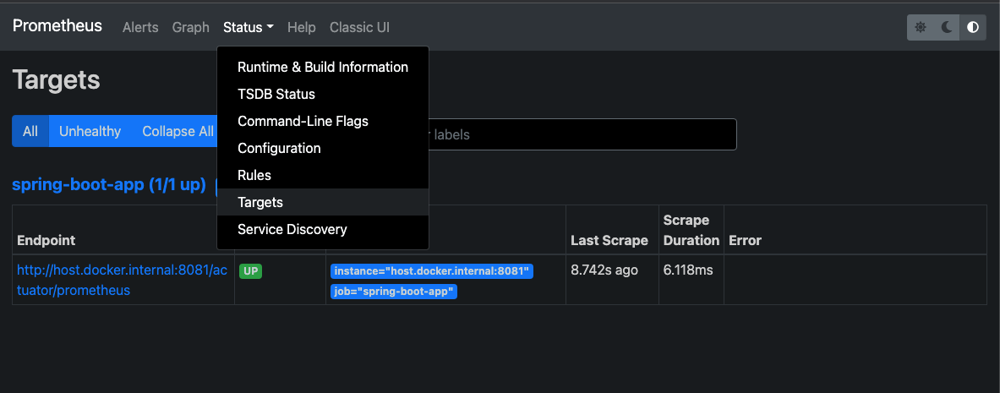
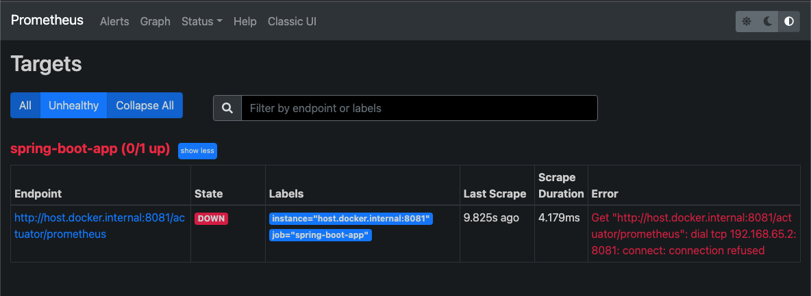
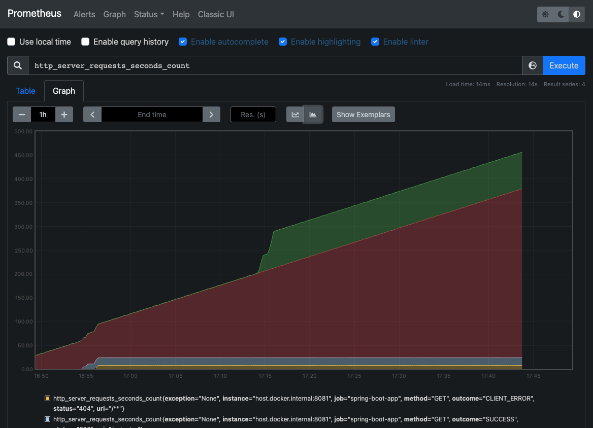

# Prometheus quick start with docker
> 이 글은 빠른 실습을 위해 Spring Boot + Spring Actuator를 기반으로 작성된 글입니다.

Prometheus는 metric을 수집하고 모니터링 및 알람에 사용되는 오픈소스 애플리케이션이다.

## 설치 및 설정
### 1. 도커 이미지 다운로드 
```sh
docker pull prom/prometheus
```

### 2. prometheus.yml 파일 생성
Prometheus Server는 `/etc/prometheus/prometheus.yml`설정 파일을 사용한다.
docker volume mount를 이용해 local에 만든 `prometheus.yml`를 mount할 것이다.

#### 1-1. prometheus.yml 파일 생성 예시
> Spring Boot Application을 기반으로 생성한 예제
```yaml
global:
  scrape_interval: 10s
  evaluation_interval: 10s

scrape_configs:
  - job_name: 'spring-boot-app'
    metrics_path: '/actuator/prometheus' # Application prometheus endpoint
    static_configs:
      - targets: ['host.docker.internal:8081'] # application host:port
```

> `host.docker.internal`는 docker에서 특별한 DNS name으로 사용된다. 개발용으로만 사용해야 하며, Local를 제외한 외부의 환경에서는 동작하지 않는다.

### 3. Docker run
```sh
docker run -d --name 컨테이너-이름 -p docker내부포트번호:docker외부포트번호 -v 로컬-prometheus.yml경로:/etc/prometheus/prometheus.yml prom/prometheus
```

#### 3-1. 예시
`prometheus.yml`의 경로가 `~/spring-actuator/install/prometheus/prometheus.yml` 일 때 docker 외부/내부 포트를 9090으로 컨테이너를 만들고 실행하는 예시이다.
```sh
docker run -d --name prometheus -p 9090:9090 -v ~/spring-actuator/install/prometheus/prometheus.yml:/etc/prometheus/prometheus.yml prom/prometheus
```

### 4. 프로메테우스 접속
[3-1. 예시](#3-1-예시)를 기준으로 실행시킨 프로메테우스 컨테이너의 http://localhost:9090 에 접속하면 다음과 같이 Prometheus 화면이 나온다.



#### 4-1. Configuration 확인하기
상단 네비게이션바에 `Status` &rarr; `Configuration`를 선택하면 다음과 같이 나타난다.


#### 4-2. Application의 상태 확인하기
상단 네비게이션바에 `Status` &rarr; `Targets`를 선택하면 application의 상태를 나타낸다. 다음은 [3-1. 예시](#3-1-예시)의 성공 예시이다.



다음은 prometheus.yml파일에 host 이름을 잘못 입력했거나 서버가 down되었을 때 나타난다.



### 5. 프로메테우스 메트릭 확인하기
메인페이지에서 페널을 하나 만들고 검색창에 확인하고 싶은 메트릭을 입력하고 Execute를 누른다. 

다음 예시는 http_server-requests_seconds_count 메트릭을 보여주는 예시이다.



## 여담
- 프로메테우스는 따로 timezone 설정이 안된다.
  > 그래서 따로 grafana를 사용해 변경할 수 있다.
- 프로메테우스 하나로 쓰기는 너무 구려서 그라파나 혹은 데이터독을 사용할 예정이다.

## Reference
- https://jongmin92.github.io/2019/12/04/Spring/prometheus/
- https://yjwang.tistory.com/85