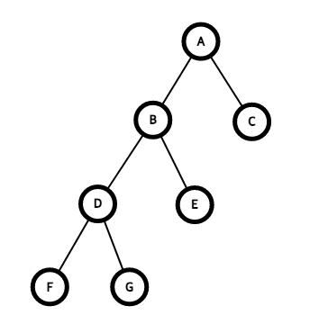
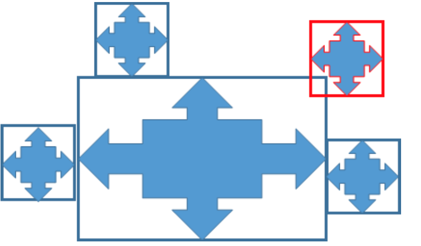
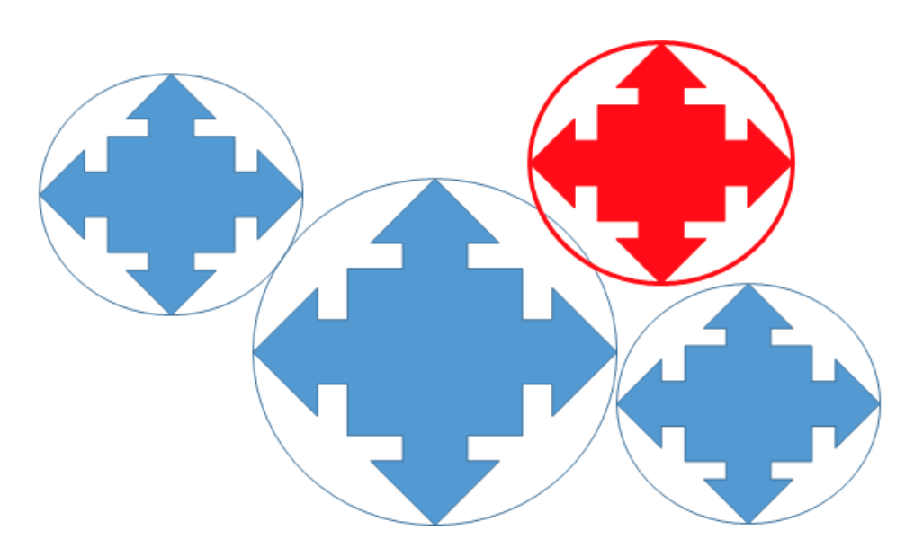
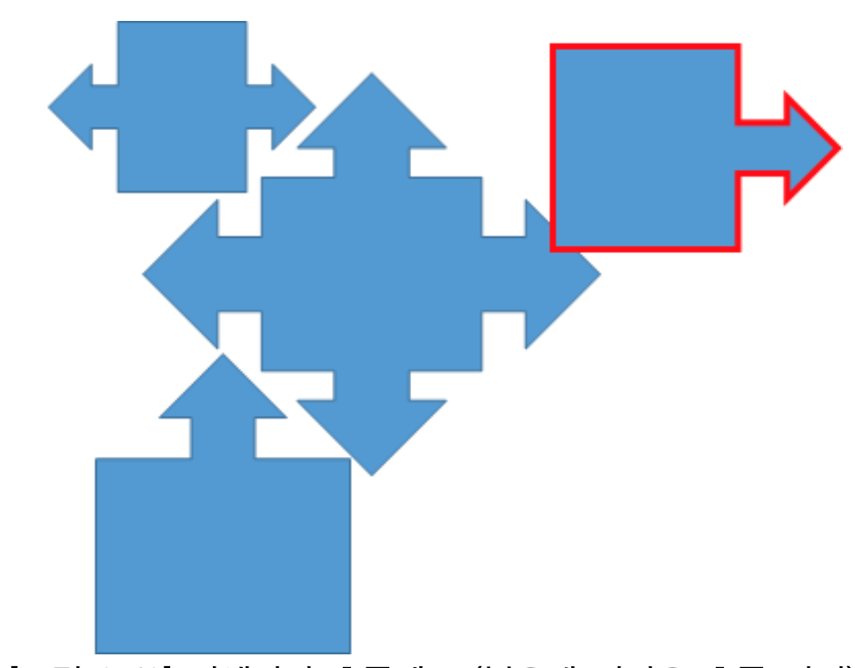
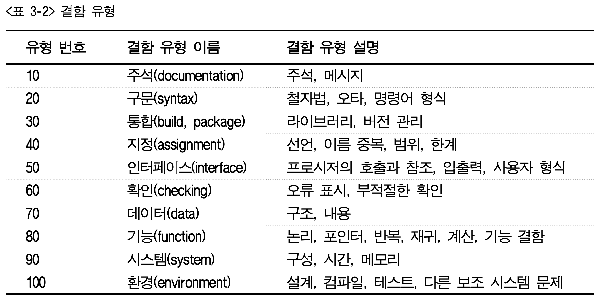

### 게임시스템
: 게임을 실행하기 위해 필요한 플랫폼 장비, 게임 내의 규칙과 요소, 정보들의 유기적 결합

### 이중 연결 리스트 삽입


```c
newnode -> Llink = before;
newnode -> Rlink = before -> Rlink;
before -> Rlink -> Llink = newnode;
before -> Rlink = newnode;
```

### stack
#### 1 ~ 3
|스택 A|스택 B|스택 C|
|--|--|--
|&nbsp;|&nbsp;||
|&nbsp;|&nbsp;||
|이광수(2)|||
|유재석(1)|이보영(3)||

#### 4 ~ 5
|스택 A|스택 B|스택 C|
|--|--|--
|&nbsp;|&nbsp;||
|&nbsp;|&nbsp;||
|&nbsp;|||
|유재석||이광수(C에서 이동됨)|
1. `push(A, "유재석");`
2. `push(A, "이광수");`
3. `push(B, "이보영");`
4. `pop(B);`
5. `push(c, pop(A));`

### 탐색


#### 1. 깊이 우선 탐색
A &rarr; B &rarr; D  &rarr; F &rarr; G &rarr; E &rarr; C
#### 2. 너비 우선 탐색
A &rarr; B &rarr; C &rarr; D &rarr; E &rarr; F &rarr; G
#### 3. 전위 순회
A &rarr; B &rarr; D &rarr; F &rarr; G &rarr; E &rarr; C
#### 4. 중위 순회
F &rarr; G &rarr; D &rarr; B &rarr; E &rarr; A &rarr; C
#### 5. 후위 순회
F &rarr; G &rarr; D &rarr; E &rarr; B &rarr; C &rarr; A

### 레스터 그래픽
: 픽셀(Pixel)이라 불리는 작은 사각형의 점으로 이미지 를 표현하고 연속된 색의 배열을 통해 이미지를 표현하는 방법

### 벡터 그래픽
: 점과 점을 연결하는 수학적 함수관계에 의해 이미지 를 표현하여 선과 면을 생성하고 색상과 위치 속성을 포함하는 점과 선을 이용하여 이미지를 표현한다.

### 지형 알고리즘
#### 1. 아이소메트릭 맵
#### 2. 이진 공간 분할법


#### 3. 쿼드트리 분할법
#### 4. 옥트리 분할법

### 충돌체크
#### 바운딩 박스 충돌 체크


#### 바운딩스피어 충돌 체크


#### 픽셀단위 충돌 체크


### 게임 프로그램 테스트
#### 3. 컴파일
: 단위 프로그램의 단순한 논리적 오류를 점검하고 검사하고, 수정하는 단계이다.
#### 4. 단위 테스트
: 모듈을 만드는 프로그래머가 이상 유무를 일정한 테스트 프로그램을 사용하여 테스트하여 수행 논리의 효율과 시간을 측정하는 단계이다.
#### 5. 통합 테스트
: 전체 프로그램을 연결하고 프로그램 파트에서 기계적인 동작에 대해서 이상 유무를 테스 트하는 단계이다.
#### 6. 요구 사항 테스트
: 기획과 그래픽 파트의 요구사양서에 명시한 테스트 또는 프로그램 작성 시 요구되었던 사 항을 테스트하는 단계이다.
#### 7. 알고리즘 테스트
: 프로그램에 대해서 기계적으로 동작을 매크로로 작성하여 같은 동작을 수 십, 수 백 번 수행시키는 연속적 테스트를 수행하는 단계이다.

### stack 구현
```c
#include
#define MAC_SIZE 2

int stack[MAX_SIZE];
int top = -1;
int bottom = 0;

int isEmpty(){
    if( top < 0) return 1;
    else return 0;
}

int isFull(){
    if( top >= MAZ_SIZE -1) return 1;
    else return 0;
}

int push(int value){
    if(isfull() == 1)
        printf("Stack is full\n");
    else
        stack[++top] = value;
}

int pop(){
    if (isEmpty() == 1)
        printf("Stack is empty\n");
    else
        return (stack[top--]);
}

int main(void){
    push(1);
    push(2);
    push(3);

    printf("%d \n", pop());
    printf("%d \n", pop());
    printf("%d \n", pop());
    printf("%d \n", pop());

    return 0;
}
```

### 동전 게임
```c
#include<stdio.h>
#include<stdlib.h>
#include<time.h>
int main(int argc, char **argv){
    int front;
    srand(time(NULL));

    for(int i = 0; i < 100; i++) 
        front += rand() % 2;
        
    printf("앞면: %d\n뒷면: %d", front , 100 - front);
}
```

### 결합 유형
