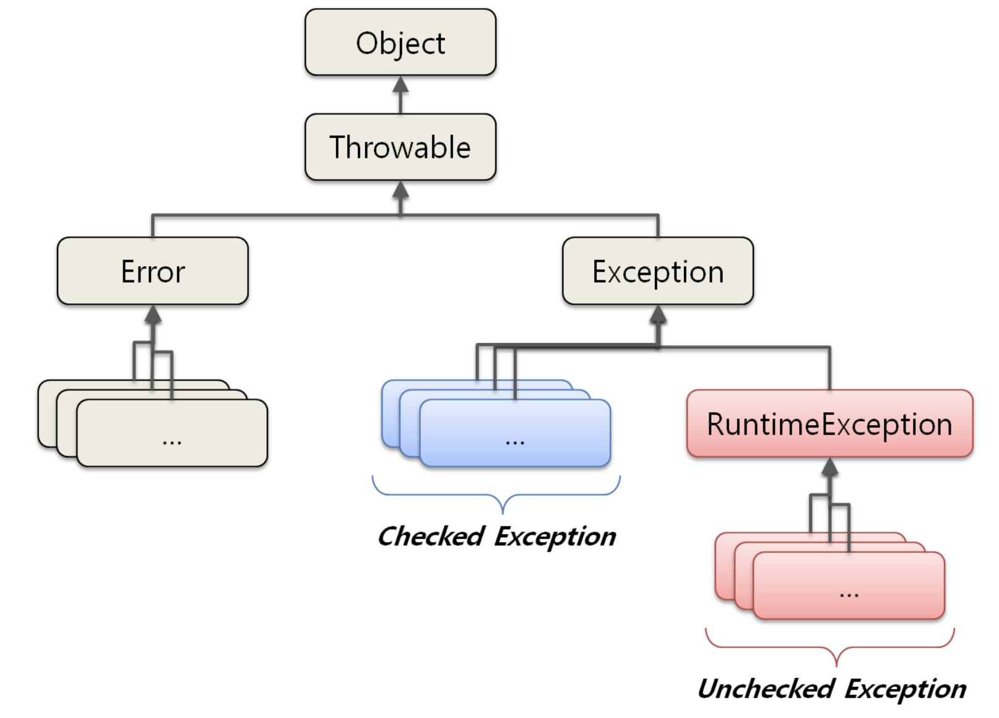
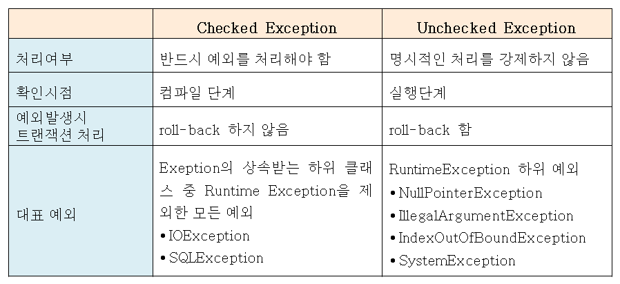

# Exception (예외)
### 오류(Error)와 예외(Exception)
#### 오류(Error)
: 시스템에 비정상적인 상황이 생겼을 때 발생한다.
- 시스템 레벨에서 발생한다. &rarr; 심각한 수준의 오류
- 개발자가 미리 예측하여 처리할 수 없다. &rarr; 오류에 대한 처리를 신경 쓰지 않아도 된다.

#### 예외(Exception)
: 개발자가 구현한 로직에서 발생하는 에러이다.
- 예외가 발생할 상황을 미리 예측하여 개발자가 처리 가능하다.
- **예외를 구분하고 그에 따른 처리 방법을 정확이 알고 적용하는것이 중요하다.**

### JAVA의 예외 클래스


- 모든 예외 class는 Throwable class를 상속받고 있다.
- Error는 시스템 레벨에 심각한 수준의 에러이기 때문에 시스템에 변화를 주어 문제를 처리하는게 일반적이다.
- Exception은 개발자가 로직을 추가하여 처리할 수 있다.

### 예외 클래스의 종류


**Checked Exception과 Unchecked Exception의 명확한 구분기준은 꼭 처리를 해야되는 여부에 따라 구분된다.**

### 일반적인 예외 처리의 방법
> 일반적으로 예외 복구, 예외처리 회피, 예외 전환 이 있다.
#### 1. 예외 복구
```java
int maxretry = MAX_RETRY;
while(maxretry -- > 0) {
    try {
        // 예외가 발생할 가능성이 있는 시도
        return; // 작업성공시 리턴
    }
    catch (SomeException e) {
        // 로그 출력. 정해진 시간만큼 대기
    } 
    finally {
        // 리소스 반납 및 정리 작업
    }
}
throw new RetryFailedException(); // 최대 재시도 횟수를 넘기면 직접 예외 발생
```
> 제시도를 통해 예외를 복구한다.

**예외 복구의 핵심은 예외가 발생하여도 에플리케이션은 정상적인 흐름으로 진행한다.**

#### 2. 예외처리 회피
```java
public void add() throws SQLException {
    ... // 구현 로직
}
```
**예외가 발생하면 throws를 통해 호출한쪽으로 예외를 던지고 그 처리를 회피한다.**
- 무책임하게 예외를 던지는것은 위험하다.
- 호출한 쪽에서 다시 예외를 받아 처리하도록 하거나,
- 해당 매서드에서 처리하는것이 최선의 방법이다.

#### 3. 예외전환
```java
catch(SQLException e) {
   ...
   throw DuplicateUserIdException();
}
```
**예외를 잡아서 다른 예외를 던지는 것이다.**
- 호출한 쪽에서 예외를 받아서 처리할떄 좀더 명확하게 인지 할 수 있도록 돕기 위한 방법이다.  &rarr; 예외를 분명히 알아야지 처리하기 좋다.
- 예를들어 Checked Exception 중 복구가 불가능한 예외가 잡혔다면 이를 Unchecked Exception으로 전환하여 다른 계층에서 일일이 예외를 선언할 필요가 없도록 할 수도 있다.