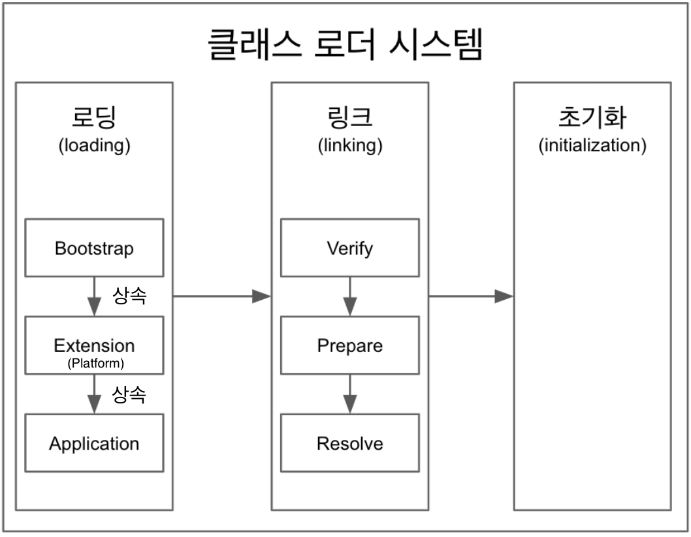
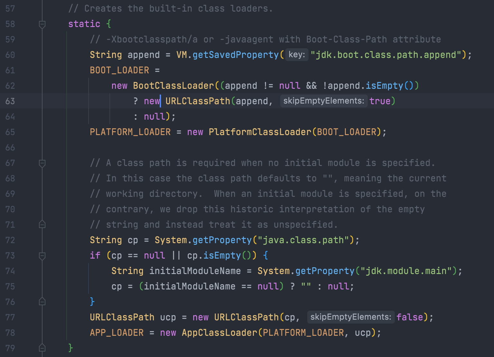

# Class Loader System - 클래스 로더 시스템
> 로딩 &rarr; 링크 &rarr; 초기화



## 1. 로딩
클래스 로더가 .class파일을 읽은 후 그 내용에 따라 적절한 바이너리 데이터를 만들고 메서드 영역에 저장한다.
- 기본적으로 계층형 구조로 되어있다.
  > 기본적인 3가지 클래스 로더, Bootstrap. Platform(Extension), Application
- 최상위 Bootstrap클래스 로더부터 하위 클래스 로더까지 class를 찾다 존재하지 않으면 `ClassNotFoundException`을 던지고 해당 프로그램 및 스래드가 죽는다.
    > Bootstrap &rarr; Platform &rarr; Application &rarr; `throw ClassNotFoundException`
- `Extension Class Loader`는 JDK9부터 `Platform Class Loader`로 이름변경 되었다.
- 로딩이 끝나면 해당 클래스 타입의 `Class<?>`객체를 생성하여 `힙 - heap` 영역에 저장된다.
### 저장되는 데이터
#### 1. `FQCN - Fully Qualified Class Name`   
모든 클래스에는 정의된 클래스 이름과 패키지 이름이 있는데, 완전한 클래스 이름은 `클래스 이름` + `패키지 이름`을 합쳐야된다.

```java
String a = "a" // Class Name
java.lang.String b = "b" // Fully Qualified Class Name
```
**2. Class, Interface, Enum**  
**3. Method, Variable**

### Class Loader의 실체를 확인해보자
```java
public class App {

    public static void main(String[] args) {
        ClassLoader classLoader = App.class.getClassLoader();
        System.out.println("classLoader = " + classLoader);
        System.out.println("classLoader.getParent() = " + classLoader.getParent());
        System.out.println("classLoader.getParent().getParent() = " + classLoader.getParent().getParent());
    }
}
```
main메서드가 있는 클래스에서 class loader를 불러와 부모와 자식들을 확인해 봤다.

출력결과는 다음과 같다.
```sh
classLoader = jdk.internal.loader.ClassLoaders$AppClassLoader@2c13da15
classLoader.getParent() = jdk.internal.loader.ClassLoaders$PlatformClassLoader@17c68925
classLoader.getParent().getParent() = null
```
`AppClassLoader(ApplicationClassLoader)`와 `PlatformClassLoader`가 출력된다. 하지만 `BootstrpClassLoader`는 나오지 않고 null이 출력된다.

#### BootstrapClassLoader를 불러올 수 없는 이유
결론은 native코드로 구현되어 Java에서 볼 수가 없다.
- native코드로 되어있어서 JVM구현체마다 다르다.
- Java code에서 참조를 할 수 없다.


하지만 `jdk.internal.loader.ClassLoaders`에서 Bootstrap클래스 로더를 확인할 수 있다.

