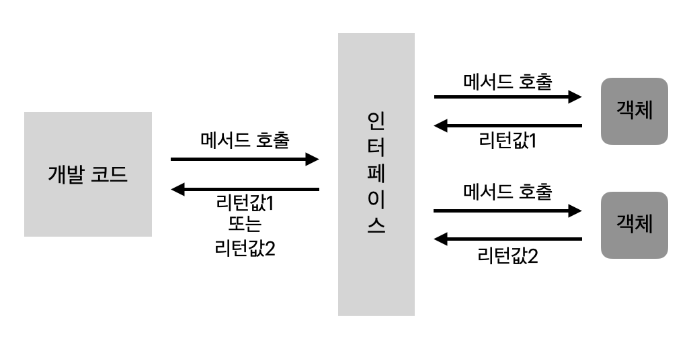

# Interface
: Java Programing 언어에서 **`class`들이 구현해야 하는 동작을 지정하는데 사용하는 추상 자료형**이다.
- `interface`라는 키워드를 사용하여 선언한다.
- 메소드 시그니처(`Method sigature`), 상수 선언
  > `static` 과 `final`은 상수를 값을 할당해줘야 한다.
### 역할
#### `interface`의 특징
- 인터페이스는 객체를 어떻게 구성해야 하는지 정리한 설계도이다.
- 객체의 교환성(또는 다형성)을 높여준다.
- `interface` 변수에 `interface`가 구현된 서로 다른 구현 객체를 할당해서 사용이 가능하다.
- 구현 객체를 직접 몰라도 `interface`의 메서드만 알아도 객체 호출이 가능하게 한다.
- 객체가 `interface`를 사용하면, `interface` 메서드를 반드시 구현해야 하는 제약을 한다.

위 특징을 이용해서 얻고자 하는 인터페이스(`interface`) 역할은 다음과 같다.


**`interface`를 이용하여, 개발 코드를 직접 수정하지 않고도, 사용하고 있는 객체만 변경할 수 있도록 하기 위함이다.**

## interface 사용
### 1. interface 선언 
```java
[public] interface 인터페이스명 { ... }

// ex.1
public interface User{ ... }
// ex.2
interface User{ ... }
```
- 인터페이스명은 Upper CamelCase로 작성되어야 한다.
- `interface`는 접근지정자 `public`만 사용할 수 있다.
- `interface`는 객체로 생성할 수 없기 떄문에 생성자를 가질 수 없다.

### 2. interface의 구성요소
1. [상수 필드(Constant Field)](#2-1-상수-필드constant-field)
2. [추상 메서드(Abstract Method)](#2-2-추상-메서드abstract-method)
3. [디폴트 메서드(Default Method)](#2-3-디폴트-메서드default-method)
4. [정적 메서드(Static Method)](#2-4-정적-메서드static-method)
#### 2-1. 상수 필드(Constant Field)
```java
public interface User{
    
    [public static final] 필드타입 상수명 = 값;

    //ex
    String FIRST_NAME = "siwon"; //또는
    public static final String FIRST_NAME = "siwon"; // 는 같다.
}
```
- `interface`는 객체가 될 수 없기에 런타임에 필드 데이터를 저장할 수 없다.  
  그래서 **인스턴스 필드(`instance field `)** / **정적 필드(`static field`)**는 선언이 불가능 하다. 
- 상수 필드는 `Compile Time`에 선언되고 `Run Time`에 변경되지 않으므로 인터페이스에 선언이 가능하다.
- [public static final]는 명시적으로 사용하지 않아도, `Compile Time`에 자동으로 선언되어 상수로 만든다.
- 네이밍은 모두 대문자로 구성되고 구분자는 Under Bar("_") 로 표현한다.

#### 2-2. 추상 메서드(Abstract Method)
```java
public interface User{
    [public abstract] 리턴타입 메서드이름(매개변수, ...)

    // 예시
    String sendMoeny(Money money); // 와
    public abstract String sendMoeny(Money money); // 는 같다
}
```
- `interface` 변수로 호출된 메서드는 최종적으로 구현 객체에서 실행된다.
- 추상 메서드는 **리턴 타입** / **매서드 시그니처(Method sigature)** 가 기술되는 클래스 설계 메서드이다.
- `public abstract`은 명시적으로 선언하지 않아도, `Compile Time`에 자동으로 선언된다.

#### 2-3 디폴트 메서드(Default Method)
```java
public interface User{
    //디폴트 메서드(Default Method)
    [ public ] default 리턴타입 메서드_이름(매개변수, ...){ ... }
    // 예시
    public default void setStatus(Status status){
        if(statuc == Status.ACTIVE){
            System.out.println("사용자가 활성화 되었습니다.");
            return;
        }
        System.out.println("사용자가 비활성화 되었습니다");
    }
}
```
- 선언시 `default` 가 필요하다.
- 클래스의 인스턴스 메서드와 동일하다.  &rarr; 인스턴스 메서드 
- 디폴트 메서드는 나중에 인터페이스를 구현한 구현 클래스에 인스턴스 메서드로 추가된다.
- 재정의(`Override`)를 통해서 구현 클래스에서 재정의된 인스턴스 메서드로 사용할 수 있다.

#### 2-4 정적 메서드(Static Method)
```java
public interface User{
    // 정적 메서드(Static Method)
    [ public ] static 리턴타입 메서드이름(매개변수, ...) { ... }
    // 예시
    public static void printFirstName(){
        System.out.println("나의 이름은 " + firstName + "입니다.");
    }
}
```
- Java8 에서 추가된 `interface`의 맴버이다.
- 키워드로 `static`을 붙이고 **메소드 시그니처 + 메서드의 Body(몸체)** 가 있어야 한다.
- [ `public` ]은 명시적으로 사용하지 않아도, `Compile Time`에 자동으로 선언됩니다.

### 3. interface 구현
- 객체는 interface에 있는 추상 메서드를 구현한 실체 메서드를 가지고 있어야한다.
- interface를 구현한 객체를 구현 객체(구현체) 라고 한다.

#### interface 구현 방식
1. [단일 인터페이스 구현 클래스(Single Interface Implement Class)](#3-1-단일-인터페이스-구현-클래스implementclass)
2. [다중 인터페이스 구현 클래스(Multiple interface Implement Class)](#3-2-다중-인터페이스-구현-클래스multiple-interface-implement-class)
3. 익명 구현 객체(Anonymous Implement Object)

#### 3-1. 단일 인터페이스 구현 클래스(ImplementClass)
```java
public class 구현클래스_이름 implements 인터페이스_이름{
    // 인터페이스의 추상 메서드를 구현한 실체 메서드 선언 부분
}
```
예시
```java
public interface User{
    public static final String FIRST_NAME = "siwon";
    String sendMony(Money money);
    public default void setStatus(Status status){
        if(status == Status.ACTIVE){
            System.out.println("사용자가 활성화 되었습니다");
            return;
        }
        System.out.println("사용자가 비활성화 되었습니다");
    }
    public static void printFirstName() { 
        System.out.println("나의 이름은 " + firstName + "입니다."); 
    }
}

public class Recipient implements User {

    // 추상 메서드는 다음처럼 실체 메서드를 정의해야한다.
    public String sendMoney(Money money) {
        thirdpartyApi.send(money.getType(), money.getAmount());
        return Status.SUCCESS.name();
    }

    // 디폴트 메서드는 재정의가 가능하다.
    // 재정의 하지 않으면, 인터페이스에 정의된 내용 그대로 사용된다.
    @Override
    public default void setStatus(Status status) {
        if(status == Status.ACTIVE) {
            System.out.println("수취인이 활성화 되었습니다");
            return;
        }
        System.out.println("수취인이 비활성화 되었습니다");
    }
}
```
만약 추상 메서드를 구현 클래스에서 실체 메서드를 모두 작성하지 않으면 추상클래스로 선언해야된다.
```java
public abstract class Recipient implements User{ ... }
```

#### 3-2 다중 인터페이스 구현 클래스(Multiple Interface Implement Class)
```java
public class 구현클래스_이름 implements 인터페이스_이름1, 인터페이스이름2{
    // 인터페이스의 추상 메서드를 구현한 실체 메서드를 선언하는 부분
}
```
- `interface`를 구현한 구현 클래스는 다중 인터페이스를 구현 가능합니다.
- 다중 `interface`를 구현한 구현 클래스는 반드시 모든 `interface`의 추상 메서드를 실체 메서드로 구현해야한다.
- 하나라도 추상 메서드가 구현되지 않으면, 구현 클래스는 추상 클래스로 선언되어야 한다.

**다중 인터페이스의 사용**
```java
하위인터페이스 = new 구현클래스(); 
상위인터페이스1 = new 구현클래스();
상위인터페이스2 = new 구현클래스();
```
- `하위인터페이스` 변수는 `하위인터페이스`, `상위인터페이스1`, `상위인터페이스2`의 실체 메서드를 모두 사용할 수 있다.
- `상위인터페이스1` 변수는 `상위인터페이스1`의 실체 메서드만 사용할 수 있다.
- `상위인터페이스2` 변수는 `상위인터페이스2`의 실체 메서드만 사용할 수 있다.

#### 3-3. 다중 인터페이스 구현 클래스(Multiple Interface Implement Class)
- 구현 클래스를 만들어서 사용하는 것이 일반적이고, 재사용이 가능하기에 편리하다.  
  하지만 일회성으로 사용하는 구현 클래스는 클래스로 만들어서 선언해서 쓰는 것이 비효율적이다.
- 이러한 비효율을 개선하기 위해 만들어졌다. &rarr; 주로 임시 작업 스레드를 만들기 위해 많이 활용된다.
- 익명 구현 객체의 경우에는 참조할 구현 클래스가 없기 때문에 `User interface` 이름을 그대로 사용한다.
- 다만, 익명 구현 객체의 구현 부에는 `interface`의 추상 메서드가 아닌 실체 메서드를 선언해야 한다.

```java
User user = new User(){
    public String sendMoeny(Money money){
        thirdpartyApi.send(money.getType(), money.getAmount());
        return Status.SUCCESS.name();
    }

    @Override
    public default void setStatus(Status status) {
        if(status == Status.ACTIVE) {
            System.out.println("수취인이 활성화 되었습니다");
            return;
        }
        System.out.println("수취인이 비활성화 되었습니다");
    }
}
```
**익명 구현 객체는 일반 클래스처럼 클래스가 생성된다.**
- 익명 구현 객체가 사용된 자바 파일을 컴파일을 하게 되면 자동으로 익명 구현 객체의 클래스 파일이 생성된다.
- `[익명 구현 객체가 사용된 자바 파일]$[번호].class` 형식으로 생성된다.