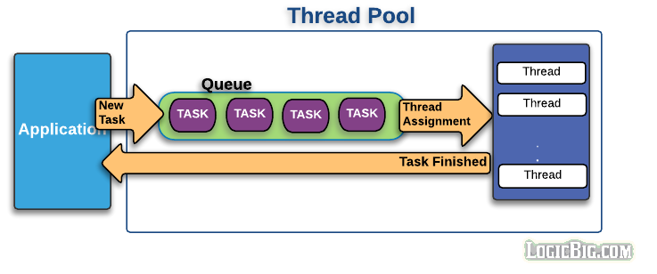

# Thread Pool
: 작업 처리에 사용되는 스레드를 제한된 개수만큼 정해 놓고 작업 큐(Queue)에 들어오는 작업들을 하나씩 스레드가 맡아 처리하는 것

### Java의 스레드의 특성
- Java의 스레드는 **CPU를 최대한 사용해서 많은 업무를 동시에 처리**할 수 있게 도와준다.
- 스레드를 생성하려면 **약간의 시간과 메모리가 필요**하다.
- **JVM은 스레드의 생성 개수에 대한 제약이 없다.**
  > &rarr; 지속적으로 생성한다면 성능저하 및 메모리 고갈의 문제가 생길 수 있다.

### Thread Pool의 필요성
- JVM의 옵션등으로 스레드의 생성을 제어를 할 수 없다.
- 무제한적인 스레드의 생성을 막기위한 스레드 관리 방식이 필요하다.
- Thread Pool은 어플리케이션이 선택적으로 사용할 수 있는 스레드 관리 방식이다.

#### Thread Pool방식을 사용하는 소프트웨어
대표적으로 Tomcat과 같은 웹서버가 있다.  
- 웹서버는 엄청 많은 요청이 들어올 수 있는데 **요청마다 스레드를 생성하는 것은 JVM의 메모리를 급격하게 소비시키며 성능에도 저하가 발생할 수 있다.** 
- 이럴 때 최대 스레드 개수를 지정해 놓으면 지정한 스레드 개수 이상의 HTTP 요청에 대해서 처리하지 않고 기다렸다가 
- 사용하지 않는 스레드가 생기면 그 때 사용하지 않는 스레드를 재사용하여 HTTP요청을 처리한다.

### Thread Pool의 구조

1. Thread Pool은 작업처리에 사용되는 스레드를 제한된 개수만큼 정한다.
2. `작업큐 - Queue`에 들어오는 `작업 - Task`들을 하나씩 스레드가 맡아 처리한다.
3. 그 후 스레드에서 Task가 끝나면 Application에 반환한다.

