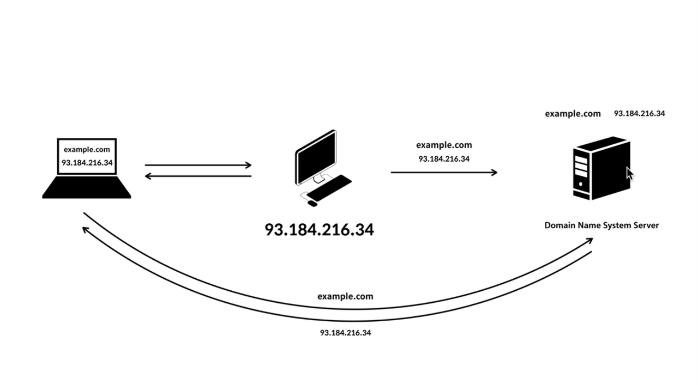
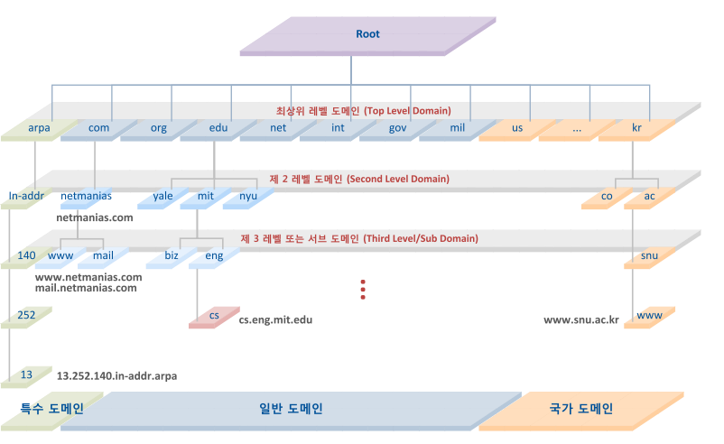
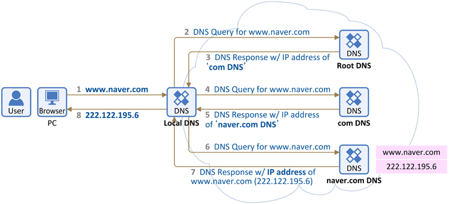

# DNS
> Domain Name System

- client는 `93.184.216.34`같은 ip로 접속하는게 아니라  
  `example.com` 이와같은 도메인으로 접속이 가능하다.
- UDP, TCP 포트 : 53

>UDP: 일반적인 DNS 조회를 할 경우 사용한다.  
>TCP: Zone Transfer(영역 전송)와 512Byte를 초과하는 DNS패킷을 전송해야 할 경우이다.
### 등장배경
1. 인터넷 표준 프로토콜은 TCP/IP이다.
2. TCP/IP 프로토콜을 사용하는 네트워크 안에서 Host들을 식별하기 위한 목적으로 IP 주소를 사용한다.
3. 사람의 경우 숫자보다 문자를 사용하는 것이 더 편하기 때문에 도메인 이름을 사용하여 Host들을 식별한다.
4. 도메인 이름을 사용하는 경우에도 최종적으로 IP주소를 알고 있어야 상대방 장비와 연결이 가능하다.

**네트워크에서 도메인이나 호스트 이름을 숫자로 된 IP 주소로 해석해 주는 TCP/IP Network Service인 DNS가 등장하였다.**

### DNS의 변천사
#### 1. 과거
1. 예전에는 컴퓨터마다 hosts.txt 파일을 가지고 있다.
2. hosts 파일에는 모든 컴퓨터의 Hostname과 IP Address 정보가 저장되어있다.
3. Client는 FTP를 이용해 접근해서 hosts 파일을 다운로드 및 적용하였다.
4. 90년대 초반 Web 서비스 사용자가 폭발적으로 증가하면서 Internet에 연결된 Host 숫자가 크게 늘어 났다.
5. 호스트의 수정 및 업데이트가 늦어지고 네트워크 트레픽이 증가하고 호스트 이름을 짓기가 어려워졌다.(이름중복)

#### 2. 현제
- 분산된 데이터베이스 이용한다.
- 도메인이 워낙 많기 때문에 전 세계 모든 조직의 도메인정보를 갖고 있는 DNS 서버는 존재하지 않는다.
- 각 조직은 자신들의 도메인 정보를 관리하는 DNS서버를 자체적으로 운영하고,  
  이러한 수 많은 도메인의 DNS 서버들이 상호 연동되어 있는 **Domain Name Space**를 구성하게 된다.

### DNS 구성요소
#### 1. 도메인 네임 스페이스(Domain Name Space)
: DNS가 저장,관리하는 계층적 구조를 의미한다.   

- 최상위에 루트 DNS 서버가 존재하고,  
  그 하위로 **인터넷에 연결된 모든 노드가 연속해서 이어진 계층 구조로 구성되어 있다.**
- 각 레벨(Top level, Second level 등)의 도메인은 그 하위 도메인 에 관한 정보를 관리하는 구조이다. &rarr; 계층적 구조

#### 2. 네임 서버(Name Server)
: 숫자로 표현된 IP 주소로 변환시켜 주기 위해서는 **도메인 네임 스페이스의 트리 구조 에 대한 정보를 가지고 있는 서버**
- 도메인 이름을 IP 주소로 변환하는 것을 네임 서비스라고 한다.
- 리졸버(Resolver)로부터 요청 받은 도메인 이름에 대한 IP 정보를 다시 리졸버로 전달해주는 역할을 수행한다.

#### 3. 리졸버 (Resolver)
: DNS 클라이언트(Ex. 웹브라우저)의 요청을 네임 서버로 전달하고  
네임 서버로부터 정보(도메인 이름과 IP 주소)를 받아 클라이언트에게 제공하는 기능을 수행한다.
- 하나의 네임 서버 에게 DNS 요청을 전달하고 해당 서버에 정보가 없으면 다른 네임 서버에게 요청을 보내 정보를 받아 온다.
- 수많은 네임 서버에 접근하여 사용자로부터 요청 받은 도메인의 IP 정보를 조회하는 기능을 수행할 수 있어야 한다.

#### 4. 스터브 리졸버(Stub Resolver)
> 리졸버의 모든 기능을 PC와 같은 클라이언트 호스트에 구현하는 것은 단말 시스템 자원의 한계와 같은 제약이 있다.

- 리졸버의 대부분의 기능을 DNS 서버에 구현하고, 클라이언트 호스트에는 리졸버의 단순한 기능만을 지닌 리졸버 루틴을 구현한것이다.
- 스터브 리졸버는 리졸버가 구현된 네임 서버의 IP 주소만 파악하면 된다.
- 도메인에 대한 질의를 받은 스터브 리졸버는 설정된 네임 서버로 DNS 질의를 전달하고  
  네임 서버로부터 최종 결과를 응답 받아 웹 브라우저로 전달하는 인터페이스 기능만을 수행한다.

### www.naver.com 을 입력하여 알아보는 DNS동작원리

1 ~ 3. Root DNS 서버는 전체 FQDN 정보는 알지 못하기 때문에 자신의 하위 Domain인 `COM` DNS 서버의 주소를 알려준다.  

4 ~ 5 이를 수신한 Local DNS 서버는 다시 Iterative Query를 사용하여 `com` DNS 서버에게 정보를 요청하고,  
com DNS 서버도 자신의 하위 레벨 Domain인 `naver.com`의 DNS서버 주소를 알려준다.  

6 ~ 7 이를 수신한 Local DNS 서버는 다시 Iterative Query를 사용하여 `naver.com` DNS 서버에게 www 호스트에 대한 정보를 요청하고,  
`naver.com` DNS 서버는 www.naver.com에 대한 IP서버 주소를 알려준다.

8 Local DNS 서버는 위와 같이 `www.naver.com` 에 대한 IP주소를 수신 후 자신의 DNS Cache에 등록하고,  
해당 정보를 요청했던 Client에게 응답메세지로 답변한다.

해당 Client는 수신한 `www.naver.com`의 의 IP주소를 사용하여 실제 해당 서버에 패킷을 전송하게 된다.  
그 후 Local DNS 서버는 다른 Client에게 동일한 FQDN에 대한 DNS Query를 수신할 경우 DNS서버 Cache에 등록된 정보로 답변하는 것이 가능하다.

### 정규화된 도메인이름
> FQDN (Full Qualified Domain Name)
- 네트워크상에서 컴퓨터시스템을 지칭하는 하나의 완전한 이름이다.
- DNS의 서버이름을 hostname + domain name으로 표현된다.

>Host name : 실제 서버에 주어진 컴퓨터의 이름이다. (`www.naver`)  
>Domain name : 논리적인 그룹을 표기한다. (`.com`)

### Zone File
- Domain을 소유한 특정 조직의 DNS 서버는 해당 Domain에 대한 Zone 파일(영역 파일)을 갖는다.
- 해당 Zone 파일에는 Resource Record라고 불리는 Domain 내부 정보가 존재하고, 
- 해당 정보 조회를 허용하여 외부 Client에게 정보를 제공할 수 있다.

### Resource Recode 종류
- SOA: 해당 Domain  관리 권한 및 Zone Transfer(영역 전송)과 관련된 정보가 들어있다.
- NS: NameServer의 정보를 갖고 있다.
- A(AAAA): 특정 host의 FQDN과 연결된 IP주소 정보를 갖는다.
- CNAME: 특정 A레코드에 대한 별칭을 지정한다.
- MX: Mail eXchange의 약자로 Mail 서비스에 관련된 정보를 갖고 있다. (해당 Domain의 Mail서버 정보)
- PTR: 역방향 조회에 사용되는 레코드, 특정 IP주소에 대한 FQDN 정보를 가지고 있다.
- ANY: 도메인에 대한 모든 레코드 질의 시에 주로 이용된다. (DNS 증폭 DRDOS 공격에 악용)