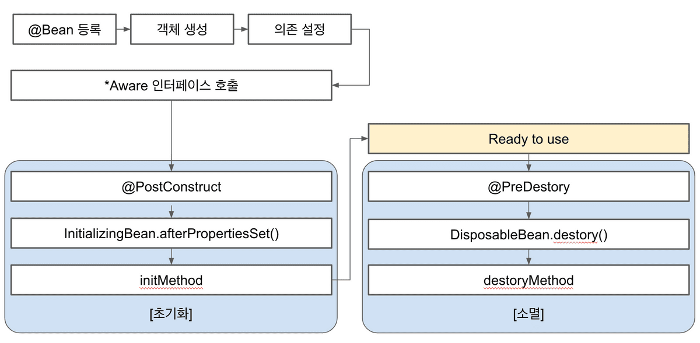

# Bean Life Cycle
### Bean Life Cycle에 대해 왜 알아야 할까?
**IoC의 이점을 얻으려면 컨테이너로 가는 애플리케이션의 흐름에 대한 부분적인 제어를 포기해야 한다.** == 인스턴스화
> 시작시 로직 설정 등에 특별한 주의가 필요하다.

Bean의 생성자에 로직을 포함 시키거나 객체의 인스턴스화 후에 메서드를 호출할 수 없다. 왜냐하면 우리는 그 과정에 통제권을 가지고 있지 않기 때문이다.

#### 예시) 시작시 로직 실행
```java
@Component
public class InvalidInitExampleBean {

    @Autowired
    private Environment env;

    public InvalidInitExampleBean() {
        env.getActiveProfiles();
    }
}
```
1. 생성자에서 autowired필드에 접근하려한다.
2. 생성자가 호출 될 때 Spring Bean은 완전히 초기화 되지 않았다
   > `@Autowired`는 필드주입을 하므로 생성자에서 호출하면 당연히 DI가 되지 않았다.
3. `NullPointerException`가 발생한다.

**Spring은 이러한 상황을 관리하는 몇 가지 방법을 제공한다.**

이러한 상황들이 발생할 수 있으므로 우리는 Bean에 대한 생명주기를 알아야 할 필요가 있다.

## Spring Bean LifeCycle


기본적인 Spring Bean LifeCycle은 다음과 같다.
> Spring 컨테이너 생성 &rarr; Spring Bean 생성/객체 생성 &rarr; 의존관계 주입 &rarr; **초기화 콜백**  
&rarr; Bean 사용 &rarr; **소멸 전 콜백** &rarr; 스프링 종료
- **단, *생성자 주입* 은 객체가 생성되는 동시에 주입된다.**
- **초기화 콜백**을 통해 DI가 완료된 상태임을 확인할 수 있다.
  > 이 때 초기화 작업을 진행해야 함을 알 수 있다.
- **소멸 콜백**을 통해 Spring이 종료되기 전인 상태를 개발자가 확인할 수 있다.
  > 이 때 종료작업을 안전하게 진행할 수 있다.

### Bean 생명주기 콜백 종류 3가지
1. Spring에서 제공하는 인터페이스 (`InitializingBean`, `DisposableBean`)
2. 설정 정보에서 초기화 메서드, 종료 메서드 지정하는 방법
3. `@PostConstruct`, `@PreDestory` 어노테이션

#### 1.  Spring에서 제공하는 인터페이스
```java
@Component
public class ExBean implements InitializingBean, DisposableBean{

    ...

    @Override
    public void afterPropertiesSet throws Exception{
        // 초기화
    }

    @Override
    public void destroy throws Exception{
        // 메모리 반납, 연결 종료와 같은 과정
    }
}
```
이 방식의 단점은 다음과 같다.
- Spring 전용 인터페이스에 코드가 의존한다.
- 메서드를 오버라이드하기 떄문에 메서드명을 변경할 수 없다.
- 코드를 커스터마이징할 수 없는 외부 라이브러리에 적용할 수 없다.

#### 2. 설정 정보에서 초기화 메서드, 종료 메서드 지정하는 방법
```java
public class ExBean{

    ...

    public void initialize() throws Exception {
        /// 초기화
    }

    public void close() throws Exception {
        // 메모리 반납, 연결 종료와 같은 과정
    }
}

@Configuration
public class LifeCycleConfig{

    @Bean(initMethod = "initialize", destroyMethod = "close")
    public ExBean exBean(){
        ...
    }
}
```
이 방식의 장점
- 메서드 이름을 자유롭게 부여 가능하다.
- Spring 코드에 의존하지 않음
- 코드를 커스터마이징 할 수 없는 외부 라이브러리에 적용 가능하다.
  > 설정 정보를 사용하기 때문에 가능하다.

이 방식에 단점
- Bean 지정 시 initMethod와 destoryMethod를 직접 지정해야 하는 번거로움이 았다.

`@Bean`의 destoryMethod 속성의 특징
- 라이브러리의 대부분 종료 메서드명이 close 혹은 shutdown
- @Bean의 destoryMethod는 기본값이 inferred (추론)으로 등록한다.
  > 즉, 종료 메서드를 추론하고 자동으로 호출한다.
- `inferred`기능을 사용하기 싫다면 명시적으로 `destoroyMethod=""` 와 같이 공백을 지정해줘야 한다.

#### 3. @PostConstruct, @PreDestroy 어노테이션
```java
public class ExBean{
    
    @PostConstruct
    public void initialize() throws Exception {
        // 초기화
    }

    @PreDestory
    public void close() throws Exception {
        // 메모리 반납, 연결 종료와 같은 과정
    }
}

@Configuration
public class LifeCycleConfig{
    
    @Bean
    public ExBean exampleBean(){
        // 생략
    }
}
```
**JSR-250**에 정의되어 있어 Spring 이외에 다른 프레임워크가 지원할 수 있다.
- **최신 스프링에서 권장하는 방법**
  > Java11에서 제거 되어서 사용할 수 없다는 말이 있는데 `javax`가 아닌 `java.xml.ws.annotation`가 Deprecated가 된것이므로 상관 없다.
- 컨포넌트 스캔과 잘 어울린다.

이 방식의 단점
- 커스터마이징이 불가능한 외부 라이브러리에서 사용 할 수 없다.