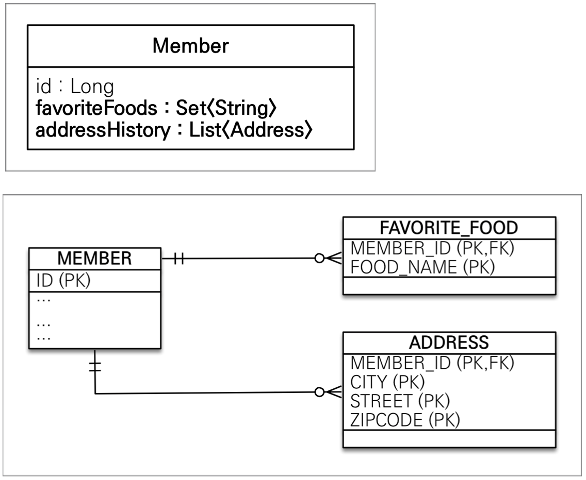

# 값 타입 컬렉션
: 값 타입을 하나 이상 저장할 때 사용한다.
- `@ElementCollection`, `@CollectionTable` 사용한다.
- DB는 컬렉션같은 테이블을 저장할 수 없다.
- 컬렉션을 저장하기 위한 별도의 테이블이 필요하다.



```java
@Entity
@Getter @Setter
public class Member{

    @Id @GeneratedValue
    @Column(name = "MEMBER_ID")
    private Long id;

    private String username;

    @Embedded
    private Address homeAddress;

    @ElementCollection
    @CollectionTable(name = "FAVORITE_FOOD", joinColumns = @JoinColumn(name = "MEMBER_ID"))
    private Set<String> favoriteFoods = HashSet<>();

    @ElementCollection
    @CollectionTable(name = "ADDRESS", joinColumns = @JoinColumn(name = "MEMBER_ID"))
    private List<Address> addressHistory = HashList<>();
}
```

## 값 컬렉션 사용
참고: 값 타입 컬렉션은 영속성 전의(Cascade) + 고아객체 제거 기능이 필수로 들어가 있다.

### 값 타입 저장 예제
```java
Member m = new Member();
m.setUsername("member1");
m.setAddress(new Address("city1", "street1", "100000"))

m.getFavoriteFoods().add("치킨");
m.getFavoriteFoods().add("피자");
m.getFavoriteFoods().add("족발");

m.getAddressHistory().add(new Address("old1", "street1", "10000"))
m.getAddressHistory().add(new Address("old2", "street2", "10000"))

em.persist(m);

```
- 컬렉션은 다른 테이블이여도 라이프 사이클이 같다. &rarr; 같이 저장됬다.
- 위 예제의 값타입의 라이프 사이클은 Member에 의존한다.

### 값 타입 조회 예제
```java
Member m = new Member();
m.setUsername("member1");
m.setAddress(new Address("city1", "street1", "100000"))

m.getFavoriteFoods().add("치킨");
m.getFavoriteFoods().add("피자");
m.getFavoriteFoods().add("족발");

m.getAddressHistory().add(new Address("old1", "street1", "10000"))
m.getAddressHistory().add(new Address("old2", "street2", "10000"))

em.persist(m);

em.flush();  em.clear();

Member findM = em.find(Member.class, m.getId()); // 기본타입은 지연로딩이 된다. 

List<Address> addressHistory = findM.getAddresHistory(); // 이때 addressHistory 를 쿼리를 날려 불러온다. 

Set<String> favoriteFoodss = findM.getFavoriteFood(); //이떄 favoriteFood를 불러온다.
```
- 값 타입 컬렉션들은 기본적으로 지연로딩이 된다.

### 값 타입 수정 예제
```java
Member m = new Member();
m.setUsername("member1");
m.setAddress(new Address("city1", "street1", "100000"))

m.getFavoriteFoods().add("치킨");
m.getFavoriteFoods().add("피자");
m.getFavoriteFoods().add("족발");

m.getAddressHistory().add(new Address("old1", "street1", "10000"))
m.getAddressHistory().add(new Address("old2", "street2", "10000"))

em.persist(m);

em.flush();  em.clear();

Member findM = em.find(Member.class, m.getId());
// homeCity를 newCity로 바꾸고 싶으면
// findM.getHomeAddress().setCity("newCity"); // 다음과 같이 바꾸면 부작용이 일어날 수 있다.
Address a =  findM.getHomeAddress();
findM.setMemberAddress(new Address("newCity", a.getStreet, a.getZipcode)); //완전히 새로운 객체로 교체를 해야한다.

// 치킨을 한식으로 바꾸기
findM.getFavoritFoods().remove("치킨");
findM.getFavoritFoods().add("한식"); // 컬렉션의 값만 변경해도 업데이트 쿼리가 날라간다.

// address 바꾸기
findM.getAddressHistory().remove(new Address("old1", "street", "10000")); // Address 에equals로 값을 비교하여 지운다. Address에 equals를 오버라이드 해야한다.
findM.getAddressHistory().add(new Address("newCity1", "street", "10000"));  // addressHistory의 모든값이 제거되고 다시insert가 된다.
```
- 값 타입은 불변해야 하기 떄문에 통제로 교체를 해야한다.


### 값 타입 컬렉션 제약사항
- 값 타입은 식별자가 없다.
- 값을 변경하면 추적이 어렵다.
- 값 타입 컬렉션에 변경 사항이 발생하면, 주인 엔티티와 관련된 모든 데이터를 삭제하고,  
  값 타입 컬렉션에 있는 현재값을 모두 다시 저장한다.
- 값 타입 컬렉션을 매핑하는 테이블은 모든 컬럼을 묶어서 기본키를 구성해야 된다. **null 입력x, 중복 저장x**

## 값 타입 컬렉션 대안
- 실무에서는 상황에 따라 **값 타입 컬렉션 대신 일대다 관계를 고려한다.**
- 일대다 관계를 위한 엔티티를 만들고, 여기에서 값타입을 사용한다.
- 영속성 전이(`Cascade`) + 고아 제거를 사용해서 값 타입 컬렉션 처럼 사용한다.
- ex. `AddressEntity`