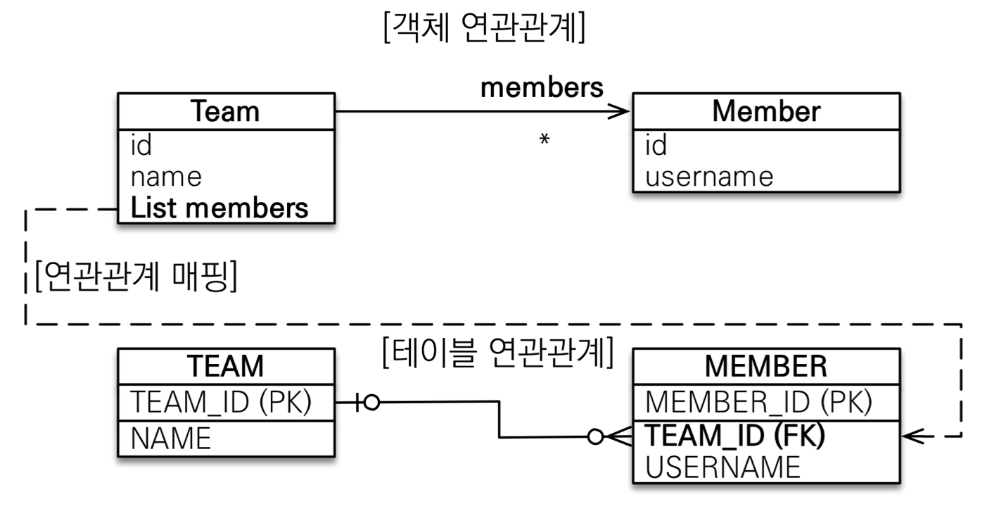
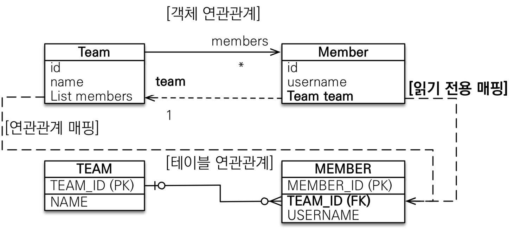

# 다양한 연관관계
### 연관관계 매핑시 고려사항
- 다중성
- 단방향, 양방향
- 연관관계의 주인(`mappedBy`)

### 다중성
- 다대일: `@ManyToOne`
- 일대다: `@OneTomany`
- 일대일: `@OneToOn`
- 다대다: `@ManyToMany`
    > 실무에서 쓰지마라

### 객체와 테이블의 차이
#### 테이블
- 외래키 하나로 양쪽 조인 가능
- 방향이라는 개념이 없다.

#### 객체
- 참조용 필드가 있는 쪽으로만 참조할 수 있다.
- 한쪽만 참조하면 단방향이다.
- 양쪽이 서로 참조하면 양방향 &rarr; 사실 단방향이 두 개가 있는것
    > 이것을 이해해야 연관관계의 주인에 대해 이해할 수 있다.
  
### 연관관계의 주인
: FK를 관리하는 참조
- 객체 양방향 관계는 참조가 두 군데 있어 둘 중 태이블의 기본키를 관리할 곳을 지정해야 한다.
- **주인의 반대편**   
    외래키에 영향을 주지 않고, 단순 조회만 가능하다.

## 다대일(N : 1)
### 1. 다대일 단방향


```java
@Entity
public class Member {
    @Id @GeneratedValue
    private Long id; 

    @Column(name = "USERNAME") private String name; private int age;

    @ManyToOne
    @JoinColumn(name = "TEAM_ID")
    private Team team; 
    // etc...
}

@Entity
public class Team{
    @Id @GeneratedValue
    private Long id;
    private String name;
}
```

- `RDB`에서 `1 : N` 이라면`N`쪽에 외래키를 두어야 한다. 
  
- 외래키가 있는곳을 기준으로 연관된 참조를 하면 된다.
- 가장 많이 사용한다.

### 2. 다대일(N : 1) 양방향


```java
@Entity
public class Member {
    @Id @GeneratedValue
    private Long id; 

    @Column(name = "USERNAME") 
    private String name; 
    private int age;

    @ManyToOne
    @JoinColumn(name = "TEAM_ID")
    private Team team; 
    // etc...
}

@Entity
public class Team{
    @Id @GeneratedValue
    private Long id;
    private String name;

    @MappedBy("team")
    private List<Member> members = new ArrayList<>();
}
```

- **FK 있는 쪽이 연관관계의 주인** &rarr; 여기 예제에서는 `Member`에 있다.
  
- 양쪽을 서로 참조하도록 개발하는 것

## 일대다(1 : N)
### 1. 일대다 단방향
> 실무에서 거의 사용하지 않는다.  
> 다음과 같이 모델링하는 것은 권장하지 않는다.  
 
일대다 단방향 매핑보다 **다대일(N : 1) 양방향 매핑을 사용하자!!**



```java
@Entity
public class Member {
    @Id @GeneratedValue
    private Long id; 
    @Column(name = "USERNAME") 
    private String name; 
    private int age;

    //etc/..
}

@Entity
public class Team{
    @Id @GeneratedValue
    private Long id;
    private String name;

    @OneToMany
    @JoinColumen(name = "TEAM_ID")
    private List<member> member = new ArrayList<>();

}
```
- `Team`에 외래키가 있으면 `Team`에 중복이 일어난다 &rarr; 사실상 `Team`이 `다(N)`가 된다.
  
- `insert`를 하면 `update`쿼리가 한 번 더 나간다. &rarr;
- 실무에서는 테이블이 한개가 아니라 수십 개를 사용한다.  
  &rarr; "난 분명 `Team`을 건들었는데 `Member`에 `update`쿼리가 나가네?" 라는 상황이 일어난다.

#### 일대다 단방향 정리
- 일대다 단방향은 일대다(1:N)에서 **일(1)이 연관관계의 주인**이다.
  
- **다(N) 쪽에 외래키가 있다.**
- 엔티티가 관리하는 외래키가 다른 테이블에 있다.
- 객체와 테이블의 차이 때문에 반대편 테이블의 외래키를 관리하는 특이한 구조
- `@JoinColumn`을 꼭 사용해야 한다.  
  그렇지 않으면 조인 테이블 방식을 사용한다.

### 2. 일대다(1 : N) 양방향 - 비 권장
> 이 방법은 야매다 사용하지마라 - 김영한



```java
@Entity
public class Member {
    @Id @GeneratedValue
    private Long id; 
    @Column(name = "USERNAME") 
    private String name; 
    private int age;

    @ManyToOne
    //강재로 읽기 전용으로 만들어버린다.
    @JoinColumn(name = "TEAM_ID", insertable = false, updatable = false)
    private Team team; 

    //etc/..
}

@Entity
public class Team{
    @Id @GeneratedValue
    private Long id;
    private String name;

    @OneToMany
    @JoinColumen(name = "TEAM_ID")
    private List<member> member = new ArrayList<>();

}
```
- 이런 매핑은 공식적으로 존재하지 않는다.  
  `@JoinColumn(name = "TEAM_ID", insertable = false, updatable = false)`

- **읽기 전용 필드**를 사용해서 양방향처럼 사용하는 방법
- **결론 : 다대일 양방향을 사용하자**

## 일대일 관계(1 : 1)
### 1. 일대일 단방향


```java
@Entity
public class Member {
    @Id @GeneratedValue
    private Long id; 
    @Column(name = "USERNAME") 
    private String name; 
    
    @OneToOne
    @JoinColumn(name = "LOCKER_ID")
    Locker locker;

    //etc/..
}

@Entity
public class Locker{

    @Id @GeneratedValue
    private Long id;
    private String name;
    @OneToOne(mappedBy="locker")
    private Member member;
}
```
- 외래키를 선택할 수 있다.

- 외래키에 DB 유니크(`UNIQUE`) 제약조건 추가
- 다대일(`@ManyToOne`) 단방향 매핑과 유사하다.

### 2. 일대일 양방향


- 다대일 양방향 매핑 처럼 **외래 키가 있는 곳이 연관관계의 주인이다.**
- 반대편 `mappedBy` 적용
  
### 3. 대상 테이블에 FK 단방향 


- **단방향 관계를 JPA에서 지원하지 않는다.**
- 양방향 관계는 지원한다.

### 4. 대상 테이블에 FK 양방향


- 무조건 즉시 로딩된다. (`EAGAR`)
  
- `Member`를 조회하면 `Locker`가 있는지 없는지 확인해야 하므로  
  즉시 로딩을 할 수밖에 없다. (반대도 마찬가지)

### 5. 일대일 정리
**주 테이블 와래키**
- 주 객체가 대상 객체의 참조를 가지는것 처럼,  
  주 테이블에 외래 키를 두고 대상 테이블을 찾는다.

- 객체지향 개발자 선호
- JPA 매핑 편리
- 장점: 주 테이블만 조회해도 대상 테이블에 데이터가 있는지 확인 가능
- 단점: 값이 없으면 외래 키에 null 허용

**대상 테이블에 외래키**
- 대상 테이블에 외래키가 존재

- 전통적인 DB 개발자 선호
- 장점: 주 테이블과 대상 테이블을 일대일에서 일대다 관계로 변경할 때 테이블 구조 유지한다.
- 단점: 프록시(Proxy) 기능의 한계로 지연 로딩으로 설정해도 항상 즉시 로딩(EAGER)된다.

## 다대다(N : N) 관계 - 비 권장
> 실무에서 쓰면 안 된다. 매핑이 있지만... 알고 안 써야지 모르면 쓰고 싶어 진다.


- 관계형 DB는 정규화된 테이블 2개로 다대다 관계를 표현할 수 없다.

- 연결 테이블을 추가해서 일대다, 다대일 관계로 풀어내야 한다. &rarr; 야매로 가능하다.

### 객체는 컬렉션을 사용하여 객체 2개로 다대가 관계가 가능하다.


- `@ManyToMany`
- `@JoinTable`로 연결 테이블을 지정한다
- 다대다 매핑: 단방향, 양방향 가능

### 다대다의 한계
- **편리해 보이지만 실무에서 사용할 수 없다.**
- 연결 테이블이 단순히 연결만 하고 끝나지 않음
- 주문 시간, 수량 같은 데이터가 들어올 수 있다.  


### 다대다 한계 극복
- **연결 테이블용 Entity를 추가한다. (연결 테이블은 엔티티로 승격)**
- `@ManyToMany` &rarr; `@OneToMany`, `@ManyToOne`  
 

- `ORDER`에 기본키는 관련 없는 값을 사용해야 한다.  
- `GeneratValue`를 이용한다. &rarr; 확장성이 높아진다.

### 다대다 결론
다대다 쓰지 마라 일대다 혹은 대다일 을 사용해라.

## anotation 정리
### `@JoinColumn` - 주요 속성
: 외래키를 매핑할때 사용한다.
|속성|설명|기본값|
|--|--|--|
|`name`|매핑할 FK 이름|필드명 + _ + 참조하는 테 이블의 기본 키 컬럼명|
|`referencedColumnName`|외래 키가 참조하는 대상 테이블의 컬럼명|참조하는 테이블의 기본 키 컬럼명|
|`foreignKey(DDL)`|외래 키 제약조건을 직접 지정할 수 있다. 이 속성은 테이블을 생성할 때만 사용한다.||
`unique`, `nullable`, `insertable`, `updatable`, `columnDefinition`, `table`,|`@Column`의 속성과 같다. 

### `@ManyToOne` - 주요 속성
: 다대일 관계 매핑
|속성|설명|기본값|
|--|--|--|
|`optional`|false로 설정하면 연관된 엔티티가 항상 있어야 한다.|TRUE|
|`fetch`|글로벌 페치 전략을 설정한다.| `@ManyToOne=FetchType.EAGER`, `@OneToMany=FetchType.LAZY`|
|`cascade`|영속성 전이 기능을 사용한다.||
|`targetEntity`|연관된 엔티티의 타입 정보를 설정한다. 이 기능은 **거의 사용하지 않는다.** 컬렉션을 사용해도 제네릭으로 타 입 정보를 알 수 있다.||

### `@OneToMany` - 주요 속성
: 일대다 관계 매핑
|속성|설명|기본값|
|--|--|--|
|`optional`|false로 설정하면 연관된 엔티티가 항상 있어야 한다.|TRUE|
|`fetch`|글로벌 페치 전략을 설정한다.| `@ManyToOne=FetchType.EAGER`, `@OneToMany=FetchType.LAZY`|
|`cascade`|영속성 전이 기능을 사용한다.||
|`targetEntity`|연관된 엔티티의 타입 정보를 설정한다. 이 기능은 **거의 사용하지 않는다.** 컬렉션을 사용해도 제네릭으로 타 입 정보를 알 수 있다.||