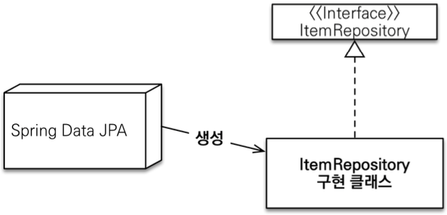
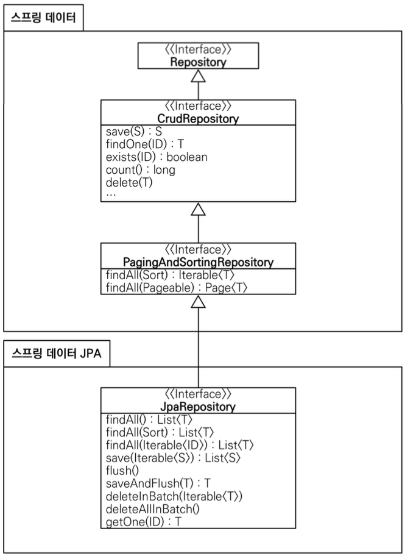

# Repository
## Spring Data JPA 사용전
### 예제 코드
#### 예제 모델
Member
```java
@Entity
@Getter @Setter
@NoArgsConstructor(access = AccessLevel.PROTECTED)
@ToString(of = {"id", "name"})
public class Team {

    @Id @GeneratedValue
    @Column(name = "team_id")
    private Long id;
    private String name;

    @OneToMany(mappedBy = "team")
    private List<Member> members = new ArrayList<>();

    public Team(String name) {
        this.name = name;
    }
}
```
Team
```java
@Entity
@Getter @Setter
@NoArgsConstructor(access = AccessLevel.PROTECTED)
@ToString(of = {"id", "name"})
public class Team {

    @Id @GeneratedValue
    @Column(name = "team_id")
    private Long id;
    private String name;

    @OneToMany(mappedBy = "team")
    private List<Member> members = new ArrayList<>();

    public Team(String name) {
        this.name = name;
    }
}
```

#### 예제 Repository
Member Repository
```java
@Repository
public class MemberJpaRepository {

    @PersistenceContext // EntityManger 를 injection 해주는 annotation
    private EntityManager em;

    public Member save(Member member){
        em.persist(member);
        return member;
    }

    public long count(){
        return em.createQuery("select count(m) from Member m", Long.class).getSingleResult();
    }

    public Optional<Member> findById(Long id){
        Member member = em.find(Member.class, id);
        return Optional.ofNullable(member);
    }

    public Member find(Long id){
        return em.find(Member.class, id);
    }

    public void delete(Member member){
        em.remove(member);
    }

    public List<Member> findAll(){
        return em.createQuery("select m from Member m").getResultList();
    }
}
```
TeamRepository
```java
@Repository
public class TeamJpaRepository {

    @PersistenceContext 
    private EntityManager em;

    public Team save(Team team){
        em.persist(team);
        return team;
    }

    public void delete(Team team){
        em.remove(team);
    }

    public List<Team> findAll(){
        return em.createQuery("select t from Team t", Team.class).getResultList();
    }

    public Optional<Team> findById(Long id){
        Team team = em.find(Team.class, id);
        return Optional.ofNullable(team);
    }

    public long count(){
        return em.createQuery("select count(t) from Team t", Long.class).getSingleResult();
    }
}
```
#### 테스트 코드 작성
```java
@SpringBootTest
@Transactional
public class MemberJpaRepositoryTest {
    @Autowired
    MemberJpaRepository memberJpaRepository;

    @Test
    public void basicCRUD() {
        Member member1 = new Member("member1");
        Member member2 = new Member("member2");
        memberJpaRepository.save(member1);
        memberJpaRepository.save(member2);

        //단건 조회 검증
        Member findMember1 = memberJpaRepository.findById(member1.getId()).get();
        Member findMember2 = memberJpaRepository.findById(member2.getId()).get();
        assertThat(findMember1).isEqualTo(member1);
        assertThat(findMember2).isEqualTo(member2);

        //리스트 조회 검증
        List<Member> all = memberJpaRepository.findAll();
        assertThat(all.size()).isEqualTo(2);

        //카운트 검증
        long count = memberJpaRepository.count(); assertThat(count).isEqualTo(2);
        //삭제 검증 

        memberJpaRepository.delete(member1); memberJpaRepository.delete(member2);
        long deletedCount = memberJpaRepository.count();
        assertThat(deletedCount).isEqualTo(0);
    }
}
```
> 참고. UPDATE는 JPA의 변경 감지(Dirty Checking)을 사용하므로 필요 없다.
### 위 코드의 문제점
- 위에 Member와 Team의 Repository는 서로 관리하는 Entity만 다르지 기능은 똑같다.
- 개발자가 CRUD같은 기본 로직을 계속 짜줘야한다. &rarr; 매우번거롭다

**하지만 Spring Data JPA는 이 귀찮은 과정을 스킵할 수 있게한다.**

## Spring Data JPA 적용후
### 공용 인터페이스 설정 
#### JavaConfig 설정- 스프링 부트 사용시 생략 가능
```java
@Configuration
@EnableJpaRepositories(basePackages = "jpabook.jpashop.repository")
public class AppConfig {} 
```
- 스프링부트사용시`@SpringBootApplication`이 위치를지정(해당 패키지와 하위 패키지 인식)
- 만약 패키지의 위치가 달라지면 `@EnableJpaRepositories`가 필요하다

#### Spring Data JPA가 구현 클래스 대신 생성한다.


- `org.springframework.data.repository.Repository`를 구현한 클래스는 스캔 대상이다. 
  - 그리하여 실제로 MemberRepository 인터페이스를 가져와 출력하면  
    memberRepo.getClass() &rarr; class com.sun.proxy.$ProxyXXX 와 같이 프록시 객체가 만들어진다는것을 알 수 있다.
- `@Repository` 생략 가능하다


### 공용 인터페이스 적용
Member Repository
```java
@Repository
public interface MemberRepository extends JpaRepository<Member, Long> {}
```
Team Repository
```java
@Repository
public interface TeamRepository extends JpaRepository<Team, Long> {}
```
#### 테스트 코드 작성
> 기존 순수 JPA 기반 테스트에서 사용했던 코드를 그대로 스프링 데이터 JPA 리포지토리 기반 테스트로 변경해도 동일한 방식으로 동작한다
```java
@SpringBootTest
@Transactional
@Rollback(value = false)
class MemberRepositoryTest {

    @Autowired MemberRepository memberRepo;

    @Test
    public void basicCRUD() {
        Member member1 = new Member("member1");
        Member member2 = new Member("member2");
        memberRepository.save(member1);
        memberRepository.save(member2);

        //단건 조회 검증
        Member findMember1 = memberRepository.findById(member1.getId()).get(); 
        Member findMember2 = memberRepository.findById(member2.getId()).get(); 
        assertThat(findMember1).isEqualTo(member1); 
        assertThat(findMember2).isEqualTo(member2);

        //리스트 조회 검증
        List<Member> all = memberRepository.findAll(); assertThat(all.size()).isEqualTo(2);

        //카운트 검증
        long count = memberRepository.count(); assertThat(count).isEqualTo(2);

        //삭제 검증 
        memberRepository.delete(member1); 
        memberRepository.delete(member2);
        long deletedCount = memberRepository.count();
        assertThat(deletedCount).isEqualTo(0);
      }


}
```
- 위와 같이 간단하게 만들 수 있다.
- 우리는 그냥 간단한 CRUD를 저기 만들어 놓은 Repository를 이용하여 만들면 된다.
- Spring Data JPA한테 구현해야 할 코드를 맡기자

### 공통 인터페이스 분석
- JpaRespotiroy 인터페이스: 공통 CRUD 제공
- 제네릭은 <Entity Type, 식별자 타입>으로 설정한다
#### JpaRepository 공통 기능 인터페이스
```java
public interface JpaRepository<T, ID> extends PagingAndSortingRepository<T, ID>, QueryByExampleExecutor<T>{
    //etc....
}
```
#### JpaRepository를 사용하는 인터페이스
```java
public interface MemberRepository extends JpaRepository<Member, Long> {}
```

#### 공통 인터페이스 구성


#### 제네릭 타입
- `T`: 엔티티
- `ID` : 엔티티의 식별자 타입
- `S` : 엔티티와 그 자식 타입

#### 주요 메서드
- `save(S)` : 새로운 엔티티는 저장하고 이미 있는 엔티티는 병합한다.
- `delete(T)` : 엔티티 하나를 삭제한다.
  > 내부에서 `EntityManager.remove()` 호출
- `findById(ID)` : 엔티티 하나를 조회한다
  > 내부에서 `EntityManager.find()` 호출
- `getOne(ID)` : 엔티티를 프록시로 조회한다.
  > 내부에서 `EntityManager.getReference()` 호출
- `findAll(...)` : 모든 엔티티를 조회한다.
  > 정렬(sort), 패이징(Pageable)조건을 파라미터로 제공할 수 있다. 

참고: `JpaRepository` 는 대부분의 공통 메서드를 제공한다.