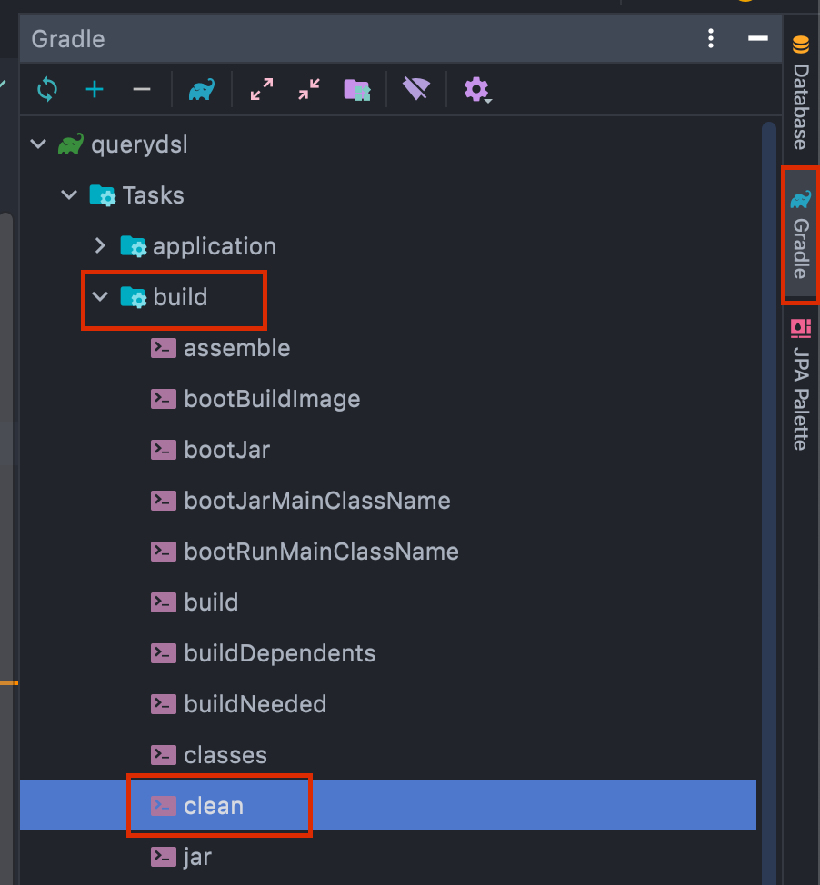
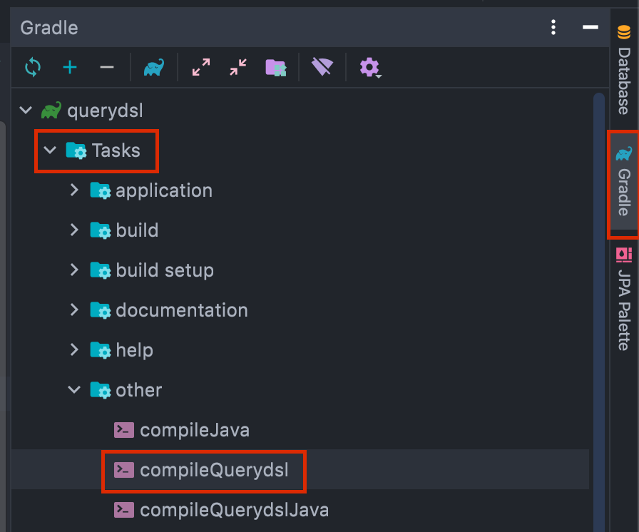
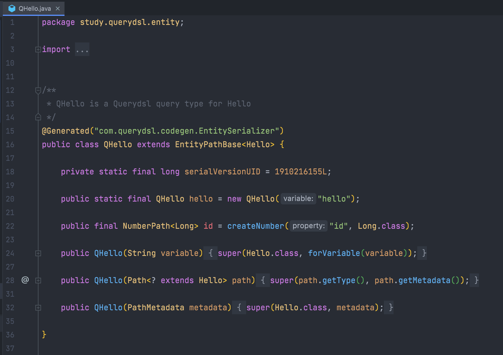

# Querydsl
: Querydsl 정적 타입을 이용해서 SQL과 같은 쿼리를 생성할 수 있도록 해 주는 프레임워크이다
- Querydsl은 타입에 안전한 방식으로 HQL 쿼리를 실행하기 위한 목적으로 만들어졌다.
- Querydsl은 Java code로 query를 만들 수 있다.

### 왜 사용할까?
- Spring Boot와 스프링 데이터JPA는 복잡한 쿼리와 동적 쿼리를 하기 힘들다.
- 하지만 네이티브 query를 사용하기에는 문자열를 사용해야 되고 문제를 Runtime에 확인할 수 밖에 없다.

#### 사용 예시
불편한 순간이라는 익명 게시판을 모두 select해서 DTO로 반환하는 매서드 이다. (`UncomportableDomain` &rarr; `UncomfortableResponseDto`)
```java
    @Query("SELECT new com.moment.the.uncomfortable.dto.UncomfortableResponseDto(table.uncomfortableIdx, table.content, table.goods, answer)" +
            "FROM UncomfortableDomain table LEFT JOIN table.answerDomain answer " +
            "ORDER BY table.uncomfortableIdx DESC "
    )
    List<UncomfortableResponseDto> uncomfortableViewAll();
```
여기에서는 `@Query`를 통해 JPQL를 직접 문자열로 작성했다. 그래서 다음 문제점들을 가지고 있다.
- Compile시점에 해당 Query문에 있는 에러를 찾기 힘들다.
- 만약 native query를 사용했다면 runtime일일히 오류를 찾아야 한다.

위 매서드를 Querydsl로 바꾸면 다음과 같다.
```java
public List<UncomfortableResponseDto> uncomfortableViewAll() {
    return queryFactory
            .from(uncomfortableDomain)
            .select(Projections.constructor(UncomfortableResponseDto.class, // 생성자를 통해 DTO로 select한다.
                uncomfortableDomain.uncomfortableIdx,
                uncomfortableDomain.content,
                uncomfortableDomain.goods
            )
    ).fetch();
}
```
- Java code로 만들어 IDE의 도움과 컴파일 시점에 오류를 해결할 수 있다.
- 반북되는 부분은 따로 메서드를 이용해 재사용이 가능하다!  
  **재사용 예시**
  ```java
      JPAQuery<UncomfortableResponseDto> convertToDto(){
        return queryFactory
                .from(uncomfortableDomain)
                .select(Projections.constructor(UncomfortableResponseDto.class, // 생성자를 통해 DTO로 select한다.
                        uncomfortableDomain.uncomfortableIdx,
                        uncomfortableDomain.content,
                        uncomfortableDomain.goods
                ));
    }

    public List<UncomfortableResponseDto> uncomfortableViewAll() {
        return convertToDto.fetch();
    }

  ```

## Querydsl 적용방법 - SpringBoot with gradle
### build.gradle
plugins 부분
```groovy
plugins {

    ...
    id 'io.spring.dependency-management' version '1.0.11.RELEASE' // Spring프로젝트의 의존성을 관리한다.

    id "com.ewerk.gradle.plugins.querydsl" version "1.0.10" // querydsl plugin
    id "io.franzbecker.gradle-lombok" version "3.0.0" // Q-Type error 발생 시 추가
}
```
- Querydsl를 사용하기 위해`com.ewerk.gradle.plugins.querydsl` plugin를 추가한다.
- 만약 Q-Type error 발생 시 `io.franzbecker.gradle-lombok` plugin를 추가한다.

dependencies 부분
```groovy
dependencies {
    ...

    implementation 'com.querydsl:querydsl-jpa' // 추가

    ...
}
```
- Querydsl를 사용하기 위해`com.querydsl:querydsl-jpa`의존성을 추가한다.

Querydsl관련 task작성
```groovy
def querydslDir = "$buildDir/generated/querydsl" as String // queryDSL이 생성하는 QClass 경로 설정
querydsl {
    jpa = true
    querydslSourcesDir = querydslDir
}
sourceSets {
    main.java.srcDir querydslDir
}
configurations {
    querydsl.extendsFrom compileClasspath
}
compileQuerydsl {
    options.annotationProcessorPath = configurations.querydsl
}
```
### Q-class 생성하기
Q-class란 APT를 이용해 Entity의 정보를 가지고 생성되는 class이다.

> APT - Annotation Processing Tool  
> Annotation 이 있는 기존코드를 바탕으로 새로운 코드와 새로운 파일들을 만들 수 있고, 이들을 이용한 클래스에서 compile 하는 기능도 지원해준다.

#### 1. Entity 생성
> Q-class를 생성하기 전 그에 필요한 Entity가 있어야 된다.

예시 Entity
```java
@Entity
@Getter @Setter
public class Hello {
    @Id @GeneratedValue
    private Long id;
}
```

#### 2. Q-class 생성
**1. Gradle 콘솔 사용방법**
```sh
# linux, macOS
./gradlew clean compileQuerydsl

# windows
./gradlew.bat clean compileQuerydsl
```

**2. Gradle IntelliJ 사용법**
1. Gradle &rarr; Tasks &rarr; build &rarr; clean  
   
2. Gradle &rarr; Tasks &rarr; other &rarr; compileQuerydsl  
   

예시) Q-class는 위 코드 예시의 Entity를 기반으로 만들었다.  
