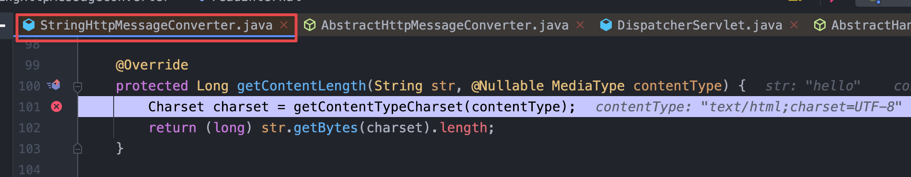

# SpringMVC는 어떻게 데이터를 반환할까? 
> 부제: `ViewResolver`와 `MessageConverter`

### 해당 글을 적게 된 동기
Spring은 MVC2를 따르기 위해 모든 요청에 대한 응답을 `DispacherServlet`에서 모두 담당하는 것이 아닌 JSP, HTML과 같이 view만을 반환하는 `ViewResolver`를 통해 view를 반환한다. 그렇다면, **"JSON혹은 XML과 같은 데이터를 받고 비즈니스 로직을 처리 후 다시 JSON이나 XML과 같은 데이터는 어떻게 데이터를 반환하여 클라이언트에 전달하는지"** 의문을 가지게 되었는데...

SpringMVC 요청 흐름을 검색하면 다음과 같이 간략한 다이어그램을 볼 수 있다.


View는 `ViewResolver`를 통해 View를 전달받는데, XML이나 JSON같은 데이터는 어떤식으로 반환하는지에 대한 정보를 찾기도 힘들고 제대로 된 다이어그램도 찾을 수 없어 직접 디버깅과 구글링을 통해 탐구할 것이다.

부분적으로 생략된 부분이 있기 때문에 디버깅을 같이 따라해보면 좋겠다.

### @ResponseBody
`@ResponseBody` 어노테이션을 사용한 Controller는 `ViewResolver`가 아닌 `MessageConverter`를 통해 사용자에게 데이터를 반환한다.
> +`@RestController`속에 `@ResponseBody` 어노테이션이 있다.

## 1. 요청/응답 과정을 핥아보자
앞으로 살펴볼 클래스들의 UML이다.
> 누락된 부분 있을 수 있으므로 제보 부탁드려요 :)


### 1-1. 사전작업
1. `DispatcherServlect`클래스 내부에 들어간다.
2. `DispatcherServlect#doService`를 찾는다.
3. 메서드의 첫번 째 줄인 `this.logRequest(request);`에 breaking point를 건다.


이후 아무 `@RestController`를 만들어서 해당 컨트롤러를 실행할 예정이다.

필자는 다음과 같은 컨트롤러를 만들었다.

```java
@RestController
public class HelloController {

    @GetMapping("/hello")
    private String hello(){
        return "hello";
    }
}
```

### 1-2. 디버깅을 해보자

#### 1. 컨트롤러(헨들러)를 가져와 실행할 수 있는 상태를 만드는 과정
`doService` 메서드에서 계속 Step Over를 하다보면 `doDispatch(request, response)`를 찾을 수 있다.


`doDispathc(request, response)` 내부로 들어가기 위해 디버거의 Step Into를 사용하면 `doDispatch`메서드로 들어가진다 그 후,
`mappedHandler = this.getHandler(processedRequest);`구분이 나올때까지 Step Over를 한다.


그 후 계속 Step Over를 하다보면 HandlerMapping부분을 찾을 수 있는데 `getHandler(processedRequest)`부분에서 다시 한번 Step Into를 하면  


1. `handlerMappings`변수에 5개의 HandlerMapping이 존재하는 것을 확인할 수 있고
2. 핸들러들을 순회하면서
3. `RequestMappingHandler`를 찾은 다음
4. `RequestMappingHandler`가 [사전작업 파트](#1-1-사전작업)에서 필자가 만든 `HelloController#hello`를 `hander`가 가지고 있는것을 볼 수 있다. 

이렇게 HandlerMapping을 통해 controller(handler) Bean객체를 `DispatcherServlet`에게 전달한 후,
`getHandler`를 통해 얻은 `HandlerAdapter`를 얻어오는 것을 볼 수 있다.  
> HandlerAdapter로 handler를 실행할 수 있다.


`getHandlerAdapter`내부로 들어가면 이번에는 for문을 통해 사용할 HandlerAdapter를 찾는 과정이 진행된다.  
HandlerAdapter는 사진과 같이 4개가 존재한다.


디버깅을 계속 진행하다보면 `RequestMappingHandlerAdapter`가 선택되는 것을 확인할 수 있다. 이제 hendler를 실행할 수 있는 HandlerAdapter를 찾았고 handler를 실행할 단계만 남아있다.

#### 2. Handler 실행하기
getHandlerAdapter에서 빠져나온 후 Step Over를 통해 이동하다보면 `mv = ha.handle(processedRequest, response, mappedHandler.getHandler());`를 볼 수 있는데 이 코드는 
handlerAdapter를 통해 handler를 실행한다. handle매서드를 속을 살펴보면  


아래와 같이 `handleInternal` 매서드가 있는 것을 볼 수 있는데   


한번 더 내부코드에 들어가면


1. `handlerMethod`를 인수로 가지고 있고,
2. `invokeHandlerMethod` 메서드에서 리플렉션으로 `handlerMethod`를 실행한다.
   > 필자 기준 `HelloController#hello()`가 실행된다.

더 자세히 알기 위해 `invokeHandlerMethod`를 살펴보면


거의 끝나간다. `invokeHandlerMethod`속 `invocableMethod.invokeAndHandle(webRequest, mavContainer)`를 통해 handler가 실행되고 그에 대한 반환결과를 얻을 수 있다!

해당 사진에 나와있는 코드이외에 여러 코드가 많지만 `invocableMethod.invokeAndHandle(webRequest, mavContainer)`부분만 알면된다 그 이외의 코드는 view관련 코드인듯 하다. 

`invokeAndHandle(webRequest, mavContainer)`의 내부를 들어가보자


1. handler를 리플렉션으로 실행한다.
2. `returnValue` 에 `hello`값이 저장되있는 것을 확인 할 수 있다.

그 이후 Step Over를 계속 하다 보면, `StringHttpMessageConverter`를 확인할 수 있다!


드디어 찾았다. HelloController는 단순하게 `"hello"`를 반환하므로 `StringHttpMessageConverter`를 통해 메시지를 반환하지만 객체를 반환하게 된다면 Jackson라이브러리에서 제공하는 `appingJackson2HttpMessageConverter`를 사용하게 된다.

## 결론
결과적으로 XML, JSON과 같은 view를 제외한 데이터는 ViewResolver를 거치지 않고, MessageConverter를 거쳐 데이터를 반환한다.

## Reference
- https://devlog-wjdrbs96.tistory.com/409
- https://velog.io/@prayme/Spring은-Http-Message-Body를-어떻게-Java의-객체로-역직렬화할까