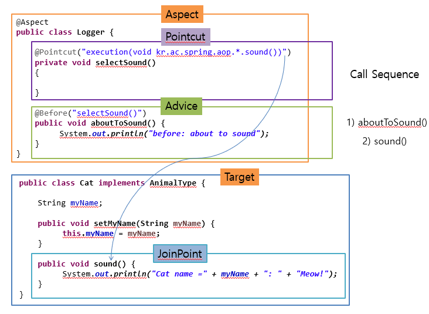

# Aspect Oriented Programming(관점 지향 프로그래밍)
## 1. 관점 지향 프로그래밍?
: 애플리케이션에서의 **관심사의 분리(기능의 분리), 핵심적인 기능에서 부가적인 기능을 분리한다.**  
분리한 부가기능을 `Aspect`라는 독특한 모듈형태로 만들어서 설계하고 개발하는 방법

### 1-1. AOP는 OOP를 보완하는 수단
AOP는 OOP를 대체하기 위함이 아니라 OOP를 보완하는 수단이다.  
여러 곳에서 쓰이는 공통 기능을 모듈화하고, 쓰이는 곳에 연결함으로써 유지보수 혹은 재사용에 용의하도록 도와준다.

#### AOP의 장점
AOP의 장점은 아래와 같다.
- 중복되는 코드 제거
- 효율적인 유지보수
- 높은 생산성
- 재활용성 극대화
- 변화 수용이 용이

## 2. Spring에서의 AOP
Spring AOP의 핵심 기능은 Spring Poject가 추구하는 방향인 비 침투적이며 그러므로 핵심기능을 수정하지 않고 공통 기능의 구현을 추가할 수 있다.

핵심 기능에 공통 기능을 추가하는 방법에는 아래와 같이 3가지 방법이 존재한다.
#### 공통 기능을 추가하는 방법
- 컴파일 : 자바 파일을 클래스 파일로 만들 때 바이트코드를 조작하여 적용된 바이트코드를 생성한다.
- 로드 타임 : 클래스를 로딩하는 시점에 끼워 넣는다.
- 런타임 : A라는 클래스를 빈으로 만들 때 A라는 타입의 프록시 빈을 감싸서 만든 후에, 프록시 빈이 클래스 중간에 코드를 추가해서 넣는다.

### 2-1 AOP 주요 개념

- Aspect : 여러 객체에 공통으로 적용되는 기능
- Target : Aspect에 적용이 되는 대상
- Advice : 타겟에 제공할 부가기능을 담고 있는 모듈(로직)
- Join Point : Advice를 적용가능한 지점 
- Pointcut : Advice를 적용할 타겟의 메서드를 선별하는 정규표현식이다.
- Weaving : Advice를 핵심 코드에 적용하는 것을 말합니다.