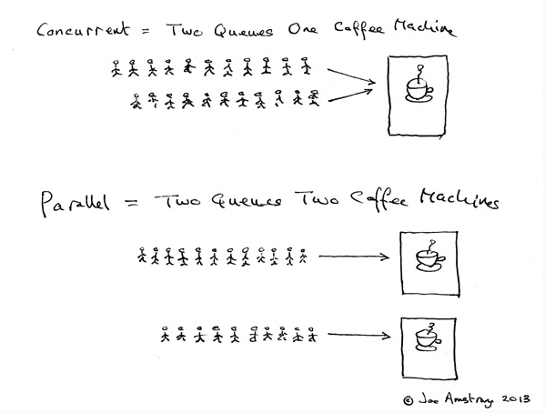

# 동시성 & 병렬성 - Concurrency & Parallelism
### 동시성 & 병렬성 요약

|동시성|병렬성|
|----|----|
|동시에 "실행되는 것" 같이 보이는 것|실제로 동시에 여러 작업이 처리되는 것|
|한번에 많은 것을 처리한다.|한번에 많은 일을 처리한다.|
|논리적인 개념|물리적인 개념|
|내부적으로 Context Switch가 일어난다.||