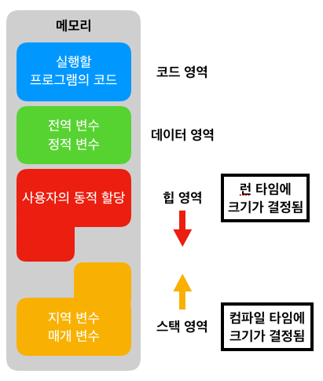

# 메모리의 구조
### 프로그램 실행 순서
> 프로그램은 보조 기억 장치에 보관되어있다가 실행되면 필요한 부분만 따로 주기억장치(RAM)에 로드한다.  
> 메모리의 구조를 알기 전에 먼저 프로그램의 실행 순서를 알아보자!
> 

프로그램의 실행 순서를 요약하자면 프로그램이 실행되면 OS는 **메모리(RAM)에 공간을 할당**한다.

#### 이 때 할당해주는 메모리 공간은 4가지(Code, Data, Heap, Statck)이 있다.
> 이 md는 Code, Data, Heap, Stack에 관해 설명할 것이다.

## 메모리 구조
메모리 구조는 다음과 같다.  

### 코드(Code) 영역
: **실행할 프로그램의 코드가 저장**되는 영역 == 텍스트(code)영역
- 실행 파일을 구성하는 명령어(컴파일된 기계어)들이 올라가는 메모리 영역이다.  
  (함수, 제어문, 상수 등)
- 코드 영역에 저장된 명령어를 하나씩 가져가서 처리하게 된다.

### 데이터(Data) 영역
: 프로그램의 **전역 변수와 정적(Static) 변수, 문자열 상수**가 저장되는 영역이다.
- 프로그램의 시작과 동시에 할당되고, 프로그램이 종료되어야 메모리가 소멸된다.   
  &rarr; 프로그램과 라이프 사이클이 같다.

### 스텍(statc) 영역
: **함수의 호출과 관계되는 지역 변수와 매개변수가 저장**되는 영역이다.
- 함수의 호출과 함께 할당되며 함수의 호출이 완료되면 소멸한다.
- 스택 영역에 저장되는 함수의 호출 정보를 스택 프레임(Stack Frame)이라고 한다.
- 컴파일 시 크기가 결정된다.
- 메모리의 높은 주소에서 낮은 주소의 방향으로 할당된다.
#### 장점
- 낭비되는 공간이 없다.
- 나의 명령만으로 메모리 조작과 어드레스 조작이 가능하다.
#### 단점
- 한계가 있어 한계를 초과하도록 삽입할 수 없다.(ex. stack overflow) &rarr; 유연성이 부족하다.

### 힙(Heap) 영역
사용자가 직접 관리할 수 있고, **관리 해야만 하는 메모리 영역**이다.
- 사용자에 의해 메모리 공간이 동적으로 할당되고 해제된다.
  > Java는 garbage collector(GC), swift는 Auto Reference Counting(ARC)가 관리한다.
- `클래스`, `클로저` 등
- 런타임시 크기가 결정된다.
- 메모리의 낮은 주소에서 높은 주소의 방향으로 할당된다.

#### 장점
- 프로그램에 필요한 개체의 개수나 크기를 미리 알 수 없는 경우에 사용 가능하다.
- 개체가 너무 커서 스택 할당자에 맞지 않는 경우 사용 가능.

#### 단점
- 할당/해제 작업 인한 속도 저하
    > 해제 작업같은 경우에는 주로 병합을 사용할때 해제 작업에 더 많은 주기가 필요하다.
- 힙 손상으로 인한 속도 저하
    > 이중 해제, 해제 후 블록 사용, 블록 경계를 벗어나 덮어쓰기 등이 가장 많이 발생한다.
- 힙 경합으로 인한 속도 저하
    - 두 개 이상의 쓰레드에서 동시에 데이터에 액세스하려고 하면 경합이 발생 한다.   
    즉, **한 쪽 쓰레드의 작업이 완료되어야 다른 쪽 쓰레드의 작업이 진행될 수 있다.**
    > **다중 프로세서 시스템**에서 일어나는 문제 중 가장 큰 문제다.

> #### 높은 주소? 낮은 주소?
> 0x00000000(가장 낮은 주소)는 상대적으로 0xFFFFFFFF(가장 높은)보다 주소가 낮다.  
> 반대로 0xFFFFFFFF의 주소값은 0x00000000보다 상대적으로 주소가 높다.

이글을 잇는 다음글은 Stack과 Heap의 차이점에 대한 글이 될 예정!
## 자료조사 후기
이러한 메모리 구조도 모르고 코딩을 하고 있었던 나 자신이 부끄럽다.. ///  
한편으로는 내 코드가 어떤 식으로 저장되며 동작하고 있었다는 것을 꺠달아 설래기 시작했다.  
앞으로 기본적인 공부를 열심히 해보자!

원래는 직렬화에 대해 공부하다가 메모리에 대한 공부를 하게 되었는데 직렬화 정리 끝내고 JVM에 대한 정리를 해야겠다