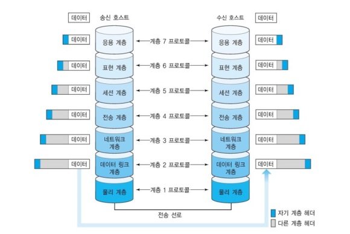

# OSI 7계층
> ~~물데네 전세표응~~
#### OSI - Open System Interconnection
: 개방형 시스템간 상호 접속이다.  
> ISO(국제표준화기구)에서 컴퓨터의 통신, 네트워크간의 상호 접속을 용이하게 하기 위해 규정한 네트워크 프로토콜로 표준화,  
> 상호통신을 가능하게 한다.

#### OSI 7계층의 목적
: 모든 시스템들이 상호 연결에 대한 문제없도록 표준을 정한것이다.

#### 계층을 나눈 이유
- 계층을 나눈 이유는 통신이 일어나는 과정이 단계별로 파악할 수 있다.
- 7단계 중 특정한 곳에 이상이 생기면 다른 단계의 장비 및 소프트웨어를 건드리지 않고도 이상이 생긴 단계만 고칠 수 있기 때문이다.
- 서로의 각 계층은 어떻게 동작하는지 알 필요가 없다. &rarr; 데이터만 알면 된다.

## OSI 7계층 - OSI 7 Layer
: 구조를 7개의 계층으로 분리하여 각 계층간 상호 작용하는 방식을 정해 놓은 것이다.
- 각 계층은 하위 계층만 사용하고, 상위 계층에게 기능을 제공한다.
- 일반적으로 하위 계층은 하드웨어, 상위 계층은 소프트웨어로 구현된다.

### 1. 물리계층 - Physical Layer
: 데이터 전기적 신호(Bit == 0 or 1)로 변환하여 전송한다.
> 전압, 허브, 네트워크 어댑터, 중계기 및 케이블 사양, 신호 변경(디지털,아날로그)
- 어떤 하나의 네트워크에서 기본 네트워크 하드웨어 전송기술들로 구성된다.
- 네트워크의 높은 수준의 기능의 논리 데이터 구조를 기초로 하는 필수 계층이다.
#### 장비 
- 허브, 리피터 등...
#### 프로토콜
- Ethernet.RS-232C 등...

### 2. 데이터 링크 계층 - Data Link Layer
: 물리적인 네트워크를 통해 데이터를 전송하는 수단을 제공한다.
> MAC 주소, 브리지 및 스위치
- 포인트 투 포인트(Point to Point) 간 신뢰성있는 전송을 보장하기 위한 계층이다.
- 오류없이 한 장치에서 다른 장치로 프레임(Frame, 비트의 모음)을 전달하는 역할이다.
  > CRC 기반의 오류 제어와 흐름 제어가 필요하다.
- MAC 주소를 통해서 통신한다.
1. 네트워크 위의 개체들 간 데이터를 전달하고
2. 물리 계층에서 발생할 수 있는 오류를 찾아 내고,
3. 수정하는 데 필요한 기능적, 절차적 수단을 제공한다.

#### 장비
- 브릿지, 스위치 등...
#### 프로토콜
- MAC, PPP, HDLC, Frame-Relay, FDDI, ATM 등...

### 3. 네트워크 계층 - Network Layer
: 데이터를 목적지까지 (안전하고 빠르게) IP 통해 라우팅한다.
> 라우터
- 여러개의 노드를 거칠때마다 경로를 찾아주는 역할을 하는 계층이다.
- 라우팅, 흐름 제어, 세그맨테이션(segmentation/desegmentation), 오류 제어, 인터네트워킹(Internetworking)등을 수행한다.
- 네트워크 계층에서 데이터 단위는 패킷(Packet)

1. 다양한 길이의 데이터를 네트워크들을 통해 전달하고,
2. 그 과정에서 전송 계층이 요구하는 서비스 품질(QoS)을 제공하기 위한 기능적, 절차적 수단을 제공한다.

#### 장비
- 라우터, L3 스위치
#### 프로토콜
- IP, ICMP, IGMP

### 4. 전송 계층 - Transport Layer
: 종단간 통신(End to End)을 다루는 최하위 계층이다
> 특정 방화벽, 프록시 서버
- 양 끝단(End to end)의 사용자들이 신뢰성 있는 데이터를 주고 받을 수 있도록 한다.
   > 상위 계층들이 데이터 전달의 유효성이나 효율성을 생각하지 않도록 해준다.
- 데이터 전송을 위해서 Port 번호를 사용한다.
- 특정 연결의 유효성을 제어한다.
- 전송 계층에서 데이터 단위는 세그먼트(Segment)
#### 장비
- Gateway
#### 프로토콜
- TCP, UDP, ARP
   > 연결형 프로토콜과 비 연결형 프로토콜을 모두 사용한다.

### 5. 세션 계층 - Session Layer
: 양 끝단의 응용 프로세스가 통신을 관리하기 위한 방법을 제공한다.
- 동시 송수신 방식(duplex), 반이중 방식(half-duplex), 전이중 방식(Full Duplex)의 통신과 함께,  
  체크 포인팅과 유휴, 종료, 다시 시작 과정 등을 수행한다.
- 통신 세션을 구성하는 계층으로, 포트(port)연결이라고도 할 수 있다.
- 연결 세션에서 데이터 교환과 에러 발생 시의 복구를 관리한다.

#### 프로토콜
: SSH, TLS 등...

### 6. 표현 계층 - Presentation Layer
: 데이터를 어떻게 표현할지 정하는 역할을 하는 계층이다.
> 인코딩, 디코딩, 암호화, 복호화
- 송신자에서 온 데이터를 해석하기 위한 응용계층 데이터 부호화, 변화한다.
- 수신자에서 데이터의 압축을 풀수 있는 방식으로 된 데이터 압축한다.
- 데이터의 암호화와 복호화한다.
#### 프로토콜
- ASCII, MPEG, JPEG, MIDI, EBCDIC 등...

### 7. 응용 계층 - Application Layer
: 사용자가 네트워크 자원에 접근하는 방법을 제공한다.
> 텔넷(Telnet), 구글 크롬, 이메일, 데이터베이스 관리
- 사용자와 가장 밀접한 계층으로 인터페이스 역할이다.
- 응용 프로세스 간의 정보 교환을 담당한다.

#### 프로토콜
- HTTP, SMTP, FTP, Telnet, DNS